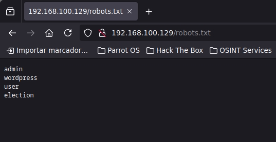

En este WriteUp estaremos resolviendo la maquina de VulnHub llamada `eLection` la cual contempla las siguientes conceptos:  
*SUID
*Fuzzing 


Link de la maquina --> [eLection: 1 ~ VulnHub](https://www.vulnhub.com/entry/election-1,503/)
# Reconocimiento 

Usando __Nmap__ Iniciaremos la fase de reconocimiento de la maquina de `eLection`

```bash 
 nmap -p- --open -sS --min-rate 5000 -vvv -n -Pn 192.168.100.129 -oG allPorts
```


y para conocer que servicios están corriendo por estos puertos 

```bash
nmap -sCV -p22,80 192.168.100.129 -oN Ports
```


ok tenemos un servicio web con `Apache2` el cual tiene la pagina por defecto de apache y un servicio de `ssh` por el cual conectarnos al servidor 

Procederemos a hacer un Fuzzing con Nmap  

```bash 
nmap --script http-enum -p80 192.168.100.129 -oN WebFuzzing
```

Con esto conseguimos los siguiente directorios

```txt
PORT   STATE SERVICE
80/tcp open  http
| http-enum: 
|   /robots.txt: Robots file
|   /phpinfo.php: Possible information file
|_  /phpmyadmin/: phpMyAdmin
MAC Address: 00:0C:29:61:BD:3D (VMware)
```

## Election web

Visualizando el `robots.txt` nos da la información de mas directorios los cuales son : admin, wordpress, user y election  




Si probamos los directorios el único que es correcto es el de `election `, el cual nos manda a la siguiente pagina 


En pocas palabras la pagina es sencilla y no tiene ninguna función importante que nos pueda interesar por lo cual haremos un ataque de fuerza 

## Jugando con gobuster

Usaremos gobuster para realizar el ataque de fuerza bruta y si tenemos suerte encontraremos mas directorios importantes 

``` bash
gobuster dir -w /usr/share/dirbuster/wordlists/directory-list-lowercase-2.3-small.txt -u http://192.168.100.129/election/ -t10
```

y encontramos un directorio llamado ``admin`` el cual tiene un panel de inicio de sección el cual si nos equivocamos mas de 5 veces nos bloqueara el acceso 


Pues la verdad es que no hay nada que podamos hacer aquí, segaremos buscando mas subdirectorios dentro de esta ruta  

```bash 
gobuster dir -w /usr/share/dirbuster/wordlists/directory-list-lowercase-2.3-small.txt -u http://192.168.100.129/election/admin -t10
```

y dentro de esta ruta podemos encontrar los siguientes directorios los cuales son:


De todos estos el que tiene información importante es el de logs, dentro de el tenemos credenciales del usuario `admin`


Estas credenciales son lo mas seguro para conectarnos por `ssh` 

# Dentro eLection 

Si nos conectamos por `ssh`  y te sale la siguiente advertencia lo podes solucionar de la síguete manera 

```bash 

ssh love@192.168.100.129 -p22
@@@@@@@@@@@@@@@@@@@@@@@@@@@@@@@@@@@@@@@@@@@@@@@@@@@@@@@@@@@
@    WARNING: REMOTE HOST IDENTIFICATION HAS CHANGED!     @
@@@@@@@@@@@@@@@@@@@@@@@@@@@@@@@@@@@@@@@@@@@@@@@@@@@@@@@@@@@
IT IS POSSIBLE THAT SOMEONE IS DOING SOMETHING NASTY!
Someone could be eavesdropping on you right now (man-in-the-middle attack)!
It is also possible that a host key has just been changed.
The fingerprint for the ED25519 key sent by the remote host is
SHA256:z1Xg/pSBrK8rLIMLyeb0L7CS1YL4g7BgCK95moiAYhQ.
Please contact your system administrator.
Add correct host key in /root/.ssh/known_hosts to get rid of this message.
Offending ECDSA key in /root/.ssh/known_hosts:14
  remove with:
	ssh-keygen -f "/root/.ssh/known_hosts" -R "192.168.100.129"
Host key for 192.168.100.129 has changed and you have requested strict checking.
Host key verification failed.
```


Usamos este comando y especificamos la `IP` del servidor 
```bash
❯ ssh-keygen -R 192.168.100.129
# Host 192.168.100.129 found: line 13
# Host 192.168.100.129 found: line 14
/root/.ssh/known_hosts updated.
Original contents retained as /root/.ssh/known_hosts.old
```

Y con eso hecho ya nos deberíamos conectar si ningún problema 
```bash 
❯ ssh love@192.168.100.129 -p22
The authenticity of host '192.168.100.129 (192.168.100.129)' can't be established.
ED25519 key fingerprint is SHA256:z1Xg/pSBrK8rLIMLyeb0L7CS1YL4g7BgCK95moiAYhQ.
This key is not known by any other names.
Are you sure you want to continue connecting (yes/no/[fingerprint])? 

```

Procedemos a hacer el tratamiento de la terminal y con esto ya tenemos una terminal mas funcional

```bash
export TERM=xterm
```

Bien aquí dentro solo existe el usuario `root` y `love`  el cual somos nosotros, si listamos los permisos y privilegios de nuestro usuario no tenemos nada:


Si buscamos por permisos SUID tenemos los siguientes resultados (/home/love SUID XD)

```bash
> find / -perm -4000 2>/dev/null | grep -v snap
/usr/bin/arping
/usr/bin/passwd
/usr/bin/pkexec
/usr/bin/traceroute6.iputils
/usr/bin/newgrp
/usr/bin/chsh
/usr/bin/chfn
/usr/bin/gpasswd
/usr/bin/sudo
/usr/sbin/pppd
/usr/local/Serv-U/Serv-U
/usr/lib/policykit-1/polkit-agent-helper-1
/usr/lib/eject/dmcrypt-get-device
/usr/lib/openssh/ssh-keysign
/usr/lib/dbus-1.0/dbus-daemon-launch-helper
/usr/lib/xorg/Xorg.wrap
/bin/fusermount
/bin/ping
/bin/umount
/bin/mount
/bin/su
/home/love
```

De todos estos el que tiene un riesgo de ``elevación de privilegios`` es el de: `serv-U`, si quieres saber que es serv-u has una búsqueda rápida en Google 


Buscando en la web podemos encontrar un exploit de elevación de privilegios el cual consiste en un script de `c` que compilaremos y ejecutaremos 

# Exploit serv-u -> root

el exploit lo encontramos en la confiable de `searchsploit` [Serv-U FTP Server < 15.1.7 - Local Privilege Escalation (1) - Linux local Exploit](https://www.exploit-db.com/exploits/47009)

Crearemos un archivo .c y pegaremos dentro de el, el código de C


Ahora bien para compilarlo y generar el binario se hace de la siguiente manera:

```bash
gcc exploit.c -o exploit
```

y esto nos generara el binario dentro de la carpeta donde estemos.


Y con ejecutarlo nos dará una ``sh`` con los  permisos de `root` 
